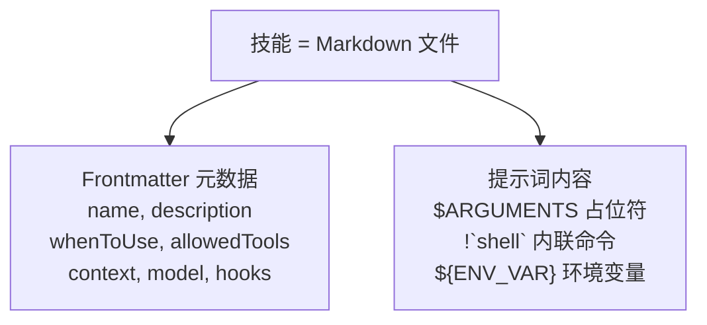
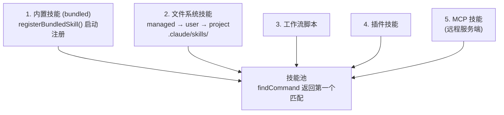

# 第 5 章：技能系统

> 技能是 Claude Code 的"AI Shell 脚本"——将验证有效的 prompt 模板化，让 Agent 不必每次从头编写相同的流程。

## 5.1 什么是技能？

Shell 脚本自动化终端任务，技能自动化 AI 任务。拆开看，一个技能就是三样东西：提示词模板、元数据、执行上下文。



技能解决的是重复的 AI 工作流。你让 Claude 做代码审查，每次都要写一遍"检查安全漏洞、看边界情况、注意命名规范……"。技能把这些经过验证的提示词固化下来，一次编写，反复使用。

### 双重调用：技能的关键创新

与传统聊天机器人的 slash command 不同，Claude Code 的技能有两条调用路径：

| 调用方式 | 触发者 | 示例 |
|---------|--------|------|
| 用户手动 | 用户输入 `/commit` | 用户明确需要某个流程 |
| 模型自动 | 模型判断当前任务需要调用技能 | 用户说"帮我提交代码"，模型识别意图后通过 SkillTool 调用 |

传统 slash command 只能手动触发——用户必须知道命令名、记住命令语法。技能的使用场景因此受限：用户不知道 `/review` 命令存在，就永远不会用它。

双重调用让技能成为 Agent 行为的一部分。模型可以根据当前任务的上下文，判断"现在应该调用审查技能"并自动执行。用户不需要记住命令名，只需要表达意图——"帮我看看这段代码有没有问题"，模型就会选择合适的技能。

两条路径在代码层面最终汇合到相同的执行逻辑：inline 技能走 `processPromptSlashCommand()`，fork 技能走 `prepareForkedCommandContext()`。

### 技能的文件格式

每个技能是一个目录，包含一个 `SKILL.md` 文件：

```
.claude/skills/
  └── review/
      └── SKILL.md        # frontmatter + 提示词
      └── templates/       # 可选：资源文件
          └── report.md
```

用目录而非单文件，是因为技能可能需要附带资源文件（模板、配置、参考文档），并通过 `$\{CLAUDE_SKILL_DIR\}` 环境变量引用这些资源。目录格式让技能成为一个自包含的单元。

## 5.2 技能来源与加载

> 本节回答：技能从哪里来？Claude Code 启动时做了什么？

### 五个来源

技能从多个来源加载，`loadAllCommands()`（`src/commands.ts`）按以下顺序合并，`findCommand()` 返回第一个匹配，因此排在前面的来源优先级更高：



**Bundled 技能优先级最高**——所以你无法通过项目技能覆盖内置技能的名称。这是有意的设计：核心技能的行为必须可预测，不能被项目配置意外替换。

文件系统技能通过 `realpath()` 解析符号链接去重——相同规范路径的文件视为同一技能，确保在各种环境（容器、NFS、符号链接）下正确去重。

### 懒加载：只加载需要的

这里有一个容易被忽略但重要的设计：技能内容**不在启动时加载**。系统只预加载 frontmatter（name、description、whenToUse），完整的 Markdown 提示词内容在用户实际调用或模型触发时才读取。

```typescript
// src/skills/loadSkillsDir.ts
export function estimateSkillFrontmatterTokens(skill: Command): number {
  const frontmatterText = [skill.name, skill.description, skill.whenToUse]
    .filter(Boolean)
    .join(' ')
  return roughTokenCountEstimation(frontmatterText)
}
```

全量加载技能内容代价不小。系统可能注册几十个技能，每个可能有几百行提示词，全部加载会挤占大量上下文空间；大部分技能在当前会话里根本用不上；全量加载还增加启动延迟，影响首次响应速度。

只加载 frontmatter，模型就知道"有哪些技能可用"；内容推迟到实际需要时再读。展示成本低，执行成本按需付。

## 5.3 技能发现：模型如何知道技能存在？

> 本节回答：技能列表如何进入模型的视野？模型如何决定何时自动触发技能？

### System-reminder 注入
