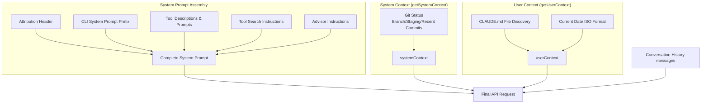

## 3.1 Context Construction Overview

Every time the Claude API is called, the model starts from zero — it has no persistent memory across requests and can only see the content carried in the current request. Therefore, Claude Code must assemble all the information the model needs into a complete request before every API call.

This assembly process involves three pillars:

1. **System Prompt**: Defines the model's identity, capability boundaries, and behavioral rules. This is the most stable part, essentially unchanged across requests.
2. **System & User Context**: Environmental information (git status, platform) and project knowledge (CLAUDE.md instruction files). Computed once per session.
3. **Message History**: User questions, model responses, tool calls and results — recording everything that happened in the conversation. This is the fastest-changing and most space-consuming part.



### Anatomy of a Complete API Request

The three pillars above are somewhat abstract. Let's look at what an actual API request looks like. The Claude API request body has three top-level fields: `system` (system prompt array), `tools` (tool schema array), and `messages` (message array). Here's their complete structure:

```
┌─────────────────────────────────────────────────────────────┐
│  system — System Prompt Array (multiple TextBlocks)          │
│  ┌────────────────────────────────────────────────────────┐  │
│  │ [0] Attribution Header                     not cached  │  │
│  │ [1] CLI Prefix (interactive / -p mode)     not cached  │  │
│  │ ─── Static Content ──────────────────── 🔒 global ──  │  │
│  │ [2] Core instructions + tool descriptions + safety     │  │
│  │     rules + behavioral guidelines                      │  │
│  │     (identical for ALL users)                          │  │
│  │ ─── __SYSTEM_PROMPT_DYNAMIC_BOUNDARY__ ────────────── │  │
│  │ ─── Dynamic Content ──────────────────── not cached ── │  │
│  │ [3] Output style, language prefs, MCP instructions     │  │
│  │     (varies by user/session)                           │  │
│  └────────────────────────────────────────────────────────┘  │
│                                                               │
│  tools — Tool Schema Array                                    │
│  ┌────────────────────────────────────────────────────────┐  │
│  │ Built-in tools (Read, Edit, Bash, Grep, Write, Glob…) │  │
│  │ MCP tools (user-installed, may have defer_loading)     │  │
│  │ Server-side tools (advisor etc.) sit at the end        │  │
│  │ Whole array renders before system, cached along with   │  │
│  │ the system breakpoint (no per-tool cache_control in    │  │
│  │ the snapshot — see 3.6)                                 │  │
│  └────────────────────────────────────────────────────────┘  │
│                                                               │
│  messages — Message Array                                     │
│  ┌────────────────────────────────────────────────────────┐  │
│  │                                                          │  │
│  │ [User]  User's 1st message                               │  │
│  │ [Asst]  Model response (may contain tool_use blocks)    │  │
│  │ [User]  tool_result                                      │  │
│  │ [User]  Attachment messages (each a separate isMeta      │  │
│  │         user message):                                   │  │
