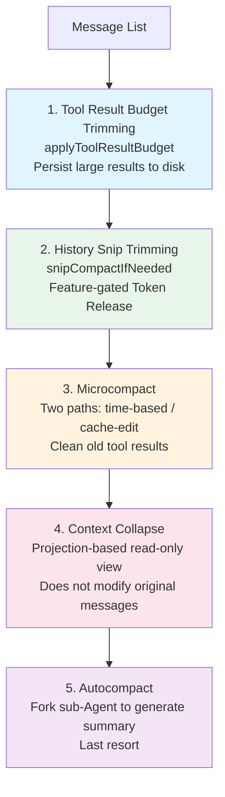
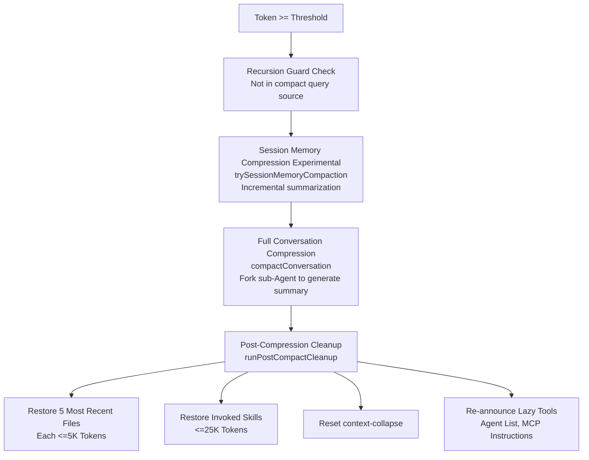

## 3.4 Five-Level Compression Pipeline

This is the core mechanism of Claude Code's context management. As conversations grow longer and token usage keeps increasing, the five-level compression pipeline activates level by level. The design philosophy is **progressive compression** — try to free space using the lowest-cost means first, only deploying heavier weapons when necessary.



### Why Execute in This Order?

Each level is "heavier" than the previous one — consuming more computational resources or losing more context detail:

1. **Tool Result Budget first**: Pure local operation, no API calls. Large results written to disk, context only retains a preview. Zero latency, zero cost.
2. **Snip releases the most**: Directly removes redundant parts from the message list, freeing large amounts of tokens, potentially making subsequent compression unnecessary.
3. **Microcompact has extremely low cost**: Cleans old tool results, no API calls, suitable for frequent execution.
4. **Context Collapse before Autocompact**: Context Collapse is a projection-based compression — creating a read-only folded view of messages without modifying original data (see Level 4). Folding may bring token usage below the Autocompact threshold, thus preventing unnecessary full compression — preserving finer-grained context.
5. **Autocompact as the last resort**: Requires forking a sub-Agent to call the API and generate a summary, highest cost, and irreversible (original messages replaced by summary).

### Detailed Explanation of Each Level

#### Level 1: Tool Result Budget Trimming

`applyToolResultBudget()` is the lightest processing — a pure local operation with no API calls. The core problem it solves is: **a single tool call may return enormous results**. For example, using `FileReadTool` to read a ten-thousand-line file, or using `BashTool` to execute a `find` command that returns thousands of file paths.

Processing mechanism (`src/utils/toolResultStorage.ts`):

1. Each tool declares a `maxResultSizeChars`, with default value `DEFAULT_MAX_RESULT_SIZE_CHARS = 50,000` characters
2. Thresholds can be overridden per tool name via GrowthBook Feature Flag (`tengu_satin_quoll`)
3. When tool results exceed the threshold, **instead of simply truncating, they are persisted to disk**

```
Persistence path: {projectDir}/{sessionId}/tool-results/{tool_use_id}.{txt|json}
```

Only a compact reference message is kept in the context:

```xml
```

**Why choose persistence over truncation?** Truncation means permanent data loss — if the model later needs to see the full output (say, it found a bug on line 500), it cannot recover. Persistence retains the complete data, and the model can use the `Read` tool at any time to read the disk file for the full content. The 2KB preview gives the model enough information to judge whether it needs to see the complete result.

Additionally, `applyToolResultBudget` also tracks replaced tool results (`ContentReplacementState`), ensuring that session recovery (resume) makes exactly the same replacement decisions as the original session, maintaining prompt cache stability.

#### Level 2: History Snip

`snipCompactIfNeeded()` is a Feature-gated function (`HISTORY_SNIP`) that frees tokens by trimming redundant parts from historical messages. The freed amount is passed via `snipTokensFreed` to subsequent autocompact threshold checks — this is important because snip removes messages but the last assistant message's `usage` still reflects the pre-snip context size; without correction, autocompact would trigger prematurely.

#### Level 3: Microcompact

Microcompact is one of the most ingenious mechanisms in Claude Code's compression system. Its goal is to **clean up old tool results that are no longer needed in the history** — if you read a file 30 minutes ago, that tool result is most likely no longer useful, but it might still be occupying thousands of tokens.

Key design: Microcompact has **two completely different paths**, chosen based on cache state:

**Path A: Time-based Microcompact (cache cold)**

When a user leaves for a while and comes back (time since last assistant message exceeds the configured minutes), the server-side prompt cache has already expired (default 5-minute TTL). At this point the cache is "cold", and the full prefix needs to be re-uploaded regardless of what you do.

In this case, Microcompact **directly modifies message content**:

```typescript
// Replace old tool results with placeholders
return { ...block, content: '[Old tool result content cleared]' }
```

Only the results from the most recent N compressible tools are kept (`keepRecent`, keeping at least 1), and all others are replaced with placeholders. Because the cache is already cold, modifying message content doesn't cause additional cache invalidation — the cache needs to be rebuilt anyway.

Compressible tool types: `FileRead`, `Shell/Bash`, `Grep`, `Glob`, `WebSearch`, `WebFetch`, `FileEdit`, `FileWrite`.

**Path B: Cache-edit Microcompact (cache still hot)**

When the cache hasn't expired yet (user has been in active conversation), the situation is completely different. Directly modifying message content would cause the cache key to change, **invalidating 100K+ tokens of cached prefix**, requiring re-upload and re-billing.

Therefore, the cache-edit path **does not modify local messages at all**. It uses an ingenious API-level mechanism:

1. Adds a `cache_reference` field to tool result blocks (equal to `tool_use_id`), allowing the server to locate the specific position in the cache
2. Constructs `cache_edits` blocks telling the server "delete the content pointed to by these `cache_reference`s"
3. The server deletes in-place in the cache, without needing the client to re-upload the prefix

```typescript
// Messages themselves unchanged, editing happens at the API layer
// cache_edits blocks are passed to the API layer via consumePendingCacheEdits()
return { messages } // Returned as-is!
```

Already-sent `cache_edits` are saved via `pinCacheEdits()` and re-sent at their original positions in subsequent requests (the server needs to see them to maintain cache consistency).

| | Time-based MC | Cache-edit MC |
|---|---|---|
| **Trigger condition** | Time interval exceeds threshold (cache cold) | Tool count exceeds threshold (cache hot) |
| **Operation method** | Directly modify message content | `cache_edits` API blocks |
| **Impact on cache** | Cache needs rebuilding anyway, no extra impact | Maintains cache warmth, avoids re-upload |
| **API calls** | Zero | Zero (edits piggybacked on next normal request) |
| **Applicable scenario** | First request after user returns | Continuous cleanup during active conversation |

The two paths are mutually exclusive: time-triggered has higher priority; if time-triggered takes effect, the cache-edit path is skipped (because the cache is cold, using `cache_edits` is pointless).

#### Level 4: Context Collapse

**Projection-based** context folding — the key characteristic is that it **does not modify original messages**. It creates a folded view of messages, replacing unimportant early messages with summaries. This allows folding to persist across turns and be rolled back when needed.

```typescript
// src/query.ts — Context Collapse is a read-time projection, doesn't write to original messages
if (feature('CONTEXT_COLLAPSE') && contextCollapse) {
  const collapseResult = await contextCollapse.applyCollapsesIfNeeded(
    messagesForQuery, toolUseContext, querySource
  )
  messagesForQuery = collapseResult.messages
}
```

This can be analogized to a database View: the underlying table (message array) data remains unchanged, but what you see when querying (sending API requests) is a filtered/transformed view. Summaries are stored in an independent collapse store, and `projectView()` overlays the folded view onto the original messages at each loop entry.

Measured against the same denominator, `effectiveWindow`: Context Collapse commits folds at approximately **90%** utilization and blocks (spawning a subtask) at approximately **95%**, while Autocompact triggers at approximately **93%** (`effective - 13k`) — landing right between the two, so it competes with collapse and usually wins. Running both simultaneously would create competition — the source code comments explicitly state *"Autocompact firing at effective-13k (~93% of effective) sits right between collapse's commit-start (90%) and blocking (95%), so it would race collapse and usually win, nuking granular context that collapse was about to save"*. Therefore, **when Context Collapse is enabled and active, Autocompact is suppressed**.

#### Level 5: Autocompact

This is the last resort — when all lightweight compression methods fail to keep token usage within safe limits, the system forks a sub-Agent to generate a summary of the entire conversation.

**Trigger conditions** (`shouldAutoCompact()`) — all 5 conditions must be met simultaneously:

```typescript
// 1. Recursion guard: Prevent the compression Agent from triggering its own compression (infinite loop)
querySource !== 'session_memory' && querySource !== 'compact'

// 2. Triple switch check: Disabled if any one is off
isAutoCompactEnabled()
  // Check DISABLE_COMPACT environment variable
  // Check DISABLE_AUTO_COMPACT environment variable
  // Check userConfig.autoCompactEnabled setting

// 3. Not reactive-only mode
// When REACTIVE_COMPACT is enabled and a specific flag is active,
// let the API's own PTL error trigger reactive compression rather than proactive compression

// 4. Not context-collapse mode
// When CONTEXT_COLLAPSE is enabled and active, autocompact is suppressed
// Reason: collapse commits at ~90%, autocompact triggers at ~93% (relative to effectiveWindow) —
// the two thresholds are close enough to race, autocompact may destroy the fine-grained context collapse is about to save

// 5. Token threshold (with snipTokensFreed correction)
tokenCountWithEstimation(messages) - snipTokensFreed >= getAutoCompactThreshold(model)
```

**Threshold calculation**:

```
// Source: getEffectiveContextWindowSize()
reservedTokensForSummary = Math.min(getMaxOutputTokensForModel(model), MAX_OUTPUT_TOKENS_FOR_SUMMARY)
                         // MAX_OUTPUT_TOKENS_FOR_SUMMARY = 20,000 (based on p99.99 summary output of 17,387 tokens)
                         // getMaxOutputTokensForModel is affected by slot-cap feature flag (8K when enabled)
effectiveWindow = contextWindow - reservedTokensForSummary

// Source: getAutoCompactThreshold()
autoCompactThreshold = effectiveWindow - AUTOCOMPACT_BUFFER_TOKENS  // AUTOCOMPACT_BUFFER_TOKENS = 13,000
```

For a 200K context window, the actual threshold depends on `reservedTokensForSummary`:

| Scenario | reservedTokensForSummary | effectiveWindow | autoCompactThreshold | Relative to Total Window |
|----------|-------------------------|-----------------|---------------------|--------------------------|
| slot-cap on (max_output=8K) | min(8K, 20K) = **8K** | 192,000 | **179,000** | ~89.5% |
| slot-cap off (max_output≥20K) | min(≥20K, 20K) = **20K** | 180,000 | **167,000** | ~83.5% |

Can be overridden by percentage via the `CLAUDE_AUTOCOMPACT_PCT_OVERRIDE` environment variable.

**Compression prompt design** (`src/services/compact/prompt.ts`):

The quality of compression depends on the prompt given to the sub-Agent. Claude Code uses an ingenious "analysis-summary" two-phase pattern here:

First, an aggressive `NO_TOOLS_PREAMBLE` ensures the summary model won't attempt tool calls (on Sonnet 4.6+ adaptive thinking models, the model sometimes ignores weaker restrictions and attempts tool calls, resulting in no text output):

```
CRITICAL: Respond with TEXT ONLY. Do NOT call any tools.
- Tool calls will be REJECTED and will waste your only turn — you will fail the task.
```

Then, the model is asked to generate two parts:

1. **`<analysis>` block** — A thinking draft that analyzes each message in the conversation chronologically: user intent, approaches taken, key decisions, filenames, code snippets, errors and fixes, user feedback
2. **`` block** — The formal summary containing 9 standardized sections:

| # | Section | Content |
|---|---------|---------|
| 1 | Primary Request | All explicit requests and intentions from the user |
| 2 | Key Technical Concepts | Technical concepts and frameworks discussed |
| 3 | Files and Code | Files inspected/modified/created and key code snippets |
| 4 | Errors and Fixes | Errors encountered and how they were fixed, especially user feedback |
| 5 | Problem Solving | Problems solved and ongoing troubleshooting |
| 6 | All User Messages | All non-tool-result user messages (verbatim) |
| 7 | Pending Tasks | Tasks yet to be completed |
| 8 | Current Work | Work in progress before compression (most detailed) |
| 9 | Optional Next Step | Next step plan (including direct quotes from original conversation) |

The key design insight: **`formatCompactSummary()` strips the `<analysis>` block**, keeping only the `` in the context. This is the classic "Chain-of-Thought Scratchpad" technique — letting the model reason first and then summarize produces far higher quality than directly generating a summary, but the reasoning process itself would waste large amounts of tokens if kept in the context. Discarding the analysis and keeping the conclusion — the best of both worlds.

**Post-compression recovery mechanism**:

The risk of Autocompact is making the model "forget" recently edited files. The system automatically executes `runPostCompactCleanup()` after compression:



1. **Restore 5 most recent files**: Takes the 5 most recently read files from the pre-compression `readFileState` cache, each limited to 5K tokens, injected as attachment messages
2. **Restore all activated skills**: Budget of 25K tokens (each skill limited to 5K tokens), ensuring loaded [skills](/lib/09-harness/how-claude-code-works/en-docs-09-skills-system) are not lost
3. **Re-announce context increments**: Compression consumed the previous lazy tool announcements, Agent lists, MCP instructions and other incremental announcements; regenerated from current state
4. **Reset Context Collapse**: Clear folding state to prepare for the next compression round
5. **Restore Plan state**: If currently in Plan mode or there's an active plan, inject relevant instructions

This recovery mechanism is key to Claude Code maintaining coherence in ultra-long conversations. Without it, the model would forget which files it just edited after compression, potentially leading to repeated reads or inconsistent modifications in subsequent operations.

**The compression request itself may exceed limits**: When the conversation is already extremely long, the request to send complete messages for the sub-Agent to summarize may itself trigger a Prompt-Too-Long error. `truncateHeadForPTLRetry()` shrinks the compression request by grouping by API turns and discarding the oldest turns from the head, retrying up to 3 times.

**Circuit breaker mechanism**: After 3 consecutive autocompact failures (`MAX_CONSECUTIVE_AUTOCOMPACT_FAILURES`), stop retrying — the context is irrecoverably over-limit. This circuit breaker comes from real data: there were once 1,279 sessions that failed consecutively over 50 times (maximum 3,272 times), wasting approximately 250K API calls per day.

### Key Constants

| Constant | Value | Purpose |
|----------|-------|---------|
| AUTOCOMPACT_BUFFER_TOKENS | 13,000 | Trigger threshold buffer |
| WARNING_THRESHOLD_BUFFER_TOKENS | 20,000 | UI warning threshold |
| ERROR_THRESHOLD_BUFFER_TOKENS | 20,000 | Blocking limit threshold |
| MANUAL_COMPACT_BUFFER_TOKENS | 3,000 | Manual compression buffer |
| MAX_CONSECUTIVE_AUTOCOMPACT_FAILURES | 3 | Circuit breaker threshold |
| DEFAULT_MAX_RESULT_SIZE_CHARS | 50,000 | Tool result persistence threshold |
| PREVIEW_SIZE_BYTES | 2,000 | Preview size for persisted results |
| POST_COMPACT_MAX_FILES_TO_RESTORE | 5 | Number of files restored after compression |
| POST_COMPACT_MAX_TOKENS_PER_FILE | 5,000 | Token limit per restored file |
| POST_COMPACT_SKILLS_TOKEN_BUDGET | 25,000 | Total budget for skill restoration |
