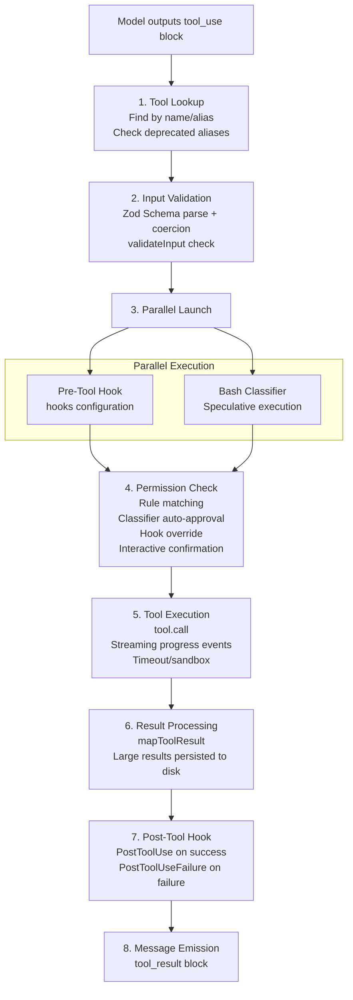

## 4.4 Tool Execution Lifecycle

When the model produces a `tool_use` block during streaming output, the call request is not executed directly—it must pass through a complete processing pipeline. From tool lookup, input validation, permission checking (which may involve user interaction), to actual execution, result formatting, and Hook callbacks, there are 8 stages in total. This pipeline is identical for all tools (built-in, MCP, REPL) and is a direct manifestation of the unified `Tool` interface from Section 4.1. Understanding this pipeline is key to understanding Claude Code's security model and execution semantics.



### Detailed Explanation of Each Stage

**Stage 1 - Tool Lookup**

The system matches tool definitions by `name` and `aliases`. If a tool is called via a deprecated alias, the system appends a deprecation warning in the tool_result, guiding the model to use the new name in subsequent calls. If no matching tool is found, an error message is returned directly—this happens when the model hallucinates a non-existent tool.

**Stage 2 - Input Validation**

Input validation is divided into two phases:

```typescript
// Phase 1: Zod Schema coercion
// Zod's safeParse not only validates, but also performs type coercion (e.g., string number → number)
const parsed = tool.inputSchema.safeParse(rawInput)
// If Schema validation fails, format error message and return to model

// Phase 2: Business logic validation
// Only executed after Schema validation passes
const validation = await tool.validateInput(parsed.data, context)
// Return types:
// { result: true }                              — Validation passed
// { result: false, message, errorCode }         — Direct rejection
// { result: false, message, behavior: 'ask' }   — Show UI prompt to let user decide
```

The two-phase separation design ensures that: the Schema layer handles structural validation (field existence, types), while the business layer handles semantic validation (e.g., FileEditTool checks if the file exists, FileWriteTool checks if the file has been read before writing). The `behavior: 'ask'` mode allows tools to hand the decision to the user in uncertain situations, rather than rejecting outright.

**Stage 3 - Parallel Launch**

The Pre-Tool Hook and Bash classifier **launch simultaneously**, rather than waiting serially. Both operations may take tens to hundreds of milliseconds each, and parallelization can significantly reduce the total latency of permission checks.

- **Pre-Tool Hook**: Executes external scripts configured by the user under the `PreToolUse` event, which can return `allow`, `deny`, or no decision
- **Bash classifier**: Speculatively classifies BashTool calls for safety (determining if the command is read-only), with results cached for use in permission checks

**Stage 4 - Permission Check**

The permission check is the most complex stage in the entire pipeline, implemented in `checkPermissionsAndCallTool()` (`src/services/tools/toolExecution.ts`). It involves multiple decision sources, evaluated in a chained priority order—once any stage makes a definitive decision, subsequent checks are skipped:

**4a. Hook Permission Override (Highest Priority)**

If the Pre-Tool Hook from Stage 3 returned a permission decision (`hookPermissionResult`), it directly overrides all subsequent checks. The Hook can return three results:
- `allow`: Skip all permission checks and execute directly (e.g., an enterprise internal Hook auto-approves specific commands)
- `deny`: Immediately reject, with a denial reason attached
- No decision: Falls through to the next check layer

**4b. Tool's Own `checkPermissions()`**

Each tool can implement its own permission logic. Most tools use the default implementation (directly returning `allow`), but BashTool's `bashToolHasPermission()` is a complex implementation of 200+ lines (see Section 4.6 for details). File tools check whether the path is within the allowed working directory scope.

**4c. Rule Matching**

The system collects permission rules from **8 sources**:

| Source | Description | Example |
|--------|-------------|---------|
| `userSettings` | `~/.claude/settings.json` | User-level global settings |
| `projectSettings` | `.claude/settings.json` | Project-level shared settings |
| `localSettings` | `.claude/settings.local.json` | Personal settings not committed to git |
| `flagSettings` | Settings passed via the `--settings` flag | A settings file explicitly named on the command line |
| `policySettings` | Organization policy (`managed-settings.json` or remote settings from the API) | Mandatory rules distributed by enterprise admins |
| `cliArg` | Rules specified via command-line arguments | `--allowedTools 'Bash(git *)'` |
| `command` | Rules carried by slash commands / command frontmatter | `allowedTools` declared in a command definition |
| `session` | Temporary authorization from the user in the current session | Generated when user clicks "Allow once" |

Each rule has three behaviors: `allow` (auto-approve), `deny` (auto-reject), `ask` (require interactive confirmation). These sources are not a simple linear priority ordering—what actually decides the outcome is the **behavior precedence `deny > ask > allow`**: a `deny` from any source takes effect first, and a `deny` in the enterprise `policySettings` cannot be overridden by a `session` grant. Among the settings-class sources, later ones override earlier ones (`userSettings` < `projectSettings` < `localSettings` < `flagSettings` < `policySettings`, so enterprise policy is strongest). A rule's `ruleContent` supports three matching modes:
- **Exact match**: `Bash(npm install)` matches only the exact same command
- **Prefix match**: `Bash(git commit:*)` matches all commands starting with `git commit`
- **Wildcard match**: `Bash(git *)` matches all commands starting with `git `

**4d. Speculative Classifier Result (Bash-specific)**

The Bash classifier launched in parallel during Stage 3 returns its result at this point. The classifier is an LLM-side query based on semantic descriptions, used to determine whether a command matches user-defined allow/deny descriptions. If the classifier determines with high confidence that the command is safe (matching an allow description), the permission popup can be automatically skipped. The classifier's result is passed asynchronously via a `pendingClassifierCheck` Promise, and the UI layer can wait for it before displaying the popup.

**4e. Interactive Confirmation Popup**

If none of the above checks made a definitive decision (neither auto-allow nor auto-deny), the user sees a permission confirmation popup. The popup includes:
- Tool name and full input (e.g., Bash command text)
- Destructive command warning (if applicable, from `getDestructiveCommandWarning()`)
- Suggested permission rule (e.g., `Bash(git commit:*)`), which the user can choose to save to avoid future repeated confirmations
- Three action options: **Allow once** (this time only), **Always allow** (save as rule), **Deny**

**4f. Denial Tracking**

`DenialTrackingState` tracks consecutive permission denials. After the same tool or command pattern is denied multiple times, the system injects a guiding prompt into the conversation to help the model understand that it should try a different approach rather than repeatedly requesting the denied operation. This prevents the model from falling into a "request permission → get denied → request again" death loop.

**Stage 5 - Tool Execution**

`tool.call()` performs the actual operation. The key mechanism is the `onProgress` callback—it allows tools to emit progress messages in real time during execution. For example, BashTool streams stdout/stderr output through this callback, allowing users to see command output in real time without waiting for the command to complete. Background tasks (`run_in_background: true`) automatically switch to asynchronous execution after the timeout threshold.

**Stage 6 - Result Processing**

`mapToolResultToToolResultBlockParam()` converts the tool's internal `ToolResult` to the API-compatible `ToolResultBlockParam` format. One core piece of logic is **large result handling**: if the result exceeds `maxResultSizeChars`, the full content is saved to disk, and the model receives a file path + truncation indicator (see Section 4.8 for details). This prevents a single grep search result from blowing up the entire context window.

**Stage 7 - Post-Tool Hook**

The Post-Tool Hook is split into two independent events:

| Hook Event | Trigger | Script Receives |
|------------|---------|-----------------|
| `PostToolUse` | Triggered when tool execution succeeds | Tool name, input, and output |
| `PostToolUseFailure` | Triggered when tool execution fails | Tool name, input, and error details |

Both are independent Hook events, and users can configure different handling logic for each. For example, you could send a notification in `PostToolUse` for BashTool's `git push` command, and log failures in `PostToolUseFailure`. (Event names are case-sensitive and matched literally in the settings config—they must be spelled `PostToolUse` / `PostToolUseFailure`; lowercase spellings will never fire.)

### Error Handling and Propagation

The error handling in the tool execution pipeline follows a core philosophy: **errors are data, not exceptions**. Errors occurring at any stage do not cause process crashes or conversation interruptions—they are converted to `tool_result` messages (with `is_error: true` flag) and returned to the model, allowing the model to self-correct.

Error forms at each stage:

| Stage | Error Type | Handling Method |
|-------|-----------|-----------------|
| Schema validation | Zod parse failure (type errors, missing fields) | `formatZodValidationError()` formats and wraps in `<tool_use_error>` XML tags |
| Business validation | `validateInput()` returns `\{result: false\}` | Returns validation error message with `errorCode` |
| Permission denial | User clicks "Deny" or rule matches deny | Returns `CANCEL_MESSAGE` or specific denial reason |
| Tool execution | Runtime exceptions (file not found, command failed, etc.) | try-catch captures, `classifyToolError()` classifies then records telemetry |
| MCP tools | `McpToolCallError` or `McpAuthError` | Auth errors trigger OAuth flow, other errors returned to model |

The design of `classifyToolError()` (`src/services/tools/toolExecution.ts`) is noteworthy. In minified builds, JavaScript's `error.constructor.name` gets obfuscated to short identifiers like `"nJT"`, making it unusable for telemetry analysis. Therefore, this function adopts a robust classification priority chain:

1. `TelemetrySafeError` instance → Uses its `telemetryMessage` (messages explicitly marked as telemetry-safe by the developer)
2. Standard Error + errno code → Returns `"Error:ENOENT"`, `"Error:EACCES"`, etc. (stable identifiers for Node.js filesystem errors)
3. Error instance with `.name` length > 3 (not minified) → Uses the original error name
4. Other Errors → Returns `"Error"`
5. Non-Error values → Returns `"UnknownError"`

This design ensures that telemetry data is analyzable under any build mode, while avoiding leaking file paths or code snippets into the telemetry system.
