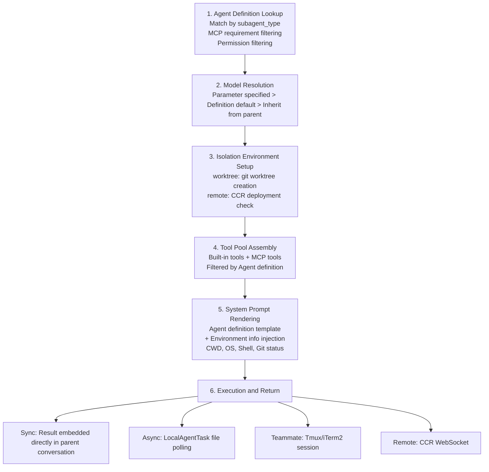

## 4.6 BashTool Deep Dive

BashTool is the most complex tool in the entire tool system—its implementation is spread across 18 source files (the `src/tools/BashTool/` directory), covering security validation, permission management, sandbox isolation, command semantic parsing, and multiple other subsystems. This complexity stems from a fundamental contradiction: **Shell is the most powerful tool** (it can do almost anything), but it is also **the most dangerous tool** (a single malicious command can delete the entire filesystem).

BashTool's input Schema:

```typescript
{
  command: string              // Shell command
  timeout?: number             // Timeout (milliseconds)
  description?: string         // Activity description (UI display)
  run_in_background?: boolean  // Async execution
  dangerouslyDisableSandbox?: boolean  // Disable sandbox
}
```

### 4.6.1 Security Validation (bashSecurity.ts)

Security validation is BashTool's first line of defense, executed before permission checks. `bashSecurity.ts` is approximately 2600 lines of code, implementing **23 named security checks** (mapped to numeric IDs via the `BASH_SECURITY_CHECK_IDS` constant, avoiding recording mutable strings in telemetry logs):

```typescript
const BASH_SECURITY_CHECK_IDS = {
  INCOMPLETE_COMMANDS: 1,        // Incomplete command fragments
  JQ_SYSTEM_FUNCTION: 2,        // jq's system() function calls
  JQ_FILE_ARGUMENTS: 3,         // jq file argument restrictions
  OBFUSCATED_FLAGS: 4,          // Obfuscated command flags
  SHELL_METACHARACTERS: 5,      // Shell metacharacters
  DANGEROUS_VARIABLES: 6,       // Dangerous variables in pipes/redirections
  NEWLINES: 7,                  // Newlines in unquoted content
  DANGEROUS_PATTERNS_COMMAND_SUBSTITUTION: 8,  // Command substitution
  DANGEROUS_PATTERNS_INPUT_REDIRECTION: 9,     // Input redirection
  DANGEROUS_PATTERNS_OUTPUT_REDIRECTION: 10,   // Output redirection
  IFS_INJECTION: 11,            // IFS variable injection
  GIT_COMMIT_SUBSTITUTION: 12,  // Substitution in git commit
  PROC_ENVIRON_ACCESS: 13,      // /proc/self/environ access
  MALFORMED_TOKEN_INJECTION: 14, // Malformed token injection
  BACKSLASH_ESCAPED_WHITESPACE: 15, // Backslash-escaped whitespace
  BRACE_EXPANSION: 16,          // Brace expansion
  CONTROL_CHARACTERS: 17,       // Control characters
  UNICODE_WHITESPACE: 18,       // Unicode whitespace homoglyphs
  MID_WORD_HASH: 19,            // Mid-word # comment attack
  ZSH_DANGEROUS_COMMANDS: 20,   // Zsh dangerous commands
```
  BACKSLASH_ESCAPED_OPERATORS: 21, // Backslash-escaped operators
  COMMENT_QUOTE_DESYNC: 22,     // Comment-quote desync attack
  QUOTED_NEWLINE: 23,           // Newline within quotes
\}
```

**Command substitution blocking** is the most critical defense. The `COMMAND_SUBSTITUTION_PATTERNS` array contains 12 patterns, covering all known forms of command substitution:

```typescript
const COMMAND_SUBSTITUTION_PATTERNS = [
  { pattern: /<\(/, message: 'process substitution <()' },
  { pattern: />\(/, message: 'process substitution >()' },
  { pattern: /=\(/, message: 'Zsh process substitution =()' },
  // Zsh EQUALS expansion: =curl evil.com → /usr/bin/curl evil.com
  // Bypasses Bash(curl:*) deny rule because the parser sees the base command as =curl rather than curl
  { pattern: /(?:^|[\s;&|])=[a-zA-Z_]/, message: 'Zsh equals expansion (=cmd)' },
  { pattern: /\$\(/, message: '$() command substitution' },
  { pattern: /\$\{/, message: '${} parameter substitution' },
  { pattern: /\$\[/, message: '$[] legacy arithmetic expansion' },
  { pattern: /~\[/, message: 'Zsh-style parameter expansion' },
  { pattern: /\(e:/, message: 'Zsh-style glob qualifiers' },
  { pattern: /\(\+/, message: 'Zsh glob qualifier with command execution' },
  { pattern: /\}\s*always\s*\{/, message: 'Zsh always block (try/always construct)' },
  { pattern: /<#/, message: 'PowerShell comment syntax' },  // Defense in depth
]
```

Several of these patterns are particularly noteworthy:

- **Zsh equals expansion** (`=curl`): In Zsh, `=cmd` expands to the full path of `cmd` (equivalent to `$(which cmd)`). An attacker can use `=curl evil.com` to bypass the `Bash(curl:*)` deny rule, because the permission system resolves the base command as `=curl` rather than `curl`.
- **Zsh glob qualifiers** (`(e:` and `(+`): Zsh's glob qualifiers can execute arbitrary code during filename matching — this is an often-overlooked code execution vector.
- **PowerShell comment syntax** (`<#`): Although Claude Code does not execute commands in PowerShell, this is included as defense in depth, in case a PowerShell execution path is introduced in the future.

To avoid false positives (e.g., incorrectly detecting command substitution in string literals like `echo '$(...)'`), the security validator uses the `extractQuotedContent()` function to first strip content within quotes. This function iterates character by character, tracking single-quote/double-quote state, and produces three variants: `withDoubleQuotes` (strips only content within single quotes), `fullyUnquoted` (strips all quoted content), and `unquotedKeepQuoteChars` (content stripped but quote characters themselves retained, used for detecting quote adjacency).

**Zsh dangerous commands** also have dedicated defenses. The `ZSH_DANGEROUS_COMMANDS` set contains 18 commands:

- **`zmodload`**: The Zsh module loader, which is an entry point for multiple attacks — `zsh/mapfile` (invisible file I/O via array assignment), `zsh/zpty` (pseudo-terminal command execution), `zsh/net/tcp` (`ztcp` network data exfiltration), `zsh/files` (built-in `rm/mv/ln/chmod` bypassing binary checks)
- **`emulate -c`**: A construct equivalent to `eval` that can execute arbitrary code
- **`sysopen`/`sysread`/`syswrite`/`sysseek`**: Fine-grained file descriptor operations (from the `zsh/system` module)
- **`zf_*` built-in commands** (`zf_rm`, `zf_mv`, `zf_ln`, `zf_chmod`, etc.): Built-in file operations provided by the `zsh/files` module, bypassing permission checks on external binaries

**Tree-sitter AST parsing** provides structured command analysis capabilities. When tree-sitter-bash is available, `parseCommandRaw()` parses the command into an AST, and `parseForSecurityFromAst()` extracts `SimpleCommand[]` (a list of simple commands with quotes resolved) from it. If the AST analysis finds the command structure is too complex (containing command substitutions, expansions, complex control flow), it returns `'too-complex'`, triggering `ask` behavior — that is, requesting user confirmation. When tree-sitter is unavailable (e.g., on certain platforms), the system falls back to a legacy regex-based parsing path. The `checkSemantics()` function performs semantic validation at the AST level, checking for commands that are syntactically valid but semantically dangerous.

### 4.6.2 Multi-layer Permission System (bashPermissions.ts)

`bashToolHasPermission()` (`src/tools/BashTool/bashPermissions.ts`) is the most complex permission function in the entire codebase, implementing the following layered processing:

**Step 1: AST Parsing and Complexity Assessment**

First, it attempts to parse the command using tree-sitter. The parsing result falls into three categories:
- `'simple'`: The command structure is simple and can be checked sub-command by sub-command
- `'too-complex'`: Contains complex structures (nested substitutions, pipe chains, etc.) where safety cannot be guaranteed — skips detailed analysis and goes directly to the `ask` path
- `'parse-unavailable'`: tree-sitter is unavailable, falls back to the legacy `splitCommand_DEPRECATED()` regex splitting

**Step 2: Sub-command Splitting and Upper Bound Protection**

Compound commands (`cmd1 && cmd2 || cmd3`) are split into a sub-command array, with each sub-command checked independently. To prevent CPU exhaustion (maliciously crafted compound commands could cause regex splitting to produce an exponentially growing number of sub-commands), there is a hard upper limit on the split count:

```typescript
export const MAX_SUBCOMMANDS_FOR_SECURITY_CHECK = 50
```

When exceeding 50 sub-commands, the system abandons per-command analysis and directly returns `ask` — this is a safe fallback: anything that cannot be proven safe is left for the user to decide.

**Step 3: Safe Environment Variable Stripping**

Before matching permission rules, safe environment variable assignments preceding the command are stripped. For example, `NODE_ENV=prod` in `NODE_ENV=prod npm run build` is removed, leaving `npm run build` for rule matching. The `SAFE_ENV_VARS` set contains 32 known-safe variables (Go series like `GOEXPERIMENT`/`GOOS`/`GOARCH`, Rust series like `RUST_BACKTRACE`/`RUST_LOG`, Node's `NODE_ENV`, locale variables like `LANG`/`LC_ALL`, etc.); internal builds add an `ANT_ONLY_SAFE_ENV_VARS` extension set (active when `USER_TYPE === 'ant'`).

Why distinguish between safe and unsafe environment variables? Because `MY_VAR=val command` where `MY_VAR` could affect command behavior (e.g., `LD_PRELOAD=evil.so curl`) cannot be unconditionally stripped. However, `NODE_ENV=prod` is harmless, and if not stripped, a user-configured `Bash(npm run:*)` rule would fail to match `NODE_ENV=prod npm run build`.

**Step 4: Prefix Extraction and Rule Suggestions**

`getSimpleCommandPrefix()` extracts a stable 2-word prefix from the command for reusable permission rules. For example:

| Command | Extracted prefix | Suggested rule |
|---------|-----------------|----------------|
| `git commit -m "fix typo"` | `git commit` | `Bash(git commit:*)` |
| `npm run build` | `npm run` | `Bash(npm run:*)` |
| `NODE_ENV=prod npm run build` | `npm run` (after stripping safe env vars) | `Bash(npm run:*)` |
| `ls -la` | `null` (`-la` is a flag, not a subcommand) | Only provides exact match rule |
| `bash -c "rm -rf /"` | `null` (`bash` is blocked from generating prefix rules) | No prefix rule suggested |

Note the last line: bare shell prefixes like `bash`, `sh`, `sudo`, `env` are explicitly blocked from generating prefix rules, because `Bash(bash:*)` is equivalent to `Bash(*)` — this would accidentally allow all commands.

**Step 5: Compound Command Permission Aggregation**

For compound commands, all sub-commands must independently pass permission checks. If any sub-command is denied, the whole command is denied; if any sub-command requires `ask`, the whole command requires `ask`. The number of suggested rules has an upper limit:

```typescript
export const MAX_SUGGESTED_RULES_FOR_COMPOUND = 5
```

When exceeding 5 rules, the permission prompt degrades to a "similar commands" description rather than listing each one. This avoids the confusing experience of a user saving 10+ rules from a single `&&` chain.

### 4.6.3 Sandbox Mode (shouldUseSandbox.ts)

BashTool supports executing commands in a sandbox, restricting file system access, network, and process capabilities. The sandbox decision logic (`shouldUseSandbox()`) returns `false` (no sandbox) under the following conditions:

1. `SandboxManager.isSandboxingEnabled()` returns `false` (globally disabled)
2. The command has `dangerouslyDisableSandbox: true` set and the policy allows bypass
3. The command matches the user-configured `excludedCommands` exclusion list

Platform support: macOS uses `sandbox-exec` profiles, Linux uses bubblewrap (bwrap) to provide landlock-like restrictions. Excluded command processing involves compound command splitting, environment variable stripping, and wildcard matching — sharing the same command parsing infrastructure as the permission system.

### 4.6.4 sed Validation (sedValidation.ts)

The `sed` command has a dedicated validation layer to prevent it from being used as a backdoor to bypass FileEditTool permissions. Validation uses a **whitelist strategy** — only known-safe patterns are automatically approved:

**Safe pattern 1: Pure line printing** (must have `-n` flag)
- `sed -n '5p'` (print line 5)
- `sed -n '1,10p'` (print lines 1-10)
- `sed -n '1p;5p;10p'` (print multiple specified lines)

**Safe pattern 2: Substitution expressions**
- `sed 's/foo/bar/g'` (substitution operation, but flags only allow `g`/`p`/`i`/`I`/`m`/`M`/`1-9`)

**Blocked dangerous operations**:
- `w`/`W` flags (file writing)
- `e`/`E` flags (command execution — `sed` can execute shell commands via the `e` flag!)
- `!` (address negation)
- `\{\}` blocks (sed script blocks)
- Non-ASCII characters (Unicode homoglyph detection)
- Backslash delimiter `s\` (potential parsing confusion)

When a sed command includes file arguments (e.g., `sed -i 's/foo/bar/' file.txt`), the `-i` (in-place editing) flag must be explicitly present, and file write permission is required. sed in pure read mode is not allowed to operate on file arguments.

### 4.6.5 Path Validation and Destructive Command Warnings

**Path validation** (`pathValidation.ts`) extracts path arguments from commands involving file paths (`cd`, `rm`, `mv`, `cp`, `cat`, `grep`, etc. — approximately 36 command categories, i.e. the keys of `PATH_EXTRACTORS`) and validates whether they are within the allowed working directory scope. Different commands have different path extraction rules — `cd` concatenates all arguments into one path, `find` collects paths before the first non-glob flag, `grep`/`rg` collect file paths after parsing the pattern argument. All commands respect the POSIX `--` separator (all arguments after it are positional arguments, not flags).

For dangerous deletion paths (`rm -rf /`, `rm -rf ~`), regardless of whatever saved rules the user has, explicit approval is always required — this is a non-overridable security hard limit.

**Destructive command warnings** (`destructiveCommandWarning.ts`) is a purely informational layer — it does not affect permission decisions, only displays additional warnings in the permission prompt. Detected patterns include:

| Category | Pattern | Warning message |
|----------|---------|-----------------|
| Git data loss | `git reset --hard` | "may discard uncommitted changes" |
| Git history overwrite | `git push --force` / `-f` | "may overwrite remote history" |
| Git safety bypass | `--no-verify` | "may skip safety hooks" |
| Git commit overwrite | `git commit --amend` | "may rewrite the last commit" |
| Recursive force delete | `rm -rf` | "may recursively force-remove files" |
| Database | `DROP TABLE` / `TRUNCATE` | "may drop or truncate database objects" |
| Database | `DELETE FROM table;` (no WHERE) | "may delete all rows" |
| Infrastructure | `kubectl delete` | "may delete Kubernetes resources" |
| Infrastructure | `terraform destroy` | "may destroy Terraform infrastructure" |

### 4.6.6 Background Task Management

BashTool supports two background execution modes:

**Explicit backgrounding**: The model sets `run_in_background: true` in the parameters, and the command executes asynchronously as a `LocalShellTask` from the start. Output is streamed to the task output file, and the model can poll for results via `TaskGetTool`.

**Automatic backgrounding**: In assistant mode (long-running conversations), blocking commands are automatically moved to background execution after **15 seconds** (`ASSISTANT_BLOCKING_BUDGET_MS = 15_000`). The system calls `backgroundExistingForegroundTask()` to move the foreground task to the background, freeing the main loop to continue processing. This prevents a long-running `npm install` or `make build` from blocking the entire conversation.

### 4.6.7 Command Semantics (commandSemantics.ts)

BashTool doesn't just mechanically check exit codes — it understands the **semantic conventions** of different commands. In standard Unix convention, exit code 0 = success, non-0 = failure, but this is not universal:

| Command | Exit code 0 | Exit code 1 | Exit code 2+ |
|---------|------------|------------|-------------|
| `grep` | Found match | **No match** (not an error) | Actual error |
| `rg` | Found match | **No match** (not an error) | Actual error |
| `diff` | No differences | **Has differences** (not an error) | Actual error |
| `test` / `[` | Condition true | **Condition false** (not an error) | Syntax error |
| `find` | Success | Partial success (some directories inaccessible) | Actual error |

`interpretCommandResult()` looks up exit codes by command name to interpret them, preventing the model from misinterpreting `grep`'s "no match" as an execution failure and initiating unnecessary retries.

### 4.6.8 Command Classification (UI Display)

BashTool also maintains a command classification system for collapsible display in the UI. The `isSearchOrReadBashCommand()` function analyzes each part of a pipeline, and only marks it as collapsible when **all parts** are search/read commands:

| Category | Commands | UI behavior |
|----------|----------|-------------|
| Search | find, grep, rg, ag, ack, locate, which, whereis | Collapsed as "Searched..." |
| Read | cat, head, tail, less, more, wc, stat, file, jq, awk, cut, sort, uniq, tr | Collapsed as "Read..." |
| List | ls, tree, du | Collapsed as "Listed..." |
| Semantically neutral | echo, printf, true, false, `:` | Skipped (does not affect pipeline classification) |

Semantically neutral commands are skipped in pipeline classification — for example, `ls dir && echo "---" && ls dir2` is still considered a read operation (rather than becoming non-collapsible because of `echo`).

## 4.7 AgentTool Deep Dive

AgentTool is responsible for spawning sub-Agents and is the core of the multi-Agent architecture:

```typescript
{
  description: string          // 3-5 word task description
  prompt: string               // Sub-Agent task instructions
  subagent_type?: string       // Specialized Agent type
  model?: 'sonnet' | 'opus' | 'haiku'
  run_in_background?: boolean  // Async execution
  name?: string                // Addressable teammate name
  isolation?: 'worktree' | 'remote'  // Isolation mode
}
```

### Sub-Agent Lifecycle

A sub-Agent goes through 6 stages from creation to execution, each with precise decision logic:



**Stage 1 - Agent Definition Lookup**: If `subagent_type` is provided, the system matches by type name against predefined Agent definitions (e.g., `coder`, `researcher`). During matching, it also checks whether the MCP services required by the Agent definition are available and whether the current permission mode allows it. When no definition is matched, a generic default configuration is used.

**Stage 2 - Model Resolution**: Model selection follows a three-level priority chain. The `model` field in the call parameters has the highest priority; next is the default model in the Agent definition; finally, it inherits the model currently used by the parent Agent. This design allows cost-sensitive tasks to use `haiku` while complex tasks escalate to `opus`.

**Stage 3 - Isolation Environment Setup**: The `worktree` mode creates an independent working tree via `git worktree add`, allowing the sub-Agent to work in an isolated file system view to avoid file editing conflicts with the parent Agent. The `remote` mode checks CCR (Claude Code Remote) environment availability and prepares for remote deployment.

**Stage 4 - Tool Pool Assembly**: The sub-Agent's tool pool is not necessarily the same as the parent Agent's. Agent definitions can specify tool whitelists/blacklists — for example, the `researcher` type might only receive read-only tools. MCP tools are filtered according to the Agent definition's requirements.

**Stage 5 - System Prompt Rendering**: Merges the prompt template from the Agent definition with environment information. Injected content includes: current working directory, operating system type, shell type, Git repository status, etc. This ensures the sub-Agent has accurate awareness of the execution environment.

**Stage 6 - Execution and Return**: Divided into four modes depending on the invocation method:
- **Synchronous**: The sub-Agent executes directly within the current process, with the result embedded in the parent conversation's tool_result
- **Asynchronous**: Creates a `LocalAgentTask`, the sub-Agent writes results to a temporary file, and the parent Agent polls via `TaskGetTool`
- **Teammate**: Creates a new terminal session via Tmux or iTerm2, with the sub-Agent running as an independent process in parallel, communicable via `SendMessageTool`
- **Remote**: Creates a remote execution environment via CCR, returns a WebSocket URL, with results sent back asynchronously

## 4.8 Large Result Handling Mechanism

When tool output exceeds `maxResultSizeChars`, Claude Code does not inject the entire content into the conversation context:
