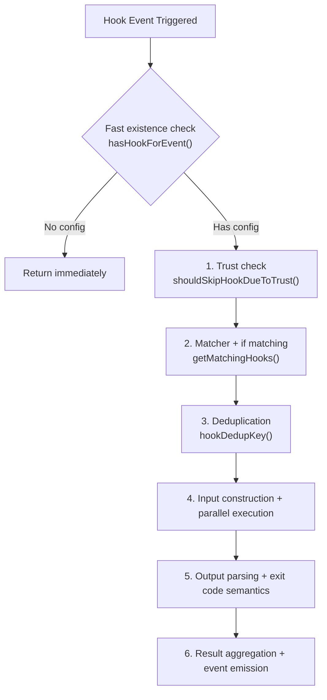

# Chapter 7: Hooks and Extensibility

> Hooks are Claude Code's event-driven extension mechanism — injecting custom logic into key lifecycle points without modifying the source code.

Imagine these scenarios: automatically running lint checks every time Claude executes `git push`; running tests in the background after every file edit and only interrupting Claude when a test fails; or sending all tool calls to your company's audit system. These are all typical use cases for Hooks.

The core design philosophy of Hooks is: **every key point in the Agent Loop exposes an event, and external code can listen to these events and inject behavior**. This shares the same design philosophy as Git Hooks (pre-commit, post-merge) and Webpack Plugins, but the problem Claude Code faces is more complex — it needs to handle permission control, long-running async tasks, multi-Agent coordination, and other scenarios, making the Hook system design far more complex than traditional "before/after interceptors."

**Chapter Roadmap:**

- **7.1 Event Overview**: 27 Hook event types — categorization and trigger timing
- **7.2 Hook Types**: 4 configurable Hooks (Command/Prompt/Agent/HTTP) + 2 programmatic Hooks (Callback/Function)
- **7.3 Matcher**: Three-level matching mechanism and cooperation with `if` conditions
- **7.4 Execution Engine**: 6-stage pipeline — trust check, matching, deduplication, parallel execution, output parsing, result aggregation
- **7.5–7.9 Advanced Topics**: JSON output protocol, trust model and security, PermissionRequest deep dive, Stop Hook, practical patterns

## 7.1 Hook Event Overview

### Why These 27 Events?

Claude Code's Hook event design follows one principle: **cover all key decision points across the complete Agent Loop lifecycle**. Looking back at the Agent Loop from [Chapter 2](/lib/09-harness/how-claude-code-works/en-docs-02-agent-loop), a complete interaction involves: user input → model reasoning → tool call (permission check → execution → result) → model decides whether to continue → final output. Each step may require external intervention, so each step needs a corresponding Hook event.

The source code defines the complete event list (`src/entrypoints/sdk/coreTypes.ts`):

```typescript
export const HOOK_EVENTS = [
  'PreToolUse', 'PostToolUse', 'PostToolUseFailure',
  'Notification', 'UserPromptSubmit', 'SessionStart', 'SessionEnd',
  'Stop', 'StopFailure', 'SubagentStart', 'SubagentStop',
  'PreCompact', 'PostCompact', 'PermissionRequest', 'PermissionDenied',
  'Setup', 'TeammateIdle', 'TaskCreated', 'TaskCompleted',
  'Elicitation', 'ElicitationResult', 'ConfigChange',
  'WorktreeCreate', 'WorktreeRemove', 'InstructionsLoaded',
  'CwdChanged', 'FileChanged'
] as const
```

Categorized by function:

| Category | Event | Trigger Timing | Matcher Value |
|----------|-------|---------------|---------------|
| **Tool Lifecycle** | PreToolUse | Before tool execution | `tool_name` (e.g., `Write`, `Bash`) |
| | PostToolUse | After successful tool execution | `tool_name` |
| | PostToolUseFailure | After tool execution failure | `tool_name` |
| **Permission System** | PermissionRequest | At permission determination | `tool_name` |
| | PermissionDenied | When auto-classifier rejects | `tool_name` |
| **Notification** | Notification | System notification triggered | `notification_type` |
| **Session Lifecycle** | SessionStart | Session starts | `source` (`startup`/`resume`/`clear`/`compact`) |
| | SessionEnd | Session ends | `reason` |
| | UserPromptSubmit | When user submits input | None |
| **Model Response** | Stop | When model decides to stop | None |
| | StopFailure | When API call fails | `error` |
| **Agent Coordination** | SubagentStart | Sub-Agent starts | `agent_type` |
| | SubagentStop | Sub-Agent stops | `agent_type` |
| | TeammateIdle | Collaborative Agent idle | None |
| **Task System** | TaskCreated | Task created | None |
| | TaskCompleted | Task completed | None |
| **Compaction** | PreCompact | Before context compaction | `trigger` (`manual`/`auto`) |
| | PostCompact | After context compaction | `trigger` |
| **MCP Interaction** | Elicitation | MCP user query | `mcp_server_name` |
| | ElicitationResult | Query result | `mcp_server_name` |
| **Environment Changes** | ConfigChange | Config file changed | `source` |
| | CwdChanged | Working directory changed | None |
| | FileChanged | Watched file changed | Filename (`basename`) |
| | InstructionsLoaded | Instructions file loaded | `load_reason` |
| **Workspace** | Setup | Repository initialization/maintenance | `trigger` (`init`/`maintenance`) |
| | WorktreeCreate | Worktree created | None |
| | WorktreeRemove | Worktree removed | None |

**The fourth column "Matcher Value" in the table is important** — it tells you what value the system actually compares against when you write `matcher: "Write"` in the configuration. For tool-related events, the matcher matches the tool name; for SessionStart, it matches the trigger source; for Notification, it matches the notification type. This mapping is defined in a switch statement within `getMatchingHooks()`.

### Why So Many Events?

At first glance, 27 events may seem excessive, but each event has a clear use case:

- **Tool before/after events** (PreToolUse/PostToolUse): The most core extension points. Pre-hooks can block execution or modify input; post-hooks can perform checks or inject context.
- **Session events** (SessionStart/SessionEnd): Initialize environments, clean up resources, report audit logs.
- **Environment change events** (FileChanged/CwdChanged/ConfigChange): Respond to external changes, enabling workflows like "auto-lint after file save."
- **Agent coordination events** (SubagentStart/SubagentStop/TeammateIdle): Inject coordination logic in multi-Agent scenarios.

## 7.2 Hook Types

Claude Code supports four configurable Hook types and two programmatic Hook types. The first four can be written in `settings.json`, while the latter two are only used internally within the SDK/plugins.

| Type | Persistence | Execution Method | Applicable Scenarios |
|------|------------|-----------------|---------------------|
| **Command** | settings.json | Spawns a shell subprocess, communicates via stdin/stdout | Logging, lint, CI triggers — covers the vast majority of scenarios |
| **Prompt** | settings.json | Single-turn LLM call, returns ok/not-ok | Safety checks or code reviews requiring semantic understanding |
| **Agent** | settings.json | Multi-turn Agent Loop, can call tools to verify | Complex verification workflows (running tests, type checking) |
| **HTTP** | settings.json | POST request to an external endpoint | Webhook notifications, audit logging, enterprise compliance |
| **Callback** | In-memory only (SDK/plugin registration) | Direct in-process async function call | Internal instrumentation, file tracking, commit attribution |
| **Function** | In-memory only (session-level registration) | In-process call, isolated by sessionId | Structured output enforcement for Agent Hooks |

Before diving into each type, here is a minimal Hook configuration example to give you an intuitive sense of the overall format:

```json
// ~/.claude/settings.json
{
  "hooks": {
    "PreToolUse": [
      {
        "matcher": "Bash",
        "hooks": [
          {
            "type": "command",
            "command": "echo 'About to run a Bash command'"
          }
        ]
      }
    ]
  }
}
```

The structure is straightforward: the `hooks` object's keys are event names (e.g., `PreToolUse`), and values are arrays where each element contains a `matcher` (optional match filter) and `hooks` (the list of Hooks to execute for that match).

### 1. Command Hook

**The most commonly used type.** Executes a shell command, receives JSON input via stdin, returns JSON results via stdout, and expresses success/failure/blocking via exit codes.

```typescript
{
  type: 'command',
  command: string,           // Shell command
  if?: string,               // Secondary filtering using permission rule syntax
  shell?: 'bash' | 'powershell',  // Shell type, defaults to bash
  timeout?: number,          // Timeout (seconds)
  statusMessage?: string,    // Spinner message during execution
  once?: boolean,            // Auto-remove after one execution
  async?: boolean,           // Async execution, non-blocking
  asyncRewake?: boolean      // Async execution + wake model on exit code 2
}
```

**How it works (`execCommandHook`):**

1. **Process creation**: Calls `spawn()` to create a child process. The shell selection logic is: if `shell: 'powershell'` is specified, use `pwsh` (`-NoProfile -NonInteractive`); otherwise run `spawn(cmd, [], \{ shell: true \})` — which is `/bin/sh` on Unix and Git Bash (`findGitBashPath()`) on Windows, **not** the user's `$SHELL` (the "$SHELL" wording in the schema description does not match the actual spawn implementation).
2. **Input passing**: Serializes the Hook's structured input (including session_id, tool_name, tool_input, etc.) as JSON, passing it to the child process via **stdin**. This means Hook scripts can get full context information by reading stdin.
3. **Environment variables**: The child process inherits current environment variables. For plugin Hooks, `CLAUDE_PLUGIN_ROOT` (plugin root directory) and `CLAUDE_PLUGIN_DATA` (plugin data directory) are additionally injected, and `$\{CLAUDE_PLUGIN_ROOT\}` placeholders in commands are also replaced.
4. **Output collection**: Waits for process exit, collects stdout and stderr.
5. **Result parsing**: Determines Hook result based on exit code and stdout content (see Section 7.4 for details).

**Applicable scenarios**: Logging, file syncing, CI/CD triggering, shell script integration, custom linters.

### 2. Prompt Hook

Calls an LLM for semantic evaluation. Suitable for judgment scenarios that require "understanding" rather than simple pattern matching.

```typescript
{
  type: 'prompt',
  prompt: string,            // Prompt ($ARGUMENTS placeholder replaced with JSON input)
  if?: string,               // Permission rule syntax filtering
  model?: string,            // Specify model (defaults to a small fast model, e.g., Haiku)
  timeout?: number,          // Timeout (seconds, default 30)
  statusMessage?: string,
  once?: boolean
}
```

**How it works (`execPromptHook`):**

1. Replaces the `$ARGUMENTS` placeholder with the Hook input's JSON string
2. Builds a message array (optionally including conversation history), calls `queryModelWithoutStreaming` (single-turn, non-streaming)
3. The system prompt requires the model to return `\{"ok": true\}` or `\{"ok": false, "reason": "..."\}`
4. Parses the model response, `ok: false` maps to a blocking error

**Key design detail**: Prompt Hook directly calls `createUserMessage` instead of going through `processUserInput` — because the latter would trigger the `UserPromptSubmit` Hook, causing infinite recursion.

**Applicable scenarios**: Semantic safety checks ("Could this SQL query delete data?"), code review ("Does this change comply with project standards?").

### 3. Agent Hook

Similar to Prompt Hook, but runs in **multi-turn Agent mode** — it can call tools to verify conditions, not just "think about it."

```typescript
{
  type: 'agent',
  prompt: string,            // Verification instructions ($ARGUMENTS placeholder)
  if?: string,
  model?: string,            // Defaults to Haiku
  timeout?: number,          // Timeout (seconds, default 60)
  statusMessage?: string,
  once?: boolean
}
```

**Key differences from Prompt Hook:**

| | Prompt Hook | Agent Hook |
|--|-------------|------------|
| Invocation method | `queryModelWithoutStreaming` (single-turn) | `query` (multi-turn Agent Loop) |
| Can call tools | No (LLM reasoning only) | Yes (can read files, run commands to verify) |
| Default timeout | 30 seconds | 60 seconds |
| Output format | Forced `\{ok, reason\}` JSON | Returns `\{ok, reason\}` via registered structured output tool |

Agent Hook uses `registerStructuredOutputEnforcement` to register a function Hook, ensuring the Agent must call a structured output tool to return results at the end. This is a "Hook nesting Hook" design — the Agent Hook itself registers temporary Function Hooks during execution to constrain Agent behavior.

**Applicable scenarios**: Complex verification workflows — for example, "run tests and confirm all pass," "check if the edited file passes type checking."

### 4. HTTP Hook

Sends POST requests to external services, suitable for integration with enterprise infrastructure.

```typescript
{
  type: 'http',
  url: string,               // POST endpoint
  if?: string,
  timeout?: number,          // Timeout (seconds, default 10 minutes)
  headers?: Record<string, string>,  // Supports $VAR environment variable interpolation
  allowedEnvVars?: string[], // Whitelist of env vars allowed for interpolation
  statusMessage?: string,
  once?: boolean
}
```

**How it works (`execHttpHook`):**

1. **URL whitelist check**: If an `allowedHttpHookUrls` policy is configured, first checks whether the URL matches an allowed pattern. Non-matching URLs are directly rejected without sending any request.
2. **Header environment variable interpolation**: Iterates through headers, matching `$VAR_NAME` or `${VAR_NAME\}` patterns. **Only variables listed in `allowedEnvVars` will be substituted**; other variables are replaced with empty strings. This prevents malicious Hooks in project-level `.claude/settings.json` from stealing sensitive variables like `$HOME` or `$AWS_SECRET_ACCESS_KEY`.
3. **CRLF injection protection**: After interpolation, header values have `\r`, `\n`, and `\x00` characters stripped, preventing malicious environment variables from injecting additional HTTP headers.
4. **Proxy support**: Automatically detects sandbox proxies and environment variable proxies (`HTTP_PROXY`/`HTTPS_PROXY`), sending requests through the proxy.
5. **SSRF protection**: When not going through a proxy, uses `ssrfGuardedLookup` to prevent requests from reaching internal network addresses.
6. **Response parsing**: HTTP Hooks **must return JSON** (unlike Command Hooks, which can return plain text). An empty body is treated as `\{\}` (success with no special directives).

**Important limitation**: **HTTP Hooks do not support SessionStart and Setup events.** The reason is that in headless mode, the sandbox's structuredInput consumer has not started when these two events trigger, causing HTTP requests to deadlock.

**Applicable scenarios**: Webhook notifications, audit log reporting, third-party approval systems, compliance checks.

### 5. Callback Hook — SDK/Plugin Only

Programmatic functions that execute directly within the process, without going through spawn/HTTP or other I/O operations.

```typescript
{
  type: 'callback',
  callback: async (input, toolUseID, signal, index, context) => HookJSONOutput,
  timeout?: number,
  internal?: boolean  // Marks as internal Hook (enables fast path optimization)
}
```

**Why are Callback Hooks extremely fast?** Claude Code has a fast path optimization in `executeHooks` targeting internal Hooks:

```typescript
// src/utils/hooks.ts
// isInternalHook(h): h.hook.type === 'callback' && h.hook.internal === true
// As soon as any non-internal Hook is present (a regular callback, function,
// command…), userHooks.length > 0, and execution takes the regular path.
const userHooks = matchingHooks.filter(h => !isInternalHook(h))
if (userHooks.length === 0) {
  // Fast path: every matching Hook is an internal: true callback,
  // skip JSON serialization, AbortSignal creation, progress events, result processing
  for (const [i, { hook }] of matchingHooks.entries()) {
    if (hook.type === 'callback') {
      await hook.callback(hookInput, toolUseID, signal, i, context)
    }
  }
  return  // Does not go through the regular processHookJSONOutput flow
}
```

This optimization reduces internal Hook overhead from ~6µs to ~1.8µs (-70%). Note the fast path only fires when **every matching Hook is an `internal: true` callback** (built-in probes like file access tracking and commit attribution) — these trigger on every tool call, so the cumulative difference is significant. A single ordinary (non-internal) SDK callback or function Hook is enough to send the whole batch down the regular path.

### 7. Function Hook — Session-Scoped Only

Similar to Callback, but scoped to a specific session, preventing cross-Agent leakage.

```typescript
{
  type: 'function',
  id?: string,
  callback: (messages: Message[], signal?: AbortSignal) => boolean | Promise<boolean>,
  errorMessage: string,      // Error displayed when callback returns false
  timeout?: number,
  statusMessage?: string
}
```

**Primary use**: Structured output enforcement for Agent Hooks (ensuring the Agent must return results through a specific tool). Registered via `addFunctionHook()`, removed via `removeFunctionHook()`, isolated by `sessionId` — this ensures verification Agent's function Hooks don't leak into the main Agent.

### Common Field Descriptions

Several fields appear across multiple Hook types and deserve separate explanation:

**`if` condition**: This is a more granular filter than `matcher`. Matcher matches tool names (e.g., "Bash"), while `if` uses permission rule syntax to match the tool's specific input (e.g., `"Bash(git *)"` — only triggers when the Bash tool executes a git command). The `if` condition is parsed in `prepareIfConditionMatcher`: it calls the tool's `preparePermissionMatcher` to perform pattern matching on tool input, reusing the permission system's matching engine. **`if` can only be evaluated on tool-related events** (PreToolUse, PostToolUse, PostToolUseFailure, PermissionRequest); on other events, a Hook carrying an `if` condition is dropped outright by the `ifFilteredHooks` filter and never runs (in the source, when `ifMatcher` is `undefined` it returns `false`) — rather than the `if` being ignored while the Hook still fires.

**`once` field**: If true, the Hook is automatically removed from configuration after one execution. Suitable for one-time initialization or verification.

**`statusMessage` field**: Custom message displayed in the spinner while the Hook executes. The default shows the command content, but for complex commands or those containing sensitive information, a custom message is more user-friendly.

## 7.3 Matcher

Matcher is the Hook system's routing mechanism — determining whether a Hook should respond to a given event.

### Configuration Format

```typescript
type HookMatcher = {
  matcher?: string,          // Match pattern; matches all if not set
  hooks: HookCommand[]       // List of Hooks to execute on match
}
```

Configuration example:

```json
{
  "hooks": {
    "PreToolUse": [
      {
        "matcher": "Bash",
        "hooks": [{ "type": "command", "command": "echo 'Bash tool used'" }]
      },
      {
        "matcher": "Write|Edit",
        "hooks": [{ "type": "command", "command": "echo 'File modified'" }]
      }
    ]
  }
}
```

### Three Matching Modes

The `matchesPattern()` function implements three levels of matching, attempted in order:

```typescript
// src/utils/hooks.ts
function matchesPattern(matchQuery: string, matcher: string): boolean {
  if (!matcher || matcher === '*') return true

  // 1. Exact match or pipe-delimited (treated as simple pattern if only alphanumeric and |)
  if (/^[a-zA-Z0-9_|]+$/.test(matcher)) {
    if (matcher.includes('|')) {
      // "Write|Edit|Read" → split and exact match each
      return patterns.includes(matchQuery)
    }
    // "Write" → direct exact match
    return matchQuery === matcher
  }

  // 2. Regular expression (when any special characters are present)
  const regex = new RegExp(matcher)
  return regex.test(matchQuery)
}
```

The three modes reflect **progressive complexity**:

| Mode | Example | Use Case |
|------|---------|----------|
| Exact match | `"Write"` | Most common, matches a single tool |
| Pipe-delimited | `"Write\|Edit\|Read"` | Matches multiple tools (OR semantics) |
| Regular expression | `"^Bash.*"` / `"^(Write\|Edit)$"` | Complex pattern matching |

Why not use regex for everything? Because the vast majority of users only need exact matching. The string pattern detection (`/^[a-zA-Z0-9_|]+$/`) ensures simple tool names won't be accidentally parsed as regex — for example, `"Bash"` won't trigger the regex engine.

### Matcher and `if` Condition Cooperation

Matcher and `if` form two layers of filtering:

```
Event triggered
  │
  ▼
Matcher filter: matches tool name/event type (coarse-grained)
  │ No match → skip, don't spawn process
  ▼
if condition filter: matches tool's specific input parameters (fine-grained)
  │ No match → skip, don't spawn process
  ▼
Execute Hook
```

Example:

```json
{
  "matcher": "Bash",
  "hooks": [{
    "type": "command",
    "command": "echo 'git command detected'",
    "if": "Bash(git push*)"
  }]
}
```

The matching process for this configuration:
1. PreToolUse event triggers, tool_name is "Bash" → matcher passes
2. Check `if` condition: `"Bash(git push*)"` → parse permission rule, check if the tool input command matches the `git push*` pattern
3. If the user is executing `git push origin main` → match passes, execute Hook
4. If the user is executing `git status` → match fails, skip

**Performance critical**: Both layers of filtering complete before spawning child processes. If a PreToolUse event triggers 10 Hook configurations but only 2 pass the dual matcher + if filtering, the system will only spawn 2 processes. This is "zero-cost abstraction" — Hooks that don't trigger have absolutely no runtime overhead.

## 7.4 Hook Execution Engine

Key file: `src/utils/hooks.ts` (core scheduling)

Hook execution goes through 6 stages. Below we expand on the implementation details of each stage.



### Stage 0: Fast Existence Check

Before entering the full Hook flow, `hasHookForEvent()` provides a lightweight short-circuit check:

```typescript
// src/utils/hooks.ts
function hasHookForEvent(hookEvent, appState, sessionId): boolean {
  const snap = getHooksConfigFromSnapshot()?.[hookEvent]
  if (snap && snap.length > 0) return true
  const reg = getRegisteredHooks()?.[hookEvent]
  if (reg && reg.length > 0) return true
  if (appState?.sessionHooks.get(sessionId)?.hooks[hookEvent]) return true
  return false
}
```

This check intentionally **over-approximates**: it doesn't check whether the matcher matches, doesn't check the managedOnly policy — it returns true as long as any configuration exists. False positives only mean taking one extra step through the full matching path; false negatives would skip Hooks that should execute, so it's better to over-check than to miss.

The value of this optimization is: **the vast majority of events have no Hooks configured at all**. For a project with no FileChanged Hooks configured, every file change event can short-circuit return in a few microseconds, avoiding the overhead of `createBaseHookInput` (which requires path concatenation) and `getMatchingHooks` (which requires iterating through configurations).

### Stage 1: Trust Check

`shouldSkipHookDueToTrust()` is the safety baseline — **all Hooks require workspace trust**:

```typescript
// src/utils/hooks.ts
export function shouldSkipHookDueToTrust(): boolean {
  const isInteractive = !getIsNonInteractiveSession()
  if (!isInteractive) return false  // Trust is implicit in SDK mode
  const hasTrust = checkHasTrustDialogAccepted()
  return !hasTrust  // true = skip Hook
}
```

**Why so strict?** Hooks read configuration from `.claude/settings.json` and execute arbitrary commands. Without checking trust, a malicious repository could execute code by injecting Hooks into `.claude/settings.json`—as soon as the user clones and opens the repository, the Hooks would run automatically.

**Historical vulnerabilities drove this design**:

1. **SessionEnd Hook leak**: User clones a malicious repository → opens Claude Code → sees the trust dialog → clicks reject → exits. But the SessionEnd Hook executes on exit without checking trust—the malicious Hook still runs.
2. **SubagentStop Hook premature execution**: The sub-Agent completes before the trust dialog appears → the SubagentStop event fires → the Hook executes in an untrusted workspace.

The fix is simple but effective: check trust at the very beginning of `executeHooks`, and all Hooks (without exception) must wait until workspace trust is established before they can execute. The source code comment puts it bluntly:

> *"This centralized check prevents RCE vulnerabilities for all current and future hooks"*

### Stage 2: Matcher Matching and Hook Collection

`getMatchingHooks()` is the most logically complex function in the entire engine. It needs to:

1. **Collect Hook configurations from all sources**: snapshot config + registered SDK/plugin Hooks + session Hooks + function Hooks
2. **Determine matchQuery based on event type**: extract the match value from hookInput via a switch statement
3. **Matcher match filtering**: for each HookMatcher, check whether the matcher matches the matchQuery
4. **`if` condition filtering**: use `prepareIfConditionMatcher` to generate a matching closure and check each one
5. **Special restrictions**: HTTP Hooks are filtered out in SessionStart/Setup events

**matchQuery extraction logic** (switch in source code `getMatchingHooks`):

```typescript
switch (hookInput.hook_event_name) {
  case 'PreToolUse':
  case 'PostToolUse':
  case 'PostToolUseFailure':
  case 'PermissionRequest':
  case 'PermissionDenied':
    matchQuery = hookInput.tool_name        // tool name
    break
  case 'SessionStart':
    matchQuery = hookInput.source           // "startup" | "resume" | "clear" | "compact"
    break
  case 'Setup':
    matchQuery = hookInput.trigger          // "init" | "maintenance"
    break
  case 'Notification':
    matchQuery = hookInput.notification_type // notification type
    break
  case 'SubagentStart':
  case 'SubagentStop':
    matchQuery = hookInput.agent_type       // Agent type
    break
  case 'FileChanged':
    matchQuery = basename(hookInput.file_path) // filename (without path)
    break
  // ...
}
```

Note that `FileChanged` uses `basename`—it only matches the filename, not the path. This means `matcher: ".env"` will match `.env` files in any directory.

### Stage 3: Hook Deduplication

When Hook configurations appear in multiple sources (for example, both user settings and project settings define the same Hook), the deduplication mechanism ensures they are not executed repeatedly.

```typescript
// src/utils/hooks.ts
function hookDedupKey(m: MatchedHook, payload: string): string {
  return `${m.pluginRoot ?? m.skillRoot ?? ''}\0${payload}`
}
```

Core deduplication design:

- **Same-source Hook deduplication**: Hooks from settings (without pluginRoot/skillRoot) share an empty string prefix; identical commands keep only the last one merged
- **Cross-source Hooks are not deduplicated**: Plugin A and Plugin B may both have `$\{CLAUDE_PLUGIN_ROOT\}/hook.sh`, which expand to different files. The dedup key includes pluginRoot, ensuring they are not incorrectly merged
- **Different `if` conditions are not deduplicated**: even if the commands are identical, different `if` conditions make them different Hooks

**Last-wins semantics**: `new Map(entries)` keeps the last entry when keys conflict. For settings Hooks, this means later-merged configurations (e.g., project settings) override earlier-merged ones (e.g., user settings).

**Callback and Function Hooks skip deduplication**—each callback function is unique, and deduplication would be meaningless.

### Stage 4: Input Construction and Parallel Execution

**Input construction**: `createBaseHookInput()` builds the base input shared by all Hooks:

```typescript
{
  session_id: string,       // session ID
  transcript_path: string,  // transcript file path
  cwd: string,              // current working directory
  permission_mode?: string, // permission mode
  agent_id?: string,        // sub-Agent ID
  agent_type?: string       // Agent type
}
```

`agent_type` has a noteworthy priority logic: the sub-Agent's type (from toolUseContext) takes precedence over the main thread's `--agent` flag. This allows Hooks to distinguish between "main Agent tool calls" and "sub-Agent tool calls" by checking whether `agent_id` is present.

**Lazy serialization of JSON input**: Hook input is serialized only once and shared via closure with all Hooks in the same batch:

```typescript
let jsonInputResult: { ok: true; value: string } | { ok: false; error: unknown } | undefined
function getJsonInput() {
  if (jsonInputResult !== undefined) return jsonInputResult
  try {
    return (jsonInputResult = { ok: true, value: jsonStringify(hookInput) })
  } catch (error) {
    return (jsonInputResult = { ok: false, error })
  }
}
```

If an event triggers 5 Command Hooks, hookInput is `jsonStringify`-ed only once.

**Parallel execution**: All matching Hooks are launched in parallel via `hookPromises.map(async function* ...)`, with `all()` awaiting all results. This means the execution time for 5 Hooks depends on the slowest one, not the sum of all 5. Each Hook has independent timeout control (`createCombinedAbortSignal` merges the parent signal with the Hook's own timeout).

**Three execution modes**:

**Synchronous mode (default)**: Waits for the process to exit, collects stdout/stderr, and parses the output. While multiple Hooks run in parallel with each other, each individual Hook synchronously awaits its result.

**Asynchronous mode (`async: true`)**: The Hook process runs in the background, is registered to the global `AsyncHookRegistry` via `registerPendingAsyncHook()`, and immediately returns success. The Agent Loop calls `checkForAsyncHookResponses()` on each iteration to poll for completed async Hooks and injects the results into the conversation. **Two timeout paths must be distinguished**: a Hook configured with `async: true` inherits its own `timeout` field for the background bound (`hook.timeout*1000`, falling back to `TOOL_HOOK_EXECUTION_TIMEOUT_MS` = 10 minutes), passed at backgrounding time as `asyncTimeout: hookTimeoutMs`; the 15-second fallback in `AsyncHookRegistry`'s `|| 15000` only kicks in when a Hook self-declares async by printing `\{"async": true\}` on stdout **without** an `asyncTimeout`.

**Async rewake mode (`asyncRewake: true`)**: The most special mode, designed specifically for "background check + on-demand interrupt" scenarios:

```typescript
// src/utils/hooks.ts - executeInBackground()
if (asyncRewake) {
  // asyncRewake hooks bypass AsyncHookRegistry
  void shellCommand.result.then(async result => {
    if (result.code === 2) {
      // exit code 2 = blocking error → wake the model via notification
      enqueuePendingNotification({
        value: wrapInSystemReminder(
          `Stop hook blocking error from command "${hookName}": ${stderr || stdout}`
        ),
        mode: 'task-notification',
      })
    }
  })
}
```

Workflow:
1. The Hook process runs in the background without blocking the current operation
2. Exit code 0 → silent success, does not disturb the model
