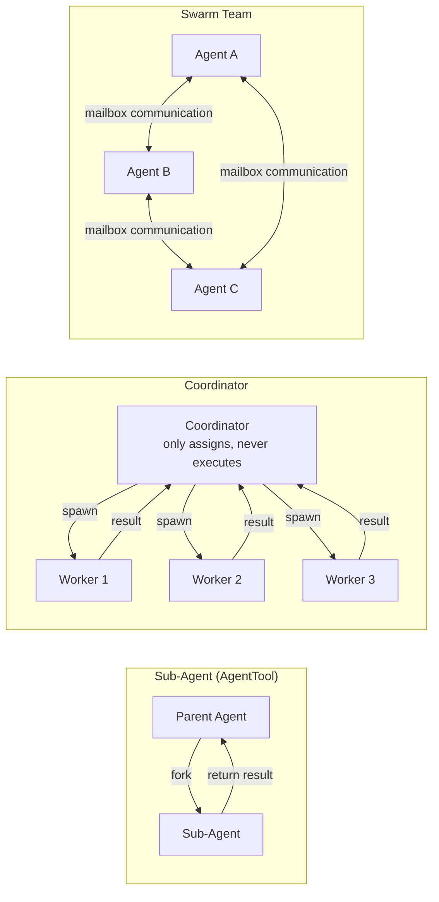

## 8.1 Three Multi-Agent Patterns

Claude Code supports three multi-Agent collaboration patterns, suitable for scenarios of varying complexity:

| Pattern | Use Case | Communication | Characteristics |
|---------|----------|---------------|-----------------|
| **Sub-Agent** | Single independent subtask | fork-return | Simplest, parent Agent waits for result |
| **Coordinator** | Complex multi-step task | spawn + synthesize | Coordinator does not execute, only orchestrates |
| **Swarm Team** | Parallel collaborative task | Named mailbox | Peer-to-peer communication between Agents |
