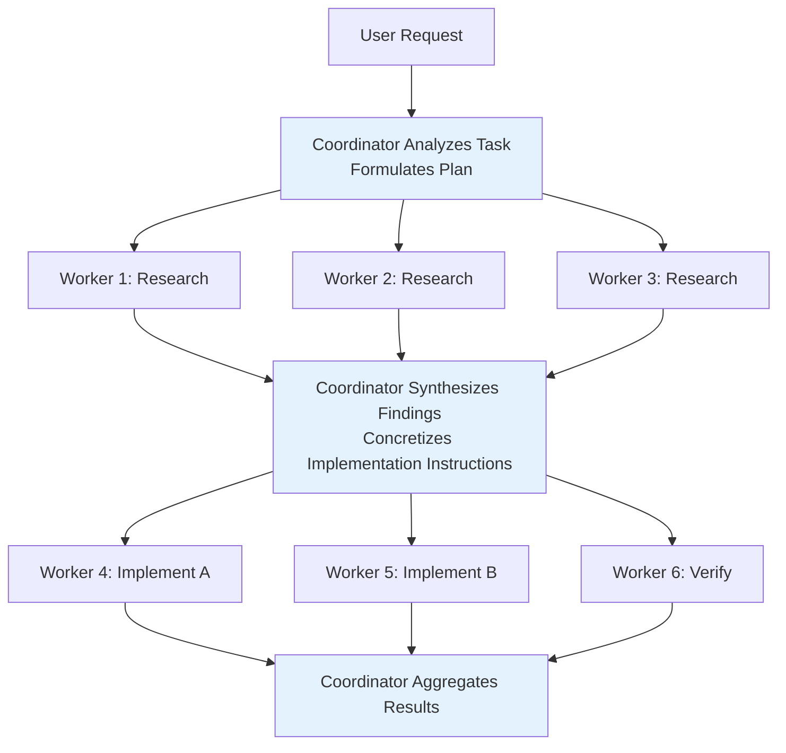

## 8.3 Coordinator Mode

Coordinator mode (Feature-gated: `COORDINATOR_MODE`) transforms the main Agent into a **pure orchestrator** — only responsible for analyzing tasks, assigning Workers, and synthesizing results, never directly operating on files.

Key file: `src/coordinator/coordinatorMode.ts`

### Coordinator Role Definition

The Coordinator's system prompt is generated by `getCoordinatorSystemPrompt()`, containing 6 carefully designed sections:

| Section | Content | Core Constraint |
|---------|---------|----------------|
| **1. Your Role** | Defines coordinator responsibilities | "Direct workers, synthesize results, communicate with user" |
| **2. Your Tools** | Agent, SendMessage, TaskStop | "Do not use workers to trivially report file contents" |
| **3. Workers** | Worker capabilities and toolset | subagent_type must be `worker` |
| **4. Task Workflow** | Four-phase workflow + concurrency management | "Parallelism is your superpower" |
| **5. Writing Worker Prompts** | Prompt writing guidelines | "Never write 'based on your findings'" |
| **6. Example Session** | Complete multi-turn interaction example | End-to-end flow from research to fix |

### Coordinator Available Tools

The Coordinator's toolset is strictly limited — this is a core design constraint:

| Tool | Purpose |
|------|---------|
| `Agent` | Spawn new Workers |
| `SendMessage` | Continue existing Workers (leveraging their loaded context) |
| `TaskStop` | Terminate Workers (cut losses when direction is wrong) |
| `subscribe_pr_activity` | Subscribe to GitHub PR events (if available) |

The Coordinator **cannot** use Bash, Edit, Read, and other tools — this ensures it only orchestrates, never executes. The `INTERNAL_WORKER_TOOLS` (TeamCreate, TeamDelete, SendMessage, SyntheticOutput) are stripped from the *list of Worker-available tools presented to the Coordinator* — they are for the Coordinator/Leader's own internal orchestration and shouldn't appear in the Worker capability description (of the four, only SyntheticOutput is actually in the Worker tool set and gets filtered out; the other three aren't in the set to begin with, so the filter is defensive).

**Why can't the Coordinator execute?** This is not merely a division of labor — if the Coordinator both made decisions and executed them, it would tend toward "doing it myself is faster than delegating," thereby degenerating into an ordinary single Agent. The hard limitation on the toolset forces it to accomplish all actual operations through Workers, which guarantees objectivity in task allocation and parallelization.

### Worker Toolset

Workers receive different tools based on the mode:

```typescript
// src/coordinator/coordinatorMode.ts
const workerTools = isEnvTruthy(process.env.CLAUDE_CODE_SIMPLE)
  ? [BASH_TOOL_NAME, FILE_READ_TOOL_NAME, FILE_EDIT_TOOL_NAME]  // Simple mode
  : Array.from(ASYNC_AGENT_ALLOWED_TOOLS)                        // Full mode
      .filter(name => !INTERNAL_WORKER_TOOLS.has(name))
```

- **Simple mode** (`CLAUDE_CODE_SIMPLE`): Bash, Read, Edit
- **Full mode**: All tools in `ASYNC_AGENT_ALLOWED_TOOLS` (excluding internal tools)
- MCP tools are automatically available
- Skills are delegated through SkillTool

### Worker Tool Context Injection

`getCoordinatorUserContext()` does something seemingly simple but critically important: it constructs a `workerToolsContext` string that is injected into the Coordinator's user context. This string tells the Coordinator:

1. **What tools Workers have** — the Coordinator needs to know Workers' capability boundaries to write feasible prompts (it won't ask Workers to use tools they don't have)
2. **What MCP servers are available** — if a Slack MCP is connected, the Coordinator knows it can dispatch a Worker to send messages
3. **Scratchpad directory path** — if Scratchpad is enabled, the Coordinator can direct Workers to write findings in the shared directory

This is **context engineering manifested at the orchestration layer** — the Coordinator is not blindly delegating, but formulating feasible task plans based on Workers' actual capabilities.

### Standard Workflow



Concurrency management rules for the four phases:

| Phase | Concurrency Strategy | Reason |
|-------|---------------------|--------|
| Research | Freely parallel | Read-only operations, no conflict risk |
| Synthesis | Coordinator serial | Must understand all findings before issuing instructions |
| Implementation | Serial per file set | Writes to the same file must be serialized to prevent conflicts |
| Verification | Can parallelize with implementation on different file regions | Verification does not modify code under test |

### Coordinator Prompt Design Essentials

`getCoordinatorSystemPrompt()` embodies multiple design principles validated through practice:

**1. "Never write 'based on your findings'"**

The Coordinator must understand research results itself, then write implementation instructions that include specific file paths, line numbers, and modification content. "Based on your findings" delegates the understanding capability to the Worker, violating the Coordinator's core responsibility.

```
// Anti-pattern — lazy delegation
Agent({ prompt: "Based on your findings, fix the auth bug" })

// Correct — concrete instructions after synthesis
Agent({ prompt: "Fix the null pointer in src/auth/validate.ts:42.
  The user field on Session is undefined when sessions expire but
  the token remains cached. Add a null check before user.id access." })
```

Why is this rule so important? Because it defines the Coordinator's **non-delegable responsibility** — synthesized understanding. If the Coordinator merely forwards messages ("Worker A found something, Worker B go handle it"), it degenerates into a message router with no intelligent orchestration value. Forcing the Coordinator to "understand and concretize" during the synthesis phase is the key to maintaining orchestration quality.

**2. "Every message you send is to the user"**
