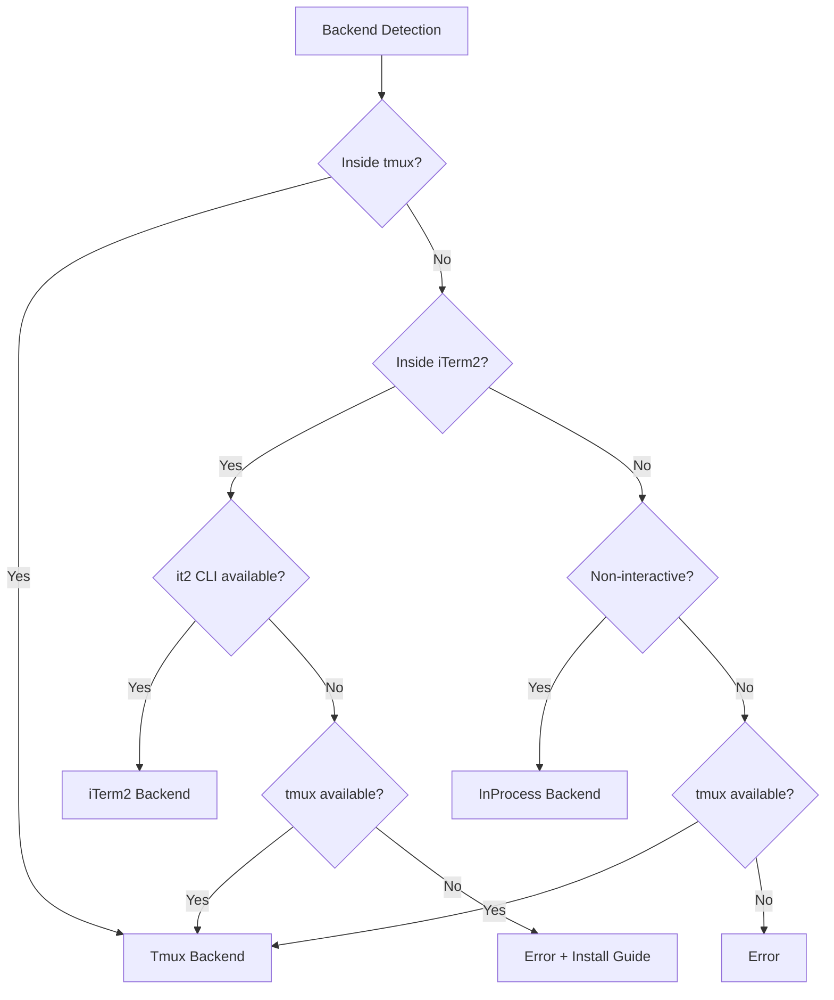
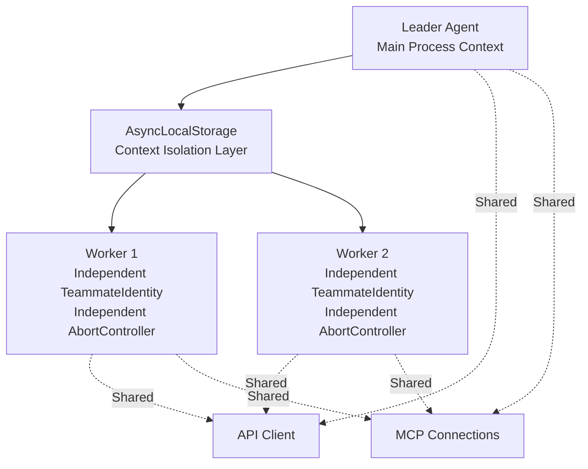

## 8.4 Swarm Execution Backend

The Swarm system supports creating **named Agent teams**, where Agents communicate peer-to-peer through mailboxes.

Key files: `src/utils/swarm/backends/`

### Three Backends



| Backend | Implementation | Characteristics |
|---------|---------------|-----------------|
| **Tmux** | Creates/manages tmux split panes | Supports hide/show, most commonly used |
| **iTerm2** | Native iTerm2 panes (via `it2` CLI) | macOS native experience |
| **InProcess** | Runs within the same Node.js process | AsyncLocalStorage isolation, shared API client and MCP connections |

#### Design Considerations for Backend Selection Priority

The backend detection priority is not arbitrarily arranged; every step has a clear rationale:

1. **Already inside tmux -> Use Tmux directly**: The user already has tmux split-pane infrastructure; creating a new tmux session inside tmux would cause nested confusion. Leveraging the existing environment directly is most natural.

2. **Inside iTerm2 + `it2` CLI available -> Use iTerm2**: Provides a macOS native pane experience (creating/splitting window panes rather than tmux panes), but falls back to tmux if `it2` CLI is unavailable — because tmux is usually also available in an iTerm2 environment.

3. **Non-interactive environment -> InProcess**: CI/CD, SDK calls, and other scenarios without a terminal cannot create visual panes. The InProcess backend running Workers within the same process is the only viable option.

4. **Other interactive environments -> Try tmux**: If none of the above are satisfied, try tmux as a last resort. tmux is available on virtually all Linux/macOS systems.

### Unified Interface

All backends implement the unified `TeammateExecutor` interface:

```typescript
interface TeammateExecutor {
  spawn(config): Promise<void>              // Create teammate
  sendMessage(agentId, message): Promise<void>  // Send message
  terminate(agentId, reason): Promise<void> // Graceful shutdown
  kill(agentId): Promise<void>              // Immediate termination
  isActive(agentId): boolean                // Check if alive
}
```

The distinction between `terminate` and `kill` is important: `terminate` sends a graceful shutdown request (the Agent can finish its current work before exiting), while `kill` immediately interrupts via AbortController. The Coordinator uses `TaskStop` (mapped to kill) when a Worker is headed in the wrong direction, and uses terminate for normal completion.

### InProcess Execution Details

The InProcess backend is the lightest execution method, suitable for non-interactive environments (such as CI/CD). Core file: `src/utils/swarm/inProcessRunner.ts`.

**AsyncLocalStorage Context Isolation**:

Each Worker runs in an independent AsyncLocalStorage context via `runWithTeammateContext()`. Node.js's AsyncLocalStorage provides a mechanism for passing context through asynchronous call chains — each Worker's async call stack (Promise chains, callbacks, etc.) can access its own `TeammateIdentity`, even when they interleave execution in the same Node.js event loop.



Why can the API client and MCP connections be shared? Because they are essentially stateless connection multiplexing — HTTP clients and WebSocket connections are thread-safe, and multiple Workers can concurrently use the same connection without interference. This avoids the overhead of establishing independent connections for each Worker (TCP handshake, TLS negotiation, MCP initialization, etc.).

**Permission Synchronization Mechanism**:

Workers need permission approval when executing tools. The InProcess backend uses two permission bridging approaches:

1. **Leader bridging** (preferred): Workers directly invoke the Leader's `ToolUseConfirm` dialog, with the UI displaying a Worker badge so the user knows which Worker is making the request. This is the fast path — permission confirmation pops up directly in the terminal, and the user sees it and makes a decision immediately.

2. **Mailbox communication** (fallback): Workers write permission requests to the mailbox (`writeToMailbox`), and the Leader reads and responds via `readMailbox`. This is implemented through `registerPermissionCallback()` / `processMailboxPermissionResponse()`. This is the fallback when Leader bridging is unavailable — for example, when the Leader is busy processing other requests.

**AbortController Independence**:

Each Worker has an independent AbortController. This means:
- One Worker's failure does not affect other Workers
- Coordinator interruption does not cascade to Workers (Workers can be explicitly TaskStopped)
- `killInProcessTeammate()` immediately terminates a specific Worker via its abort controller

### Scratchpad: Cross-Worker Knowledge Sharing

When the `tengu_scratch` feature gate is enabled, the system provides a shared Scratchpad directory:

```typescript
// src/coordinator/coordinatorMode.ts
if (scratchpadDir && isScratchpadGateEnabled()) {
  content += `\nScratchpad directory: ${scratchpadDir}\n` +
    `Workers can read and write here without permission prompts. ` +
    `Use this for durable cross-worker knowledge.`
}
```

Workers can freely read and write files in this directory (without permission confirmation), used for persisting cross-Worker knowledge — such as research findings, intermediate results, and shared configurations.

**Why is Scratchpad needed?** Without it, Workers can only relay information through the Coordinator. This has two problems:
1. **Latency**: Worker A's findings must first be transmitted back to the Coordinator, which synthesizes them and then passes them to Worker B — adding an extra round trip
2. **Information loss**: The Coordinator may lose details during synthesis (such as specific line numbers), and Worker B receives the Coordinator's understanding rather than the original findings

Scratchpad provides a direct bypass channel: Worker A writes detailed findings to a file, and Worker B reads them directly — without going through the Coordinator's "understanding and retelling."
