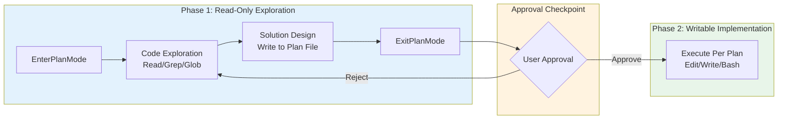
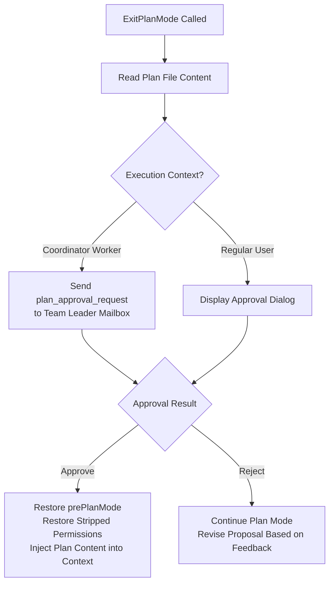

## 8.6 Plan Mode: Two-Phase Execution

Plan mode inserts an **approval checkpoint** into the Agent's tool call loop — upon entering Plan mode, write permissions are stripped at the system level, and the Agent can only read code and write plan files; after the user approves the plan, permissions are restored, and the Agent executes modifications according to the plan.

Key files: `src/tools/EnterPlanModeTool/`, `src/tools/ExitPlanModeTool/`, `src/utils/planModeV2.ts`, `src/utils/plans.ts`

### Two-Phase Design

| Phase | Permission Mode | Writable Scope | Agent Behavior |
|-------|----------------|---------------|----------------|
| **Exploration** | `plan` | Plan file only | Read-only tools + Explore/Plan sub-Agents |
| **Implementation** | Restored to original mode | All authorized tools | Execute per approved plan |

### Permission Stripping and Restoration

Upon entering Plan mode, `prepareContextForPlanMode` (`src/utils/permissions/permissionSetup.ts`) performs a layer of fine-grained permission management. Its real semantics differ from the common intuition, and three points are worth spelling out:

1. **It only records the old mode; it does not switch to plan inside the function.** It stashes the pre-Plan permission mode (e.g., `default`/`auto`) into `prePlanMode` for restoration on exit, and returns a new context; the function body **never** sets `mode = 'plan'`. The actual switch to plan mode happens in the caller `EnterPlanModeTool`, via `applyPermissionUpdate(\{ type: 'setMode', mode: 'plan' \})`.

2. **Handling of dangerous permissions hinges on "whether auto is used during plan", not on "entering from auto strips them".** When entering from `auto` mode: if plan-auto (`shouldPlanUseAutoMode()`) is enabled, it keeps auto and does **not** strip; if disabled, it calls `restoreDangerousPermissions()` — a *restore*, not a strip. The branch that actually calls `stripDangerousPermissionsForAutoMode()` to strip dangerous permissions is the one where the current mode is **not** auto and plan-auto is enabled — the goal being to keep the auto classifier from approving write operations during exploration.

3. This entire logic is gated behind the `TRANSCRIPT_CLASSIFIER` feature gate; when the gate is off, the function simply records `prePlanMode` and returns the context unchanged.

**"Dangerous permissions" that are stripped include**: Bash tool-level allow rules, script interpreter prefixes (`python:*`, `node:*`, etc.), and Agent wildcards (`agent(*)`). These permissions are automatically restored after the user approves the plan.

> **Design decision: Why not simply disable all write tools?**
>
> Plan mode preserves one writable surface — the plan file (stored at `~/.claude/plans/\{slug\}.md`). The Agent needs to persist exploration findings and design proposals to this file for user review. This "only allow writing to the plan file" design strikes a balance between safety (not modifying code) and utility (being able to produce a reviewable proposal).

### Plan Mode's Five-Phase Workflow

The system prompt (`src/utils/messages.ts`) defines a structured workflow for Plan mode:

1. **Initial Understanding** — Use Explore sub-Agent to investigate the codebase
2. **Solution Design** — Use Plan sub-Agent to design the implementation approach
3. **Solution Review** — Read key files to ensure the approach is feasible
4. **Write Plan** — Write the final proposal to the plan file (the only editable file)
5. **Exit Plan** — Call ExitPlanMode, triggering user approval

### Approval and State Transitions

After approval, the plan content is injected into the conversation as a `tool_result`, ensuring the model can reference the specific proposal during the implementation phase.

### Why Is Two-Phase Design Needed?

The traditional Agent execution model is "think while doing" — the model analyzes problems and modifies code simultaneously. This is highly efficient for simple tasks, but for complex tasks it leads to:

- **Directional rework**: The Agent starts modifying code after only looking at partial code, later discovers the overall direction is wrong, and all existing modifications are wasted
- **Unplanned local modifications**: File-by-file modifications lacking a global perspective may introduce inconsistencies, especially in large-scale refactoring
- **Overly fine-grained approval**: Users are forced to approve each tool call individually, having to make decisions without seeing the full picture

Two-phase design forces the Agent to "think thoroughly before acting" through an **approval checkpoint**. The key constraint in the source code is this sentence from the system prompt:

> *"The user indicated that they do not want you to execute yet — you MUST NOT make any edits, run any non-readonly tools, or otherwise make any changes to the system."*

This is not a suggestion; it is a hard constraint — write tool permissions are stripped at the system level in Plan mode, and even if the model attempts to call them, the calls will be rejected.
