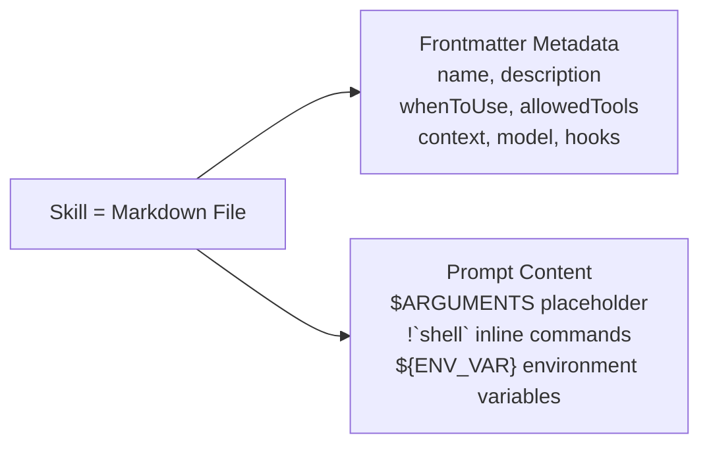
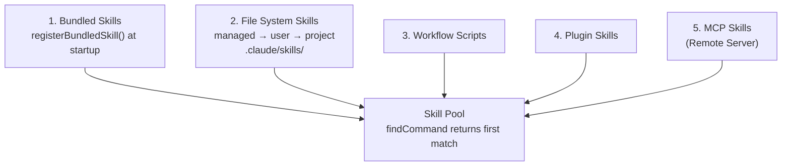

# Chapter 5: Skills System

> Skills are Claude Code's "AI Shell Scripts" — they templatize proven effective prompts so the Agent doesn't have to write the same workflow from scratch every time.

## 5.1 What Are Skills?

Shell scripts automate terminal tasks; skills automate AI tasks. A skill is essentially: **prompt template + metadata + execution context**.



The core problem skills solve: **repetitive AI workflows**. You ask Claude to review code, and every time you have to spell out "check for security vulnerabilities, look at edge cases, watch the naming conventions..." Skills crystallize these proven prompts so they can be written once and reused many times.

### Dual Invocation: The Key Innovation

Unlike traditional chatbot slash commands, Claude Code's skills have two invocation paths:

| Invocation Method | Triggered By | Example |
|---------|--------|------|
| Manual by user | User types `/commit` | User explicitly needs a certain workflow |
| Automatic by model | Model determines the current task needs a skill | User says "help me commit the code," model recognizes intent and calls SkillTool |

**Why is dual invocation a good design?** Traditional slash commands can only be triggered manually — users must know the command name and remember the syntax. This limits usage: if a user doesn't know the `/review` command exists, they'll never use it.

Dual invocation makes skills part of Agent behavior. The model can judge from current context that "now would be a good time to call the review skill" and execute it automatically. Users don't need to remember command names — they just express intent like "can you check if there are any issues with this code," and the model selects the appropriate skill.

At the code level, both paths ultimately converge on the same execution logic: `processPromptSlashCommand()` (for inline skills) or `prepareForkedCommandContext()` (for fork skills).

### Skill File Format

Each skill is a directory containing a `SKILL.md` file:

```
.claude/skills/
  └── review/
      └── SKILL.md        # frontmatter + prompt
      └── templates/       # optional: resource files
          └── report.md
```

Why a directory format instead of a single file? Because skills may need accompanying resource files (templates, configurations, reference docs), referenced via the `$\{CLAUDE_SKILL_DIR\}` environment variable. The directory format makes each skill a self-contained unit.

## 5.2 Skill Sources and Loading

> This section answers: Where do skills come from? What happens at Claude Code startup?

### Five Sources

Skills are loaded from multiple sources. `loadAllCommands()` (`src/commands.ts`) merges them in the following order, and `findCommand()` returns the **first match**, so sources listed earlier have higher priority:



**Bundled skills have the highest priority** — this means you cannot override a built-in skill's name with a project skill. This is a deliberate design: core skill behavior must be predictable and cannot be accidentally replaced by project configuration.

File system skills are deduplicated via `realpath()` to resolve symlinks — files with the same canonical path are treated as the same skill, ensuring correct deduplication across various environments (containers, NFS, symlinks).

### Lazy Loading: Only Load What's Needed

There's an easy-to-miss but important design here: skill content is **not loaded at startup**. The system only preloads frontmatter (name, description, whenToUse); the full Markdown prompt content is read only when the user actually invokes or the model triggers it.

```typescript
// src/skills/loadSkillsDir.ts
export function estimateSkillFrontmatterTokens(skill: Command): number {
  const frontmatterText = [skill.name, skill.description, skill.whenToUse]
    .filter(Boolean)
    .join(' ')
  return roughTokenCountEstimation(frontmatterText)
}
```

**Why lazy loading?** The system may register dozens of skills. If all were loaded into the context:
- A single skill can have hundreds of lines of prompt — dozens together seriously crowd out context space
- Most skills won't be used in the current session
- Full loading increases startup latency, affecting first response speed

By loading only frontmatter to let the model know "what skills are available" and deferring content loading until actually needed, this achieves **low discovery cost, pay-per-execution**.

## 5.3 Skill Discovery: How Does the Model Know Skills Exist?

> This section answers: How does the skill listing enter the model's view? How does the model decide when to auto-trigger a skill?

### System-Reminder Injection
