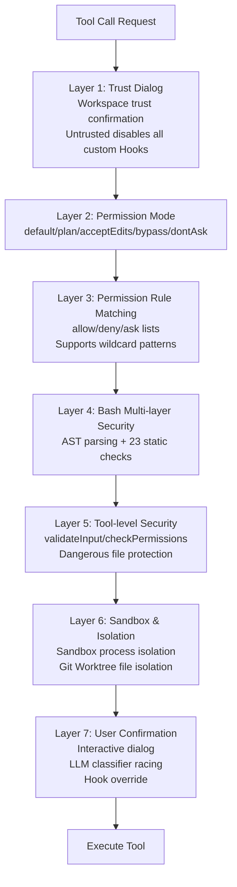

## 12.1 Defense in Depth Architecture

Claude Code adopts a **Defense in Depth** strategy. Multiple independent security layers collectively protect the user's environment — even if one layer is bypassed, the others remain effective.

**Layer 1 — Workspace Trust Confirmation (Trust Dialog)**: When you first launch Claude Code in a directory, the system displays a trust confirmation dialog. This is the first line of defense: if the user chooses not to trust the current workspace, the system will **disable all project-level Hooks and custom settings**. This prevents a common attack scenario — a malicious repository pre-plants Hook scripts in the `.claude/` directory, which would automatically execute as soon as a user clones it. Only after the user explicitly trusts the workspace will project-level configurations take effect.

**Layer 2 — Permission Mode**: A global policy switch that determines whether the system's default behavior is "ask", "auto-allow", or "auto-deny". See [12.2 Permission Modes](#122-permission-modes) for details.

**Layer 3 — Permission Rule Matching**: Users and administrators can predefine allow/deny/ask rule lists for precise control over specific tools or specific commands. For example, `Bash(npm test:*)` allows all npm test related commands to pass automatically. See [12.3 Permission Rule System](#123-permission-rule-system) for details.

**Layer 4 — Bash Multi-layer Security**: Bash has the largest attack surface among all tools, so it has an independent multi-layer security verification system, including tree-sitter AST parsing, 23 static security checks, path constraint validation, and more. See [12.6 Multi-layer Security Verification for Bash Commands](#126-multi-layer-security-verification-for-bash-commands) for details.

**Layer 5 — Tool-level Security**: Each tool declares its own security attributes and implements dedicated validation logic. The `validateInput` method validates input legality before permission checks (e.g., checking file path format); the `checkPermissions` method executes tool-specific security logic (e.g., the file editing tool checks whether the target is a dangerous file). Read-only tools (such as `Read`, `Glob`, `Grep`) can pass automatically in most modes.

**Layer 6 — Sandbox and Isolation**: This layer provides two isolation mechanisms. **Sandbox** restricts Bash commands' filesystem, network, and process permissions through OS-level process isolation (Seatbelt on macOS, namespaces on Linux). **Git Worktree** provides file-level isolation — sub-Agents work in independent worktrees and are automatically cleaned up after completion if there are no substantive modifications, preventing sub-Agents' experimental operations from polluting the main working directory. See [12.9 Sandbox Design](#129-sandbox-design) for details.

**Layer 7 — User Confirmation**: When all preceding automated layers cannot make a decision, a human makes the final call. The interactive dialog simultaneously launches Hook checks and LLM classifiers, with all three racing — but once the user personally interacts with the dialog, automated results are discarded entirely, **human intent always takes priority**. See [12.5 Three Permission Handlers](#125-three-permission-handlers) for details.

> Why not replace the 7 layers with a single unified permission check? Because the core assumption of defense in depth is "every layer can potentially be bypassed." If there were only tool-level checks, a clever command injection could bypass all security mechanisms. In the 7-layer architecture, even if AST semantic analysis is bypassed, path constraints and user confirmation can still intercept the threat.

> **Reading suggestion**: If you want to build an overall understanding first, you can skip to [12.4 Complete Permission Decision Flow](#124-complete-permission-decision-flow) to see the full permission decision chain for a single tool invocation, then come back to read the details of permission modes and the rule system in 12.2/12.3.
