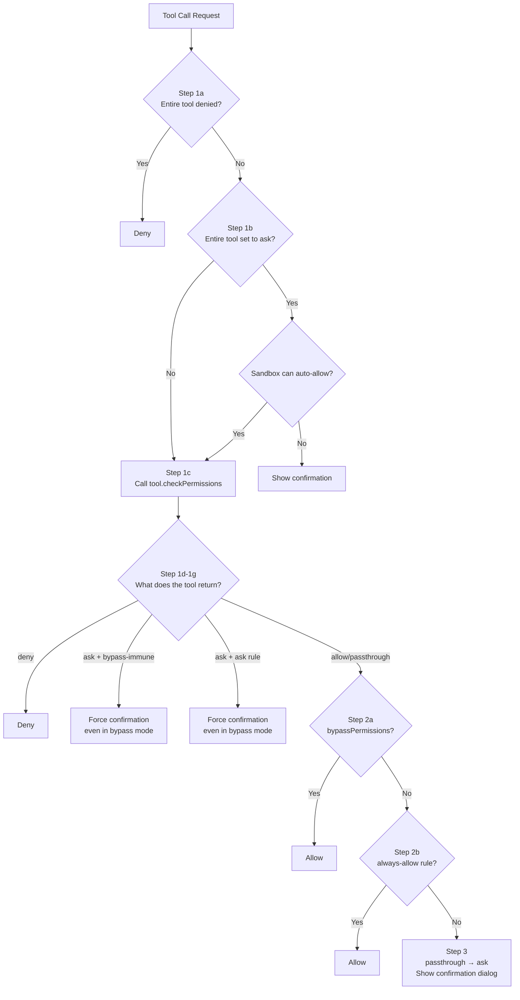

## 12.4 Complete Permission Decision Flow

Now that we understand the rule system, let's look at the complete permission decision flow. Every tool call passes through the `hasPermissionsToUseToolInner` function, which is the core dispatcher of the entire permission system.

Let's walk through this flow step by step:

**Step 1a — Tool-level deny rules**: First check whether any rule directly denies the entire tool (e.g., a deny rule `Bash` would prohibit all Bash commands). If matched, deny immediately without entering any subsequent checks.

**Step 1b — Tool-level ask rules**: Check whether any rule requires confirmation for the entire tool. There is one exception here: if the sandbox is enabled and `autoAllowBashIfSandboxed` is configured, sandboxed commands can skip ask rules and auto-approve — because the sandbox itself already restricts the command's capabilities.

**Step 1c — Tool's own permission check**: Calls `tool.checkPermissions(parsedInput, context)`. Each tool implements its own logic:
- **BashTool**: Performs the complete multi-layer security verification (AST parsing, static checks, path constraints, etc.), see [12.6](#126-multi-layer-security-verification-for-bash-commands) for details
- **FileEditTool / FileWriteTool**: Checks whether the target file is in the dangerous list, whether it is within an allowed working directory
- **Read-only tools** (Read, Glob, Grep): Typically return allow

**Step 1d-1g — Processing tool return results**: There are several critical bypass-immune scenarios here:
- **1f**: If the ask returned by the tool carries a user-configured ask rule as the reason (e.g., `Bash(npm publish:*)` ask rule), confirmation is required even in bypassPermissions mode. This ensures that the safety valve set by the user for specific operations cannot be bypassed.
- **1g**: The ask returned by safety path checks (`.git/`, `.claude/`, `.bashrc`, etc.) is bypass-immune — these paths are too sensitive and should not auto-approve under any mode.

**Step 2a — Check bypass mode**: Note this step comes after deny rules and safety checks. **Deny rules and safety checks have higher priority than bypassPermissions mode** — this is the most critical design decision in the entire flow.

**Step 2b — Check allow rules**: If a matching allow rule exists, auto-approve.

**Step 3 — Fallback to ask**: If all preceding checks did not reach a definitive conclusion (the tool returned passthrough), convert to ask and show a confirmation dialog.

> Source: `src/utils/permissions/permissions.ts:1158-1319`, function `hasPermissionsToUseToolInner`
