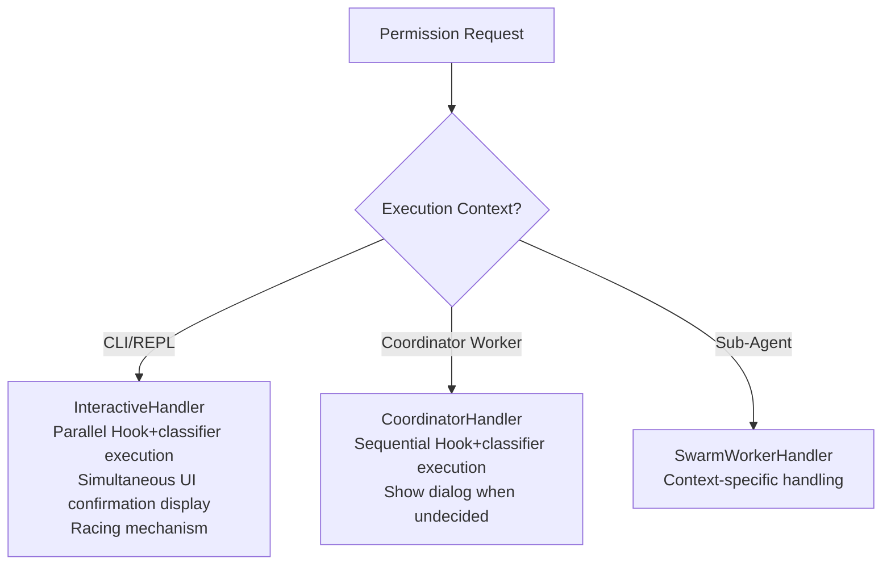
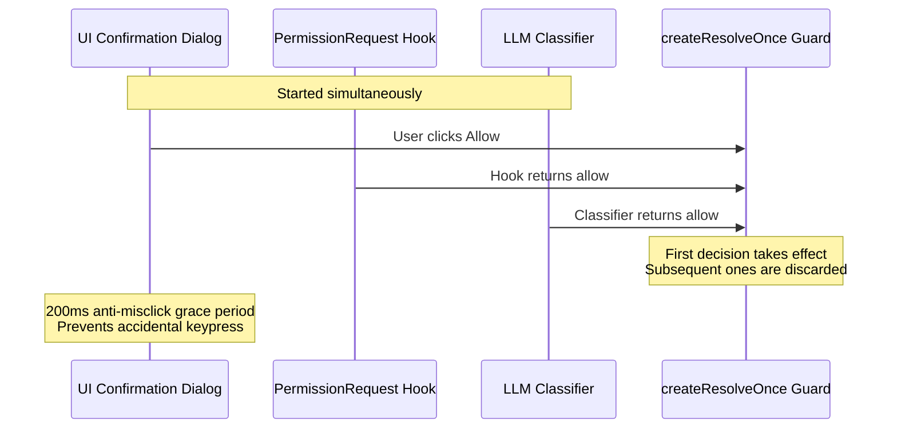

## 12.5 Three Permission Handlers

When the permission decision flow reaches an ask conclusion, how is the confirmation dialog presented to the user? Different execution contexts use different permission handlers:



### InteractiveHandler's Racing Mechanism

This is the most elegant design — user confirmation and automated checks **proceed simultaneously**:



Key details:
- The `createResolveOnce` guard ensures only the first decision takes effect
- `userInteracted` flag: once the user touches the dialog, classifier results are discarded
- **200ms anti-misclick grace period**: ignores accidental keypresses right after the dialog appears so they are not treated as "user has interacted" and do not prematurely cancel the racing classifier's auto-approval

### Code Implementation of the Racing Mechanism

```typescript
// createResolveOnce: ensures only the first decision takes effect
function createResolveOnce<T>() {
  let resolved = false
  let resolve: (value: T) => void
  const promise = new Promise<T>(r => { resolve = r })

  return {
    promise,
    resolve: (value: T) => {
      if (resolved) return    // Subsequent decisions are discarded
      resolved = true
      resolve(value)
    }
  }
}

// InteractiveHandler's parallel decision flow
async function handlePermission(request: PermissionRequest) {
  const { promise, resolve } = createResolveOnce<Decision>()
  let userInteracted = false

  // Start three decision sources simultaneously
  showUIDialog(request, (decision) => {
    userInteracted = true
    resolve(decision)
  })

  runHook('PermissionRequest', request).then(hookResult => {
    if (!userInteracted) resolve(hookResult)
  })

  runClassifier(request).then(classifierResult => {
    if (!userInteracted) resolve(classifierResult)
  })

  // 200ms anti-misclick: keypresses within 200ms of dialog appearing are ignored
  await sleep(200)
  enableDialogInput()

  return promise
}
```

Design rationale: The 200ms grace period protects the racing classifier's result, not to block mistaken approval — it prevents accidental keypresses right after the dialog appears from being counted as "user has interacted" and thereby prematurely canceling the racing LLM classifier's auto-approval (the grace period only gates interactions that would set `userInteracted`; it does not gate the actual approval action `onAllow`). Once the user interacts with the dialog after the grace period (any keypress or click), the `userInteracted` flag is set, and subsequent automated results from Hooks and classifiers are discarded — **human intent always takes priority**.

### Permission Explainer

In the confirmation dialog, the user sees not only the command itself but also an **AI-generated risk explanation**. This explanation is generated in parallel by the Haiku model (lightweight and fast) via `sideQuery`, launched simultaneously with the dialog, without blocking user interaction.

The explanation covers four dimensions:

```typescript
type PermissionExplanation = {
  explanation: string   // What this command does (1-2 sentences)
  reasoning: string     // Why it needs to be executed (starts with "I", e.g., "I need to check...")
  risk: string          // What could go wrong (15 words or less)
  riskLevel: 'LOW' | 'MEDIUM' | 'HIGH'
    // LOW: Safe development workflow (reading files, running tests)
    // MEDIUM: Recoverable changes (editing files, installing dependencies)
    // HIGH: Dangerous/irreversible operations (deleting files, modifying system config)
}
```

This design gives users sufficient contextual information when making decisions, rather than facing a bare command and relying on intuition. Especially for unfamiliar commands (such as complex `sed` or `awk` expressions), the explainer can significantly reduce the probability of user misjudgment.

> Source: `src/utils/permissions/permissionExplainer.ts`

### CoordinatorHandler

CoordinatorHandler is used for Worker Agents in coordinator (Coordinator) mode. Unlike InteractiveHandler's parallel racing, it employs a **sequential execution** strategy:

1. **Execute Hooks first** — If the PermissionRequest Hook returns a definitive decision (allow/deny), use it directly
2. **Then execute the classifier** — When the Hook is undecided, run the LLM classifier to attempt automatic judgment
3. **Finally show the dialog** — Only if the first two cannot decide does it present an interactive confirmation to the user

This sequential design avoids the chaotic scenario of multiple Workers simultaneously popping up dialogs.

### SwarmWorkerHandler

SwarmWorkerHandler is used in sub-Agent (Swarm Worker) scenarios. Its permission handling is the most conservative:

- **Tries the classifier first, forwards to the leader when undecided**: The sub-Agent does not make the final decision locally — for Bash commands it first awaits the LLM classifier's attempt to auto-approve, and if that is undecided it forwards a *new* permission request to the leader (coordinator) via mailbox (`createPermissionRequest` + `sendPermissionRequestViaMailbox`) and waits for the leader's decision, rather than reusing permissions already approved by the parent Agent
- **Restricted tool set**: Sub-Agents can only use the subset of tools explicitly authorized by the parent Agent
- **No direct user interaction**: The sub-Agent itself does not pop up a confirmation dialog, but the request is adjudicated by the leader — the leader can approve (`onAllow`) or reject (`onReject`); it is not the case that any unauthorized operation is simply denied outright. Only on the exceptional path where forwarding fails does it fall back to local UI handling
