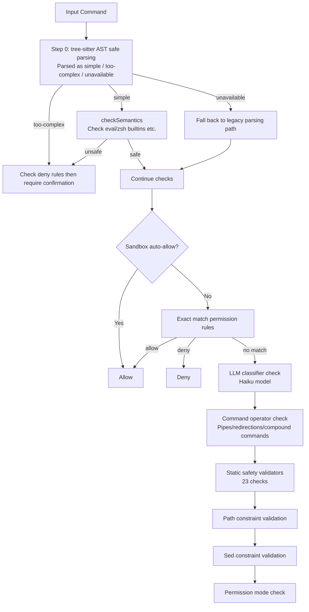

## 12.6 Multi-layer Security Verification for Bash Commands

BashTool has the largest attack surface among all tools — it can execute arbitrary Shell commands, so it has the strictest security verification system.

### 12.6.1 bashToolHasPermission Entry Flow

`bashToolHasPermission` is the main entry point for Bash permission checks (`src/tools/BashTool/bashPermissions.ts:1663`). Each command goes through the following check chain:



### 12.6.2 Tree-sitter AST Safe Parsing

This is the most important innovation in the Bash security system. Traditional approaches (regex + manual character traversal) are prone to **parser differentials** when facing Shell's complex syntax — the command meaning understood by the security checker differs from what Bash actually executes, and attackers can exploit this discrepancy to bypass checks.

The tree-sitter approach replaces manual parsing with a real Bash grammar parser. The core design principle is **FAIL-CLOSED: structures that are not understood are never trusted**.

```typescript
// Core design of ast.ts
// Original source comment:
// "The key design property is FAIL-CLOSED: we never interpret structure we
//  don't understand. If tree-sitter produces a node we haven't explicitly
//  allowlisted, we refuse to extract argv and the caller must ask the user."
```

The parsing result is a three-way enum:

| Result | Meaning | Subsequent Handling |
|--------|---------|-------------------|
| `simple` | Successfully extracted clean argv[], all quotes resolved, no hidden command substitutions | Continue normal permission rule matching |
| `too-complex` | Found structures that cannot be statically analyzed | Check deny rules then directly require user confirmation |
| `parse-unavailable` | tree-sitter WASM not loaded | Fall back to legacy parsing path |

**What triggers `too-complex`?** Any AST node type not on the whitelist. The whitelist is very conservative:

```typescript
// Only these 4 structural node types are recursively traversed
const STRUCTURAL_TYPES = new Set([
  'program',              // Root node
  'list',                 // a && b || c
  'pipeline',             // a | b
  'redirected_statement',  // Command with redirections
])

// Only these separators are allowed
const SEPARATOR_TYPES = new Set(['&&', '||', '|', ';', '&', '|&', '\n'])
```

This means the following structures are all flagged as `too-complex`, requiring user confirmation:
- Command substitution `$(cmd)` or `` `cmd` ``
- Variable expansion `${var\}`
- Arithmetic expansion `$((expr))`
- Control flow `if`/`for`/`while`/`case`
- Function definitions
- Process substitution `<(cmd)` / `>(cmd)`

**`checkSemantics` — Semantic-level Safety Checks**

Even if a command passes AST parsing (result is `simple`), semantic-level dangers still need to be checked. Some commands are perfectly legal syntactically but dangerous semantically:

- `eval "rm -rf /"` — eval can execute arbitrary strings
- `zmodload zsh/net/tcp` — loads the zsh networking module
- `emulate sh -c 'dangerous_code'` — changes shell behavior and executes code

`checkSemantics` checks whether argv[0] is a known dangerous command (eval, zsh builtins, etc.), and if so, flags it as requiring confirmation.

**Shadow Testing Strategy**

tree-sitter is a newly introduced parsing approach. To ensure stability, Claude Code adopts an incremental migration strategy:

1. **Shadow mode** (`TREE_SITTER_BASH_SHADOW` feature gate): tree-sitter runs in parallel with the legacy `splitCommand_DEPRECATED`
2. The parsing results of both are compared, and divergences are recorded in the telemetry event `tengu_tree_sitter_shadow`
3. But the final decision **still uses the legacy path** — shadow mode is purely observational
4. Only after telemetry data proves tree-sitter is sufficiently reliable will it be switched to the authoritative path

This "observe first, switch later" strategy is very common in safety-critical systems — it allows the team to collect real data in production environments, rather than guessing in test environments.

> Source: `src/utils/bash/ast.ts`, `src/tools/BashTool/bashPermissions.ts:1670-1806`

### 12.6.3 23 Static Safety Validators

`src/tools/BashTool/bashSecurity.ts` contains 23 independent checks, each targeting a specific attack vector:

| ID | Check | Protection Target | Attack Example |
|----|-------|-------------------|----------------|
| 1 | Incomplete command | Prevent injection continuation | Commands starting with tab/flag/operator may be continuations of a previous command |
| 2 | jq system functions | Prevent jq command injection | `jq 'system("rm -rf /")'` |
| 3 | jq file arguments | Prevent jq file reads | `jq -f malicious.jq` |
| 4 | Obfuscated flags | Prevent flag obfuscation attacks | Specially constructed flag sequences to bypass command identification |
| 5 | Shell metacharacters | Prevent metacharacter injection | Special characters hidden in parsed commands |
| 6 | Dangerous variables | Prevent environment variable injection | `LD_PRELOAD=/evil.so cmd` |
| 7 | Newlines | Prevent multi-line injection | Embedded newlines visually hide a second command |
| 8 | Dangerous expansion patterns | Prevent command/process substitution | `echo $(rm -rf /)`, `<(cmd)`, `` `cmd` ``, etc. |
| 9 | Input redirection | Prevent input hijacking | `cmd < /etc/passwd` |
| 10 | Output redirection | Prevent output hijacking | `cmd > ~/.bashrc` overwrites config |
| 11 | IFS injection | Prevent IFS-based regex bypass | `cat$\{IFS:0:1\}/etc/passwd` uses IFS expansion instead of spaces to bypass regex |
| 12 | git commit substitution | Prevent unauthorized commits | Command substitution embedded in git commands |
| 13 | /proc/environ | Prevent environment leakage | Reading `/proc/self/environ` to leak API keys |
| 14 | Malformed tokens | Prevent parsing confusion | Tokens that the shellQuote library misparses |
| 15 | Backslash whitespace | Prevent escape sequence bypass | `\ ` has different meanings in different parsers |
| 16 | Brace expansion | Prevent expansion attacks | `\{a,b\}` expands into multiple arguments |
| 17 | Control characters | Prevent terminal injection | Embedded ANSI escape sequences to control terminal |
| 18 | Unicode whitespace | Prevent visual confusion | Using U+200B and other zero-width characters to hide content |
| 19 | In-word hash | Prevent comment injection | `cmd#comment` is a comment in some shells |
| 20 | Zsh dangerous commands | Prevent module abuse | `zmodload zsh/net/tcp` loads network modules |
| 21 | Backslash operators | Prevent escape injection | `\;` parses as `;` or literal in different parsers |
| 22 | Comment-quote desync | Prevent quote escape | Quotes in comments alter the quote pairing of subsequent code |
| 23 | Newline within quotes | Prevent multi-line commands wrapped in quotes | Hidden newline characters within quotes |

The design philosophy behind these 23 checks is **independent and reject-on-any-trigger**. They don't need to all be correct—as long as any one of them detects an anomaly, the command is flagged as requiring user approval. This is exactly how defense in depth manifests within a single layer.

### 12.6.4 Non-Suggestable Bare Shell Prefixes

When a user approves a command, the system automatically suggests saving it as a permission rule. However, the following prefixes **cannot be suggested as rules**, because they allow `-c` arguments to execute arbitrary code—suggesting `Bash(bash:*)` is equivalent to allowing everything:

- **Shell interpreters**: sh, bash, zsh, fish, csh, tcsh, ksh, dash, cmd, powershell
- **Wrappers**: env, xargs, nice, stdbuf, nohup, timeout, time
- **Privilege escalation tools**: sudo, doas, pkexec

### 12.6.5 Zsh-Specific Protections

Since Claude Code defaults to using the user's shell (which is often zsh), specific protections are needed against zsh-specific dangerous features:

```typescript
const ZSH_DANGEROUS_COMMANDS = [
  'zmodload',   // Module loading (can load dangerous modules like zsh/net/tcp, zsh/system)
  'emulate',    // Change shell behavior (emulate sh -c can execute arbitrary code)
  'sysopen',    // Direct system calls (from the zsh/system module)
  'sysread',    // Direct system read
  'syswrite',   // Direct system write
  'ztcp',       // TCP connections (can be used for data exfiltration)
  'zsocket',    // Unix socket connections
  'zpty',       // Pseudo-terminal execution (can hide subprocesses)
  'mapfile',    // File memory mapping (silent file I/O)
]
```

Additionally, zsh-specific dangerous expansion syntax is detected:

| Syntax | Danger |
|--------|--------|
| `=cmd` | `=ls` expands to `/bin/ls`, can be exploited to execute arbitrary paths |
| `<()` / `>()` | Process substitution, can create hidden subprocesses |
| `~[]` | Zsh-specific history expansion |
| `(e:)` | Glob qualifier, can execute arbitrary code during filename matching |
| `(+)` | Glob qualifier, can trigger custom functions |

### 12.6.6 Compound Command Security Restrictions

For compound commands connected via `&&`, `||`, `;`, `|`, the security checker splits them into subcommands and verifies each one individually. However, to prevent maliciously crafted ultra-long compound commands from causing ReDoS or exponentially growing check overhead, the system sets hard limits:

```typescript
const MAX_SUBCOMMANDS_FOR_SECURITY_CHECK = 50
// Compound commands with more than 50 subcommands are directly flagged as requiring user approval

const MAX_SUGGESTED_RULES_FOR_COMPOUND = 5
// Compound commands generate at most 5 auto-suggested permission rules, preventing rule explosion
```
