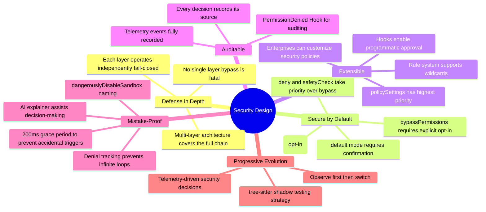

## 12.15 Security Design Principles Summary

Looking at the entire permission and security system, its core design philosophy can be summarized as: **every layer assumes the other layers may fail**. The AST parser assumes regex checks may be bypassed, so it operates independently; path constraints assume command analysis may miss things, so they check independently; user confirmation assumes all automation may fail, so it serves as the final safety net. This "pessimistic but pragmatic" design mindset is the fundamental methodology for building security-critical systems.

---

> **Hands-on Practice**: In [claude-code-from-scratch](https://github.com/Windy3f3f3f3f/claude-code-from-scratch)'s `src/agent.ts`, search for permission-related code to see a minimal "confirm before execution" implementation. Compare it with the defense-in-depth architecture in this chapter and consider: what are the minimum security layers a minimal Agent needs? See the tutorial [Chapter 5: Permissions and Security](https://github.com/Windy3f3f3f3f/claude-code-from-scratch/blob/main/docs/05-safety.md).

Previous chapter: [Task Management System](/lib/09-harness/how-claude-code-works/en-docs-15-task-system) | Next chapter: [System Prompt Design](/lib/09-harness/how-claude-code-works/en-docs-14-system-prompt-design)
