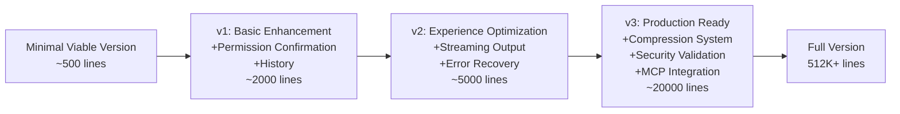

## 15.3 From Minimal to Production: Progressive Enhancement Roadmap



### Phase 1: Minimal Viable (~500 lines)

```
User Input -> System Prompt + Messages -> API Call -> Tool Execution -> Loop
```

Tools: `read_file`, `write_file`, `run_shell` -- just these three form a complete read-execute-write loop.

**Why start with these three tools?** Because they cover the agent's basic operation cycle: use `read_file` to understand the current state, use `run_shell` to execute commands (tests, compilation, git), use `write_file` to create or modify files. `edit_file` (search-and-replace), `grep_search`, `list_files` are all "better ways" to do what `read_file` + `run_shell` can already do.

**Implementation Tip**: Start with Anthropic SDK's `messages.create()` (non-streaming) rather than `messages.stream()`. Non-streaming is simpler, returns a complete response object, and doesn't require handling event streams. Once the basic loop works, upgrade to streaming.

**The biggest risk at this phase**: Context window overflow. Without `truncateResult`, a single `run_shell("cat huge_file.log")` can fill up the entire window. Even in the minimal version, it's recommended to add result truncation -- these 15 lines of code can save a lot of debugging time.

### Phase 2: Basic Enhancement (~2000 lines)

**Add Permission Confirmation**: 10 regex patterns + a confirmation dialog. Simple to implement but remarkably effective -- this is the key step to turn the agent from "your own toy" to "something you dare give to others." No need for anything as complex as AST analysis; a regex blocklist + user confirmation already covers 95% of dangerous scenarios.

**Add `edit_file` Tool**: This is the highest-value feature of Phase 2. With search-and-replace, the agent upgrades from "can only create files" to "can precisely modify existing code." The implementation is only 18 lines (uniqueness counting + replacement), but its impact on agent capability is a qualitative change.

**Add `grep_search` + `list_files`**: Enables the agent to navigate unfamiliar codebases. Without these two tools, the agent can only operate on files whose paths it already knows. With search capability, it can autonomously explore project structure.

**Add Conversation History Persistence**: JSON file + `--resume` flag. 64 lines of code solve the problem of "losing work after closing the terminal."

### Phase 3: Experience Optimization (~5000 lines)

**Add Streaming Output**: Upgrade from `messages.create()` to `messages.stream()`. This is a medium-scale refactor but brings a huge experience improvement -- users no longer stare at a blank screen waiting, but see text appearing character by character. In scenarios where the agent thinks for 10-30 seconds (common), streaming output is the difference between "feels 10x faster" and "I think it's frozen."

**Add Auto-Compression**: When context reaches 85%, automatically summarize and compress the conversation history. This is key to supporting long sessions -- without compression, 20-30 rounds of complex tool calls will hit the context limit. Implementation is about 50 lines (summary request + history replacement), but there's a tricky detail: the summary request itself consumes tokens, so the trigger threshold can't be too late.

**Add Error Retry**: Exponential backoff + retryable error code identification. API 429 (rate limiting) is common during heavy use; automatic retry frees users from having to manually handle transient errors.

**Add Token Tracking and Cost Display**: Cumulative input/output token counting, multiplied by unit price to display cost. Helps users build cost awareness and paves the way for subsequent budget management features.

### Phase 4: Production Ready (~20000 lines)

**Multi-Level Compression Pipeline**: Phase 3's "full summary" is the most brute-force compression approach. The production version has 4 levels of progressive compression strategy -- first truncate oversized tool results, then trim early messages, then micro-compress cache annotations, and only then summarize. Each level preserves as much information as possible, only escalating to a more aggressive strategy when necessary (see [Chapter 3: Context Engineering](/lib/09-harness/how-claude-code-works/en-docs-03-context-engineering/index) for details).

**Bash AST Security Analysis**: tree-sitter parsing + 23 static checks. This is a qualitative leap from regex blocklist to structured analysis. Each check rule corresponds to a bypass method discovered during security testing.

**MCP Protocol Integration**: Through Model Context Protocol, supports external tool extensions (database queries, sending Slack messages, Jira operations, etc.). This extends the agent's capability boundary from "local file operations" to "any external service."

**Multi-Agent** (AgentTool): Decomposes complex tasks for sub-agents to execute in parallel. The main agent is responsible for planning and coordination; sub-agents are responsible for concrete execution. This is the key architecture for handling large project-level tasks (see [Chapter 8: Multi-Agent Architecture](/lib/09-harness/how-claude-code-works/en-docs-07-multi-agent/index) for details).

**Prompt Caching Optimization**: Carefully arranges the content order of system prompts to maximize API prefix cache hit rates. In high-frequency use scenarios, this can save 30-50% of API costs.
