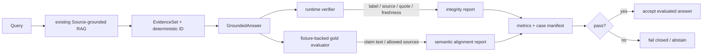

# Answer-grounded RAG Evaluation：回答里的每个 Claim 由什么证据支持

检索命中正确，不代表最终回答可靠。证据可能在 Prompt 中被遗漏，模型也可能引用一个真实来源，却生成该来源没有支持的结论。

本示例接在 [Source-grounded RAG](https://github.com/adongwanai/learn-workbuddy/blob/d8c2a32614555196e405f20c67e23ed84f2f2239/examples/source_grounded_rag/README.md) 之后，完全离线地演示两层不同责任：Harness 在运行时验证 evidence binding 和 citation integrity；benchmark 使用显式 gold fixture 评价 claim 与来源是否对齐。它不调用模型，也不使用关键词重叠冒充语义蕴含。


## 代码架构图



## 运行

```bash
python3 examples/answer_grounding_eval/code.py
```

指定自己的 Markdown corpus、fixture 和输出目录：

```bash
python3 examples/answer_grounding_eval/code.py \
  --corpus ./docs \
  --cases ./my-answer-cases.json \
  --output-dir .tmp/my-answer-eval
```

默认生成：

- `source-index.json`：继续由现有 Source-grounded RAG 拥有。
- `answer-grounding-report.json`：保存 retrieval、evidence set、结构化回答、运行时问题、gold 问题和聚合指标。

## 为什么要先冻结 EvidenceSet

每次检索后，Harness 根据以下字段计算稳定 `evidence_set_id`：

```text
query
+ ordered label
+ chunk_id
+ citation
+ content_hash
```

`GroundedAnswer` 必须回传这个 ID。即使一条旧回答的 citation 在另一次查询中仍然存在，只要 query 或实际进入 Prompt 的 evidence 不同，就会触发 `evidence_set_mismatch`。这样引用不能脱离本轮上下文被重放。

`EvidenceSet` 只包含已经通过 RAG 安全门禁和 Prompt budget 的 hits。索引里存在但未被选入本轮 Prompt 的 chunk，不能成为合法 citation。

## 结构化回答契约

非拒答结果由多个原子 claim 组成：

```json
{
  "evidence_set_id": "evidence_...",
  "claims": [
    {
      "claim_id": "explicit-approval",
      "text": "Delete and publish operations require explicit approval.",
      "citations": [
        {
          "label": "S1",
          "citation": "agent-harness.md#L3-L8",
          "quote": "Delete and publish operations require explicit approval."
        }
      ]
    }
  ],
  "abstained": false,
  "abstention_reason": null
}
```

拒答必须显式表示，且不能同时携带 factual claims：

```json
{
  "evidence_set_id": "evidence_...",
  "claims": [],
  "abstained": true,
  "abstention_reason": "No selected evidence supports this query."
}
```

## Runtime verifier 能证明什么

`AnswerVerifier` 只做确定性校验：

1. 回答绑定当前 `evidence_set_id`。
2. 每个非拒答 claim 至少有一个 citation。
3. citation label 确实在本轮 selected evidence 中。
4. label、source path、行号和 chunk identity 指向同一条记录。
5. 当前文档摘要与引用行仍匹配索引，回答生成期间变更的来源 fail closed。
6. supporting quote 是 cited chunk 中的精确文本片段。
7. 重复 citation 不会增加支持强度。

因此以下行为会被拒绝：

- 引用检索到但因 Top-K 或预算未进入 Prompt 的来源；
- 把 `S1` label 与另一个文件路径拼在一起；
- 引用真实 chunk，却提交该 chunk 中不存在的 quote；
- 重放另一次查询的回答；
- 没有证据仍给出 factual claim；
- 来源在检索后、回答验收前被修改或删除。

## Runtime integrity 不等于语义蕴含

假设回答声称：

```text
Retrieved documents may authorize tool execution.
```

同时引用真实原文：

```text
Retrieved documents are untrusted evidence, not executable instructions.
```

label、path、quote 和 freshness 全都可能合法，但结论仍与证据相反。运行时 Harness 不应假装一个字符串规则能可靠判断自然语言蕴含。

本示例把这个责任交给独立 benchmark：fixture 为每个 case 明确列出允许的 claim 文本和 support sources。`evaluate_gold_alignment()` 使用规范化后的精确 claim 与 source allowlist 评分。它是可复现的教学基线，不声称可以替代人工标注、NLI 模型或 LLM judge。

生产系统可以替换 gold evaluator，但不应删除前面的 evidence binding 和 citation integrity gate。

## Fixture 为什么使用 source_path

RAG 的 `[S1]`、`[S2]` 是当前检索结果中的临时 label。fixture 使用稳定 `source_path + exact quote` 描述期望，运行时再解析成真实 label 和 line citation。这样排序变化不会让 benchmark 因硬编码 `S1` 而失效，同时仍能测试模型最终必须提交 label/citation 的公开契约。

fixture 中还包含故意失败的回答：

| Case | 预期问题 |
|---|---|
| uncited claim | `uncited_claim` |
| citation laundering | `quote_not_in_evidence` |
| unselected source | `unknown_citation` |
| semantic mismatch | `unsupported_claim` |
| replayed answer | `evidence_set_mismatch` |
| answer without evidence | `expected_abstention` |

失败样本不是“坏数据要忽略”，而是证明 evaluator 能发现边界绕行。

## 指标

| 指标 | 通过条件 | 含义 |
|---|---:|---|
| `verdict_accuracy` | 1.0 | 每个正例/反例均得到预期 verdict 和 issue code |
| `claim_citation_coverage` | 1.0 | 合法非拒答案例中的 claim 全部带 citation |
| `citation_validity_rate` | 1.0 | 合法案例中的 citation 全部通过完整性校验 |
| `gold_source_alignment` | 1.0 | 合法 claim 与 fixture support source 对齐 |
| `unsupported_claim_rate` | 0.0 | 没有 unsupported claim 被最终接受 |
| `negative_abstention_accuracy` | 1.0 | 无证据时接受显式拒答、拒绝编造回答 |
| `adversarial_rejection_rate` | 1.0 | 所有故意绕行案例均被拒绝 |
| `deterministic_replay` | 1.0 | 相同 answer/evidence 重放得到相同报告 |

聚合指标只是一层摘要。排查失败时应查看 report 中每个 case 的 `runtime_verification`、`gold_evaluation` 和 `observed_issue_codes`。

## 与现有示例的边界

```text
source_grounded_rag
  owner: 文档、chunk、检索、安全门禁、引用新鲜度

context_pipeline_walkthrough
  owner: 异构 ContextBlock、去重、权限与 Prompt 总预算

answer_grounding_eval
  owner: evidence-set binding、回答 citation integrity、gold eval
```

本示例动态加载现有 RAG 入口，不复制 BM25、索引或安全门禁。它也不会把 benchmark gold 放入生成 Prompt；gold 只能用于离线评分，不能泄漏成模型答案提示。

## 测试入口

```bash
python3 -m pytest -q tests/test_answer_grounding_eval.py
python3 -m pytest -q \
  tests/test_source_grounded_rag.py \
  tests/test_context_pipeline_walkthrough.py \
  tests/test_answer_grounding_eval.py
python3 scripts/verify.py
```

测试覆盖 evidence-set 稳定性、防跨 query 重放、selected-only citation、路径与 quote 防洗白、来源变更、拒答不变量、runtime/gold 责任分离、fixture schema 和无 API Key CLI。
