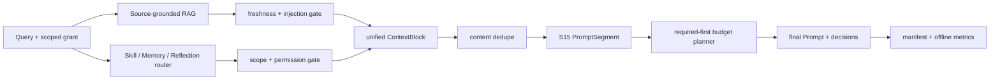

# Retrieval-to-Prompt Context Pipeline：检索结果怎样安全进入 Prompt

仓库已经分别演示了 Source-grounded RAG、Skill / Memory / Reflection 路由和 S15 Prompt budget planner。这个 walkthrough 不再实现第四套检索器，而是回答组合问题：不同来源的候选怎样经过来源、权限、新鲜度、提示注入和去重门禁，最后作为原子片段进入同一个总预算？

整个流程完全离线、无 API Key，不生成模型答案。它评测的是 Harness 的 context plumbing 和决策证据。


## 代码架构图



## 运行

```bash
# 默认查询、正常预算、紧预算和负例 abstention
python3 examples/context_pipeline_walkthrough/code.py

# 自定义查询和总 Prompt 预算
python3 examples/context_pipeline_walkthrough/code.py \
  --query "review API documentation and stale source evidence" \
  --budget-chars 2200 \
  --output-dir .tmp/context-pipeline
```

正常输出包含六个阶段：

```text
[1] Source-grounded retrieval
[2] Policy-first heterogeneous routing
[3] Unified context blocks
[4] S15 prompt budget planning
[5] Negative abstention
[6] Decision manifest
RESULT: OK
```

默认产物：

- `.tmp/context-pipeline-walkthrough/source-index.json`：由现有 RAG 模块拥有的来源索引。
- `.tmp/context-pipeline-walkthrough/context-pipeline-manifest.json`：所有检索、拒绝、去重和预算决策。

## 三个模块各自拥有什么

```text
source_grounded_rag
  owner: 文档摄取、chunk identity、行号引用、新鲜度和注入门禁

retrieval_routing_eval
  owner: Skill / Memory / Reflection 的生命周期、scope 和 permission gate

s15_prompt_assembly
  owner: required-first 总预算、可选片段价值排序和最终展示顺序

context_pipeline_walkthrough
  owner: 组合、标准化、跨边界复验和可观察 manifest
```

walkthrough 通过动态加载直接调用三个现有入口。它不会复制 BM25、路由打分或预算规划算法，因此原模块的契约变化会直接在集成测试中暴露。

## QueryGrant 是不能被检索结果扩大的边界

每次查询显式携带：

| 字段 | 作用 |
|---|---|
| `user_scope` | 阻止其他用户的 Memory 被召回 |
| `workspace_scope` | 阻止项目间状态泄漏 |
| `task_family` | 限制 Reflection / Skill 的任务用途 |
| `allowed_tools` | 允许候选声明的工具集合 |
| `allow_network` | 独立的网络授权位 |

异构 router 在打分前执行这些门禁。组合层在建立 `ContextBlock` 时再次调用同一 `policy_denial()`，防止调用方绕过 router 后手工塞入高权限候选。Prompt 中的文本只能描述 grant，不能改变 grant。

## ContextBlock 是模块间的最小组合契约

RAG hit 和 routed candidate 的字段不同，但进入预算规划前都会转换为：

```python
ContextBlock(
    block_id="rag:chk_...",
    kind="rag",
    content="[RAG:...] source: guide.md#L4-L8 ...",
    provenance="rag:guide.md#L4-L8@document-...",
    source_ids=("doc_...", "chk_...", "guide.md#L4-L8"),
    presentation_priority=51,
    budget_priority=81,
    required=False,
    dedupe_key="content:<digest>",
)
```

这里有意分开两种顺序：

- `presentation_priority` 决定最终 Prompt 中出现的位置。
- `budget_priority` 决定空间不足时谁先获得预算。

Skill 通常比普通 Memory 更接近当前执行约束，因此默认价值略高；RAG 证据再按检索 rank 微调。数值只是透明的教学策略，不代表通用最优权重。

## 为什么要跨边界再验证一次

“上游已经检查过”不是组合层盲目信任对象的理由。RAG search 完成后、S15 组装前，源文件可能被修改或删除；router result 也可能被错误调用方缓存后复用到另一个 grant。

因此 `build_context_blocks()` 会：

1. 再次验证 RAG chunk 仍属于 active index。
2. 再次比较文档摘要、引用行范围和 chunk 摘要。
3. 拒绝任何带 `unsafe_reason` 的文档。
4. 使用原始 `RoutingQuery` 再跑 policy denial。
5. 要求每个 block 都有非空 identity、provenance 和 source IDs。

只有通过复验的对象才能成为 S15 `PromptSegment`。

## 去重必须发生在总预算之前

同一事实可能同时出现在文档、Memory 或 Reflection 中。`deduplicate_blocks()` 使用规范化内容摘要作为 identity，按 required、预算价值、展示顺序和稳定 ID 选择 owner；重复项写入 `rejected_context`，而不是再次消耗 Prompt。

去重不等于证明事实正确。它只防止同一内容重复投影；事实可信度仍由来源和 owner 的验证策略负责。

## Required-first 总预算

以下四类块是 required：

- Harness 基础规则
- 当前 QueryGrant
- Evidence contract
- Work mode

RAG、Skill、Memory 和 Reflection 都是 optional。S15 先验证 required 总长度，再按 `budget_priority` 选择完整可选块；任何块都不会从中间截断。required 本身放不下时抛出 `PromptBudgetError`，不能静默删除安全规则。

walkthrough 会在同一次运行里建立三份计划：

| 计划 | 目的 |
|---|---|
| `primary_plan` | 证明 RAG 与 routed context 能同时进入总预算 |
| `tight_plan` | 只给 required + 最高价值 optional 的空间，其余完整 drop |
| `negative_plan` | 无相关候选时只保留 required，不强行填充上下文 |

## S15 为什么改为延迟初始化 provider

`PromptSegment` 和 `plan_prompt()` 是纯离线数据与算法契约。此前仅 import S15 就会构造 Anthropic client 并要求 `MODEL_ID`，让集成示例不得不伪造在线配置。

现在 `runtime_client()` 只在 `agent_loop()` 真正启动时加载 SDK、检查 `MODEL_ID` 并构造 client：

```text
import s15 / call plan_prompt
  → 不需要 SDK、MODEL_ID、API key 或网络

call agent_loop
  → runtime_client() 检查在线配置并构造 provider
```

这没有改变在线入口的错误语义，只把副作用推迟到了真正需要副作用的边界。

## Manifest 和指标

manifest 保留四层可观察证据：

- `rag`：命中、citation 和 RAG 自己的拒绝原因。
- `routing`：selected IDs、rejected candidates 和 grant。
- `context_blocks/rejected_context`：标准化与跨渠道去重结果。
- 三份 `plan`：最终 Prompt，以及每个 segment 的 included / dropped 决策。

通过阈值：

| 指标 | 要求 |
|---|---:|
| `required_retention_rate` | 1.0 |
| `provenance_coverage` | 1.0 |
| `unsafe_context_rate` | 0.0 |
| `stale_context_rate` | 0.0 |
| `duplicate_context_rate` | 0.0 |
| `budget_violation_rate` | 0.0 |
| `deterministic_replay` | 1.0 |

这些指标不评价模型回答质量。下一层的 claim-to-citation 对齐、引用覆盖率、citation integrity 和无证据拒答由 [Answer-grounded RAG Evaluation](/lib/09-harness/learn-workbuddy/examples-answer_grounding_eval) 演示，并继续保持无 provider 的离线基线。

## 测试入口

```bash
python3 -m pytest -q tests/test_context_pipeline_walkthrough.py
python3 examples/context_pipeline_walkthrough/code.py
python3 scripts/verify.py
```
