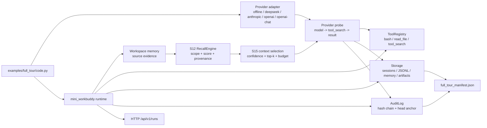

# Full Tour：一次跑遍完整 harness

章节 demo 每次只隔离一个机制。`full_tour` 反过来：它把 provider、session、记忆、召回、上下文选择、工具、权限、外部化、JSONL、HTTP 和审计串成一条完整链路，让你看到这些层怎么接在一起。运行后还会留下可检查的 artifacts。

tour 会先把 workspace note 作为来源证据交给 S12：持久化用户作用域记录并针对当前问题召回；再由可信调用方标记 `workspace_override` 权威级别，把 `RecallResult` 交给 S15 做置信度、权威优先级、top-k 和字符/token 预算选择。只有入选的 `<recalled_memory>` 才进入 provider probe 的 system request。选择真实 provider 时，模型随后必须通过统一 adapter 调用 `tool_search`，工具结果会写入 transcript 和 audit。也就是说，`--provider deepseek|anthropic|openai|openai-chat` 不只是初始化 SDK，而是真的跑过一次 memory -> context -> model -> tool -> result 循环。

## 代码架构图



## 运行

```bash
# 离线：确定性 mock provider，无 API key，无网络。
python examples/full_tour/code.py

# 真实 provider：需要 .env 里有对应 key。
python examples/full_tour/code.py --provider deepseek
python examples/full_tour/code.py --provider anthropic
python examples/full_tour/code.py --provider openai
python examples/full_tour/code.py --provider openai-chat

# 指定 artifacts 输出目录，默认是临时目录。
python examples/full_tour/code.py --home /tmp/tour
```

只有所有阶段通过，并且审计链验证通过时，退出码才是 `0`。所以它也可以当成粗粒度端到端健康检查。

## 它会走过哪些层

| 阶段 | 层 | 你会看到什么 |
|---|---|---|
| 1 | Provider adapter | 一个 loop，同时适配 offline / deepseek / anthropic / openai / openai-chat |
| 2 | Session | 工作区 cwd 绑定 transcript 和 audit stream |
| 3 | Workspace memory | 写入一条项目级来源证据，保留本地作用域 |
| 4 | Recall + context selection | S12 召回带来源的候选，S15 决定哪些候选可进入上下文 |
| 5 | Provider probe | 入选记忆进入 system request，provider 必须产生一次规范化工具调用 |
| 6 | Tool dispatch | agent 只能通过注册工具影响世界 |
| 7 | Permission denial | 危险命令被 fail-closed 拒绝 |
| 8 | Output externalization | 大输出写入文件，prompt 里只留指针 |
| 9 | Transcript + recovery | 新 `Storage` 从 JSONL 恢复会话事件 |
| 10 | HTTP run endpoint | 调一次 ACP-like `/api/v1/runs` |
| 11 | Audit hash chain | 哈希链 + head anchor 验证 |
| 12 | Artifacts | 写出 `full_tour_manifest.json` |

## Artifacts

运行后打开 `--home` 目录下的 `full_tour_manifest.json`。它会列出 provider、召回/选择/注入数量、provider probe 工具调用数、每个阶段是否通过，以及 workspace memory、remote-memory JSONL、最终 `recalled-context.txt`、externalized output、transcript 和 audit 文件的路径。`recalled-context.txt` 保留 `memory_id`、作用域和 `source_id`，可以直接解释一条记忆为什么进入 prompt。

这些文件都是普通文本，可以直接打开、diff，或者交给另一个工具继续分析。

## 为什么默认离线

CI 和无 key 读者也必须能跑完整链路。离线 mock provider 是一个脚本化的工具调用 agent：列工具、跑 `pwd`、读 README、总结。它不会根据 recalled memory 推理；测试会记录它收到的 system request，并结合 context artifact 证明 plumbing 是通的，不把脚本响应冒充模型效果。

需要真实模型时，加 `--provider deepseek|anthropic|openai|openai-chat` 即可复用同一条 loop。
