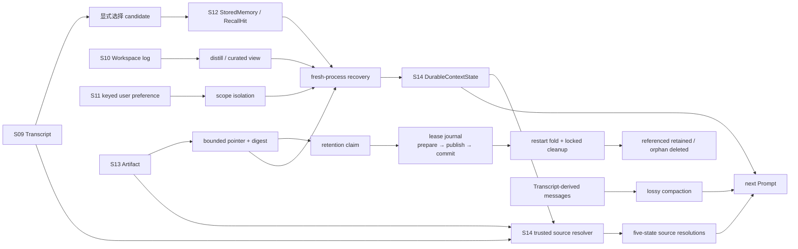

# Layered Memory Walkthrough：一次看清五类状态

单章 demo 适合隔离理解一个机制；这个 walkthrough 负责回答另一个问题：Transcript、Workspace Memory、User Memory、Remote Recall、Artifact 和 Context Compaction 在一次真实的离线流程里怎样协作，同时又不互相越权？

它没有新增 Memory 核心包，也没有复制章节实现。`code.py` 直接加载 S09–S14 的现有教学入口，只承担编排、故障注入和跨重启断言。


## 代码架构图



## 先记住：这些对象不是同一种 memory

| 对象 | 所有者 | 生命周期 | 允许有损吗 |
|---|---|---|---|
| Transcript event | S09 会话证据 | 单 session、追加写、可回放 | 不允许改写已落盘事件 |
| Workspace fact | S10 项目记忆 | 项目级、跨 session | 原始 log 不允许；curated view 可重新派生 |
| User preference | S11 用户记忆 | 用户级、跨项目 | 显式按 key 更新，不做模糊追加 |
| Recall hit | S12 查询结果 | 单 query | 是；它只是带 source 和 score 的候选视图 |
| Artifact | S13 大结果证据 | session artifact | 原文件不允许；Prompt 只留摘要和指针 |
| Retention claim | S13 清理租约 | Memory 引用期 | 无正文、无路径；只保护匹配 source/digest 的 Artifact |
| Lease journal | S13 引用事务证据 | session、跨进程 | 不允许改写；只忽略未换行的崩溃尾部 |
| Compacted messages | S14 Prompt 视图 | 单次或少数几次模型调用 | 允许；durable state 必须走无损旁路 |
| Source resolution | S14 本轮核验视图 | 单次 Prompt 组装 | 不复用旧状态；每轮从 owner 重新核验 |

这种拆分的价值不在于目录更多，而在于每层都有明确的写入者、恢复方式和失败边界。一个召回结果不能因为“被模型看见了”就自动写回长期 Memory；一个 conversation summary 也不能因为“读起来合理”就关闭 pending task。

## 运行

```bash
# 完全离线：不需要 API key，不访问网络。
python3 examples/layered_memory_walkthrough/code.py

# 保留所有证据文件，方便逐项检查。
python3 examples/layered_memory_walkthrough/code.py --home /tmp/layered-memory
```

`--home` 必须指向一个尚未生成 walkthrough manifest 的目录。这样重复实验不会静默覆盖上一轮证据。

正常输出包含七个阶段：

```text
[1] Transcript evidence
[2] Artifact reference
[3] Workspace log and distill
[4] User preference dedup and isolation
[5] Query-scoped recall
[6] Crash-recovered artifact leases and cleanup
[7] Compaction boundary — sources verified=2
RESULT: OK — layered memory boundaries survived compaction and restart.
```

## 主要代码流程

1. S09 写入两条 append-only transcript event，只显式选择其中一条 assistant message 作为 Memory candidate。candidate 只有稳定 source ID、摘要和选择原因，不复制整个 Transcript。
2. S13 把约 49KB 的工具结果外部化。Artifact 文件保存原文，后续层只接收 bounded summary、路径、SHA-256 和 source metadata。
3. S10 将同一项目决策作为两条独立证据追加到 daily log。`DistillPolicy` 根据 repeat threshold 把它们合并成一条 curated entry，同时保留两个 evidence ID；写入 Artifact outcome 前，S13 lease journal 先 fsync `prepared`，Memory 写入成功后再追加 `committed`。
4. S11 为 Alice 写入 keyed preference。相同 key/value 的第二次写入返回 `unchanged`，不增加 revision；Bob 使用同一 state root 仍得到空偏好，证明 user scope 隔离。
5. S12 把 S09 candidate 写成 source-bearing conversation record，再为一个自包含 query 生成带 rank、score 和 provenance 的 RecallHit。Recall 不修改 Workspace 或 User Memory。
6. walkthrough 丢弃所有对象并用相同路径创建新实例，分别恢复 Transcript、Workspace、User、Remote Store 和 Artifact。随后根据恢复结果重建 S14 `DurableContextState`。
7. fresh S13 journal 从 append-only 记录恢复 committed claim；fresh externalizer 在 journal 锁内重新 fold 当前引用，再用两阶段 cleanup 保留被引用的旧 Artifact、删除同龄但无 owner 的孤儿。recovery/report 都不复制正文或物理路径。
8. 为了在小 fixture 中确定性触发 S14，代码临时降低当前模块实例的压缩阈值，并在 `finally` 中恢复。对抗性 summarizer 会谎称“任务已完成”，测试要求错误只能进入 conversation summary，不能进入 durable context。
9. 压缩完成后创建新的 `SourcePointerResolver`，从可信 Transcript / Artifact 根重新核验两个 durable pointer，并确认已清理孤儿得到 `missing`。Prompt 只接收 status 与 evidence hash，bounded excerpt 不进入 durable context，manifest 也不复制正文。

## 为什么 S12 改成延迟初始化

Storage、RecallEngine 和 renderer 都是纯本地契约。若仅仅 `import s12_cloud_memory/code.py` 就要求 `MODEL_ID`、构造 SDK client 并向默认目录写 seed records，其他章节便无法在无 key 环境安全复用它。

现在的边界是：

```text
import S12
  └─ 只定义类型、函数与路径，不构造 client，不写默认 store

调用 recall_history / 启动交互 CLI
  └─ default_runtime() 首次创建教学 seed store

online agent_loop 真正调用模型
  └─ runtime_client() 才校验 MODEL_ID 并构造 provider client
```

这不是新增 provider 层，而是把副作用推迟到真正需要副作用的入口。程序化组合、测试收集和离线 walkthrough 因此不需要伪造 API key。

## Manifest 怎么读

运行目录里的 `layered_memory_manifest.json` 分三部分：

- `checks`：十一个布尔不变量，包括去重、隔离、lease 恢复、引用感知 cleanup、Artifact digest、source pointer 核验和 compaction 边界。
- `layers`：每一层的可观察结果，例如 distill report、RecallHit、ArtifactMemoryReference、不含路径的 lease recovery/cleanup report、压缩前后 token、触发层和不含 excerpt 的 source resolutions。
- `artifacts`：Transcript JSONL、Workspace log/curated view、User preferences、Remote store、retention journal 和 tool result 的真实路径。

Manifest 只是一份验收报告，不是新的 Memory 真源。需要核验时仍应打开对应 owner 的文件。

## 关键不变量

- **写入不等于召回。** StoredMemory 是 durable record；RecallHit 是当前 query 的派生候选。
- **重复不等于多存一份。** Workspace 用 evidence IDs 合并重复事实；User preference 用稳定 key 返回 `unchanged`。
- **同一 state root 不等于同一用户。** Alice 和 Bob 的 scope digest 不同，不能互读 canonical state。
- **引用不等于复制。** Memory-facing Artifact reference 没有 `content` 字段，大结果仍归 Artifact 文件所有。
- **发布不等于立即可信。** lease intent 必须先于 Memory 引用落盘；重启遇到 pending prepare 时默认保留 Artifact，等待 generation-fenced owner 对账。确认缺失时必须先在 owner 侧封存稳定 transaction ID、拒绝迟到写入，再把 lease 标成 `ABORTED`。
- **清理不等于删除整个 session。** active claim 只按 source ID + 完整 digest 保护对应证据；达到 TTL 的无引用孤儿才能在重验后删除。
- **恢复不等于复用旧对象。** walkthrough 明确创建 fresh store instances，再从磁盘重建视图。
- **摘要不拥有事实。** S14 只压缩 messages 副本，source-bearing facts 和 pending items 单独渲染。
- **Pointer 不等于已验证证据。** fresh resolver 必须从 owner 重新得到 `available`；清理、拒绝、损坏或未知 scheme 都会显式渲染 `evidence_unavailable=true`，不能由摘要补齐。

## 测试入口

```bash
python3 -m pytest -q tests/test_layered_memory_walkthrough.py
python3 -m pytest -q tests/test_remote_memory.py
python3 scripts/verify.py
```

端到端测试会主动移除常见 provider key 环境变量，运行 walkthrough 后再检查所有 manifest 不变量和实际文件。它验证的是 Harness plumbing 与状态边界，不模拟模型能力。
