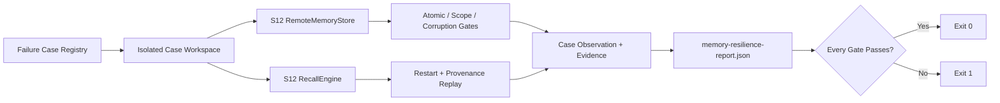

# Memory Resilience Evaluation：用故障注入验证长期记忆边界

> 结论先行：Memory “能写、能搜”还不够。并发重试、身份冲突、跨用户读取、损坏持久层和进程重启都必须得到可重复、可解释的结果。

本示例完全离线地运行五个 Memory contract gate，并输出结构化 scorecard。它直接加载 [S12 Cloud Memory](/lib/09-harness/learn-workbuddy/s12_cloud_memory) 的 `RemoteMemoryStore` 与 `RecallEngine`，不新增第二套 Memory 核心，也不调用模型或网络。

## 代码架构图



## 为什么需要独立的 resilience eval

[Layered Memory Walkthrough](/lib/09-harness/learn-workbuddy/examples-layered_memory_walkthrough) 解释 Transcript、Workspace/User Memory、Recall、Artifact 和 Compaction 在正常链路中如何协作。本示例回答另一类问题：持久层遇到竞争、边界越权或损坏后，Harness 能否留下确定的失败证据并安全停止。

它也不同于普通单元测试。测试负责保护实现；这个可运行示例给读者一份稳定的教学入口和 JSON 报告，可以直接观察每条契约的期望、实际结果和证据。

## 五个故障场景

| Case | 注入方式 | 必须成立的不变量 |
|---|---|---|
| `concurrent_duplicate_write` | 8 个 writer 同时写入同一 `memory_id` | 只有一个 durable winner，其余请求明确返回 duplicate |
| `id_collision` | 用已有 ID 提交不同内容与来源 | 新 payload 被拒绝，原记录不被覆盖 |
| `scope_isolation` | Bob 用 Alice 的物理存储路径读取 | 抛出 `RemoteMemoryScopeError`，不能泄漏记录 |
| `corrupt_store` | 在合法 JSONL 后追加 torn record | 抛出 `RemoteMemoryCorruptionError`，不能静默跳过 |
| `restart_recall` | 丢弃 store/engine 对象后重新构造 | 排名、Memory ID、provenance 一致，Recall 不改写 durable store |

这里的 “winner” 只是原子追加成功的那条 immutable record，不代表 duplicate writer 获得新的写权限。生产服务通常用唯一索引或 conditional write 提供同类边界；本地教学实现使用相邻 lock file 和 append-only JSONL。

## 主要代码流程

1. `load_memory_chapter()` 延迟加载 S12。只使用本地存储与召回类型，不构造 provider client。
2. `CaseDefinition` 把 case ID、契约和 runner 绑定在一起；每个 runner 获得独立临时目录，旧记录不会污染本轮结果。
3. runner 主动制造竞争或错误，然后将预期异常转换为 `CaseObservation`。异常类型本身就是 fail-closed 证据，不会被当作“测试崩溃”吞掉。
4. `evaluate_cases()` 捕获非预期异常并继续执行其余 case，因此一个坏场景不会遮住整份报告。
5. `EvaluationReport` 不计算可被平均美化的综合分。任意 contract gate 失败，顶层 `passed` 都是 `false`，CLI 返回非零退出码。

## 运行与报告

```bash
python3 examples/memory_resilience_eval/code.py
```

指定输出目录：

```bash
python3 examples/memory_resilience_eval/code.py \
  --output-dir /tmp/learn-workbuddy-memory-resilience
```

默认报告写入：

```text
.tmp/memory-resilience-eval/memory-resilience-report.json
```

报告中的每个 case 包含：

- `contract`：这个场景必须保护的边界；
- `observed`：实际发生的明确状态，而不是一段模糊日志；
- `evidence`：winner 数量、异常类型、Memory/Source ID、重启前后稳定性等可检查字段；
- `passed`：单条二元 gate。

这是一套确定性的存储与 Harness contract eval，不是模型质量、召回语义质量或吞吐量 benchmark。线程数量用于稳定触发竞争边界，不能解读为性能数据。

## 验证

```bash
python3 -m pytest -q tests/test_memory_resilience_eval.py
python3 scripts/verify.py
```

测试还会验证：无 API key CLI、报告落盘、全部 failure boundary 的证据字段，以及某个 runner 非预期失败时整份 scorecard 仍能给出可诊断的失败结果。
