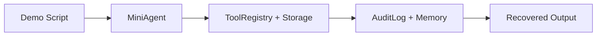

# Mini WorkBuddy 集成 demo

> Harness 层：把前面的机制连起来，得到一个最小 WorkBuddy。

## 代码架构图



## 包含什么

`mini_workbuddy` 实现了：

| 文件 | 作用 |
|---|---|
| `config.py` | 运行时目录、阈值、请求头 |
| `storage.py` | session record、JSONL transcript、tool-results |
| `tools.py` | bash/read_file/tool_search、权限和输出外部化 |
| `agent.py` | 简化 agent loop |
| `audit.py` | 串行化追加、hash chain 与 head anchor 审计日志 |
| `server.py` | REST + ACP endpoint + SSE events |
| `sidecar.py` | Unix socket sidecar manager |

## 运行单次 demo

默认 `auto` 模式：如果 `.env` 里有 `ANTHROPIC_API_KEY` 和 `MODEL_ID`，会调用真实模型；否则回退到离线 deterministic harness。

```bash
python3 examples/mini_workbuddy_demo/code.py
```

真实 API 模式：

```bash
cp .env.example .env
# 编辑 .env，填入 ANTHROPIC_API_KEY 和 MODEL_ID
python3 examples/mini_workbuddy_demo/code.py --mode real
```

离线 CI 模式：

```bash
python3 examples/mini_workbuddy_demo/code.py --mode offline
```

真实 API 模式会让模型自己发起 `tool_use`，mini harness 负责执行工具、写 transcript、写 audit、处理 tool result。离线模式会自动跑过：

- `tools`: 工具目录与延迟发现入口。
- `pwd`: shell 工具执行。
- `read README.md`: 文件读取。
- `bash rm -rf .`: 权限拒绝。
- `bash python3 -c "print('x' * 70000)"`: 大输出外部化到 `tool-results/`。
- workspace memory 写入和读取。
- JSONL transcript 恢复。
- audit hash chain 校验。

## 工具调用如何留下完整证据

`MiniAgent` 不会等工具成功后才补写历史。它先从 `ToolRegistry` 取得路径安全且唯一的 `tool_call_id`，持久化调用意图，然后才执行工具：

```text
user message
  -> tool_call (tool_call_id)
  -> tool_result (同一 tool_call_id)
     或 tool_error (同一 tool_call_id)
  -> assistant message
```

每次 `Storage.append_event()` 返回已经落盘的 `event_id` 和 `sequence`。Audit 条目通过 `transcriptEventId` 引用这条证据，SSE 更新通过 `eventId` 暴露同一引用。因此客户端收到实时事件后可以从 `/history` 找回对应记录；工具被拒绝、超时或执行失败时，Transcript 也不会只剩一条无法解释的 assistant 回复。

### 工具失败与记录失败有什么区别

`MiniAgent.prompt()` 只将 `ToolRegistry.run()` 抛出的权限拒绝、`OSError`、`KeyError` 和 `TimeoutError` 转成 `tool_error`。工具返回后的结果落盘、SSE 发布和 Audit 追加放在 `try/except/else` 的 `else` 中；这些步骤失败时，原始异常直接向调用方传播，不再生成 `Tool failed` 回复，也不自动重跑工具。

例如，`tools` 已成功返回工具目录，`tool_result` 已写入 Transcript，随后 Audit 追加抛出 `OSError`：调用方收到该异常，历史保留 `message → tool_call → tool_result`，不会给同一调用再追加 `tool_error` 或 assistant 回复。如果结果落盘前就失败，历史可能只有 `message → tool_call`；不能据此认定工具没有执行。

这里没有把工具执行、Transcript、SSE 和 Audit 变成一个事务，也没有新增自动恢复或恰好执行一次的保证。调用方遇到这类异常，应先检查已有历史及工具实际影响，再决定是否重试。异常处理按失败位置划分，而不能只按异常类型划分：同样的 `OSError`，可能来自工具，也可能来自后续记录写入。

## 并发审计追加流程

`server.py` 使用 `ThreadingHTTPServer`，多个请求会共享同一条审计链。`AuditLog.append()` 因此把链尾分配和落盘放在同一个临界区：

```text
请求线程
  -> 进程内锁
  -> 文件锁（协调共享目录的进程）
  -> 校验 index / prev_hash / hash / audit.head
  -> O_APPEND 写 audit.jsonl 并 fsync
  -> 原子替换 audit.head 并 fsync 目录
  -> 释放锁
```

锁解决的是“两个请求读到同一个旧链尾”的竞态；哈希链和 anchor 解决的是历史篡改与删尾检测。现有状态校验失败时，追加会直接拒绝，不会在损坏链上再写一条看似合法的记录。

服务重启时，`HarnessRuntime` 还会处理一个精确的崩溃状态：如果 `audit.jsonl` 的完整有效链只比 `audit.head` 多一条，并且旧 head 仍精确指向倒数第二条，就原子推进 anchor。这对应日志已经 `fsync`、但进程在发布新 head 前退出的窗口。多出两条以上、旧 head 不匹配或任一记录损坏时不会猜测恢复，运行时直接 fail closed。

## 启动服务

```bash
python3 -m mini_workbuddy.server --port 8765
```

健康检查：

```bash
curl --noproxy '*' http://127.0.0.1:8765/api/v1/health
```

发起 run：

```bash
curl --noproxy '*' -s -X POST http://127.0.0.1:8765/api/v1/runs \
  -H 'Content-Type: application/json' \
  -H 'X-Mini-WorkBuddy-Request: 1' \
  -d '{"prompt":"list files","cwd":"."}'
```

ACP 初始化：

```bash
curl --noproxy '*' -s -X POST http://127.0.0.1:8765/api/v1/acp \
  -H 'Content-Type: application/json' \
  -H 'X-Mini-WorkBuddy-Request: 1' \
  -d '{"jsonrpc":"2.0","id":1,"method":"initialize","params":{}}'
```

如果本机配置了代理，保留 `--noproxy '*'`。否则 curl 可能把 `127.0.0.1` 请求发给代理，得到空响应或 502。

## 关键学习点

这个 mini 版本不模拟模型智力，只模拟 harness 结构。真实产品里，`MiniAgent._plan()` 的位置会换成 LLM 调用；工具、权限、事件、持久化和协议层的位置保持不变。
