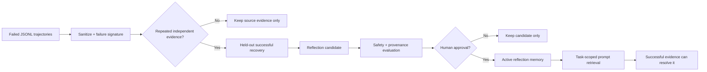

# Reflection Memory 离线示例

> Harness 层：失败是证据，不是指令。只有重复失败和成功恢复共同支持、通过评测并获得人工批准的反思，才会进入 Agent prompt。

## 代码架构图



## 为什么失败不能直接变成 Skill

失败轨迹只能说明某个做法没有奏效，不能证明正确做法是什么。如果把失败步骤直接固化成 Skill，Agent 只会更稳定地重复错误。

本示例把成功经验和失败经验分开处理：

```text
成功轨迹 + held-out 回放 -> 可执行 Skill 候选
重复失败 + 成功恢复       -> 非执行 Reflection 候选
```

Reflection 只提供任务相关的提醒，不携带工具权限，也不能绕过 harness permission gate。它与 [`examples/self_evolving_skills/`](/lib/09-harness/learn-workbuddy/examples-self_evolving_skills) 使用兼容的 JSONL 轨迹思想，但存储、审批和检索边界彼此独立。

## 形成 Reflection 的门禁

候选必须依次满足：

1. 至少两条同任务族、相同失败签名的训练轨迹；
2. `trace_id` 和 SHA-256 来源摘要都必须不同，不能复制一条证据凑支持度；
3. 失败签名只使用高层 intent、工具名和错误类别，不使用原始异常全文；
4. 一条 held-out 成功恢复轨迹必须显式引用全部失败证据；
5. 恢复轨迹与失败轨迹属于同一任务族；
6. Reflection 不复制原始命令、工具输出、路径、参数或堆栈；
7. 内容必须通过基础危险操作、密钥和提示覆盖扫描；
8. 即使评测通过，没有显式 `approved_by` 也不能成为 active memory。

字符串扫描只是第一层教学防线。真实系统还需要可信的错误分类、数据脱敏、prompt injection 防护、用户可见的记忆管理界面和更严格的权限隔离。

## 运行

只生成候选并完成评测，在人工审批门前停止：

```bash
python3 examples/reflection_memory/code.py
```

模拟用户明确批准，将 Reflection 加入任务级记忆：

```bash
python3 examples/reflection_memory/code.py --approve --approved-by alice
```

指定隔离目录：

```bash
python3 examples/reflection_memory/code.py \
  --home /tmp/learn-workbuddy-reflection-memory \
  --approve \
  --approved-by alice
```

整个示例不需要 API key，也不会访问网络。

## 产物结构

```text
.tmp/reflection-memory/
├── traces/                                      # 原始、受约束的 JSONL 证据
