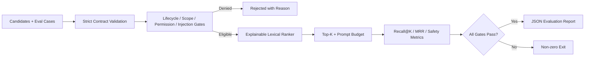

# Retrieval & Routing Evaluation 离线示例

> Harness 层：先用状态、作用域、权限和内容安全门禁过滤，再评价 Skill、Memory、Reflection 是否选对、排对、该拒答时拒答。

## 代码架构图



## 为什么需要独立评测

前面的示例已经形成三条能力：

```text
成功轨迹 -> 可执行 Skill
重复失败 + 成功恢复 -> 非执行 Reflection Memory
Skill / MCP 调用 -> 声明式权限交集
```

当候选库变大后，“能存进去”不等于“能在正确任务中取出来”。一个最新但无关的 Memory、一个关键词高度匹配但未批准的 Skill，或者其他用户作用域中的记录，都不应因为相关性分数高就进入 Prompt。

本示例不宣称实现生产级语义检索，而是建立一条可离线重复的评测基线：

```text
policy gates -> deterministic rank -> top-k/budget -> metrics
```

## 统一候选契约

`RoutingCandidate` 将三种外部知识放进同一个路由视图：

| 字段 | 作用 |
|---|---|
| `candidate_id` / `kind` | 稳定标识及 `skill`、`memory`、`reflection` 类型 |
| `title` / `summary` / `keywords` | 用于透明、可解释的离线检索 |
| `status` / `approved` | 只允许已批准的 active 候选 |
| `user_scope` / `workspace_scope` / `task_family` | 防止跨用户、跨项目、跨任务族召回 |
| `permissions` | Skill 所需工具和网络能力，必须是本轮 grant 的子集 |
| `provenance` | Prompt 投影保留来源，不把候选伪装成匿名事实 |

候选正文 `content` 只用于内容安全扫描，不参与相关性排名，也不会复制进 Prompt。这样能降低恶意正文用关键词堆叠操纵路由的空间。

## Policy-first 门禁

路由器在算分前依次拒绝：

1. `candidate`、`resolved`、`revoked` 等非 active 状态；
2. 没有显式批准的候选；
3. 含基础 prompt override 模式的摘要或正文；
4. `user_scope`、`workspace_scope` 或 `task_family` 不匹配；
5. Skill 请求了本轮未授权的工具或网络；
6. 没有词法重合，或低于拒答阈值；
7. 超过 `top_k` 或 Prompt 字符预算。

基础字符串扫描仍然不是完整的 prompt injection 防御。生产系统需要可信内容来源、分段隔离、模型级攻击评测和执行层权限；本示例保证的是失败路径可观察且默认关闭。

## 排名与稳定性

离线基线使用：

```text
score = 0.8 * query coverage + 0.2 * candidate precision
```

英文使用去除常见停用词后的单词 token，连续中文使用字符二元组。同分时按 `candidate_id` 排序，确保不同机器、不同运行次数得到相同结果。

## 评测指标

| 指标 | 解释 | 通过门槛 |
|---|---|---|
| `recall_at_k` | 正确候选进入前 K 的比例 | `>= 0.9` |
| `mrr` | 第一条正确候选的平均倒数排名 | `>= 0.9` |
| `false_positive_rate` | 明确禁止候选被选中的比例 | `0` |
| `abstention_accuracy` | 无正确候选时返回空结果的比例 | `1` |
| `scope_leak_rate` | 选中跨作用域候选的比例 | `0` |
| `permission_leak_rate` | 选中超出本轮授权 Skill 的比例 | `0` |
| `budget_violation_rate` | 超过 top-k 或字符预算的用例比例 | `0` |

这些指标不合成一个总分。安全泄漏不能被高 Recall 抵消；任何安全或预算指标失败，报告的 `passed` 都是 `false`。

## 无 key Golden Set

[`fixtures/cases.json`](https://github.com/adongwanai/learn-workbuddy/blob/d8c2a32614555196e405f20c67e23ed84f2f2239/examples/retrieval_routing_eval/fixtures/cases.json) 是可离线重复的 golden set，包含 14 个异构候选和 6 个用例。它不仅标注“应该召回谁”，还显式列出不得进入 Prompt 的 hard negatives：

- `commit` 的同义表达路由；
- 同一查询同时召回 Skill 与项目 Memory；
- Reflection 的任务族隔离；
- 关键词高度匹配但属于其他 user/workspace 的 Memory 必须先被作用域门禁拒绝；
- 已过期记录由生命周期层标为 `revoked`，已被新事实取代的冲突记录标为 `resolved`，两者都不能参加排名；
- 同作用域但低相关的 Memory 不能靠“较新”或少量重合词进入 Prompt；
- 没有候选时正确拒答；
- 相关 Skill 因网络/工具未授权而拒答；
- 未批准和 prompt override 候选作为额外 hard negatives。

路由器不从两段自然语言里猜测冲突，也不自行计算业务有效期。事实所有者先把记录推进到 `resolved` / `revoked`，检索门禁只消费显式生命周期状态。这样评测能稳定复现，生产环境也可以替换上游存储，而不改变 Recall@K/MRR 的含义。

## 运行

```bash
python3 examples/retrieval_routing_eval/code.py
```

指定 fixture 和输出目录：

```bash
python3 examples/retrieval_routing_eval/code.py \
  --fixtures examples/retrieval_routing_eval/fixtures/cases.json \
  --output-dir /tmp/learn-workbuddy-routing-eval
```

默认报告写到：

```text
.tmp/retrieval-routing-eval/retrieval-routing-report.json
```

评测完全离线，不需要 API key，不访问网络。全部门槛通过时退出码为 0，否则退出码为 1，因此可以直接作为 CI 或自进化发布前门禁。

## 验证

```bash
python3 -m pytest -q tests/test_retrieval_routing_eval.py
```

测试额外覆盖严格 fixture schema、跨 user/workspace、过期与冲突淘汰、低相关和无结果负例、权限交集、prompt override、预算截断、稳定同分排序、失败报告与 CLI JSON 产物。

## 与前两个示例的关系

```text
self_evolving_skills  -> 生成/审批 Skill
reflection_memory     -> 生成/审批 Reflection
retrieval_routing_eval -> 评价它们与 Memory 是否在正确任务中被安全召回
```

下一步可以把真实执行结果反馈为新的 eval case，但不能让路由器根据自身测试集自动改写答案或跳过人工审批，否则会把“自进化”退化成对 benchmark 的过拟合。
