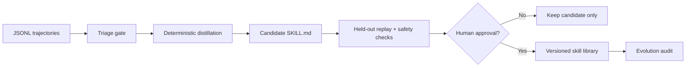

# Self-Evolving Skills 离线示例

> Harness 层：模型权重保持不变，把成功执行轨迹蒸馏成可审查、可评测、可审批和可回滚的外部 Skill。

## 代码架构图



## 这个示例解决什么问题

s09 已经能保存完整执行轨迹，s10 能从追加式事实中蒸馏长期记忆，s16 能加载和创建 `SKILL.md`，s23 能记录审计证据。本示例把这些思想连成一个部署期学习闭环：

```text
成功轨迹 -> 候选技能 -> 独立评测 -> 人工批准 -> 版本化发布
```

它不是让 Agent 无约束地改写自己的 Prompt 或源码，也不训练模型参数。Agent 的“进化”发生在外部、可读、可 diff、可回滚的 Skill 库中。

## 安全与质量门禁

候选 Skill 必须依次满足：

1. 至少两条同类、成功且步骤一致的训练轨迹；
2. 失败轨迹不能成为 Skill 来源；
3. Skill 只保留通用意图、工具名和 provenance，不复制原始命令或工具输出；
4. 声明的工具必须与实际轨迹一致；
5. 一条未参与蒸馏的 held-out 轨迹必须成功复现相同步骤；
6. 内容必须通过基础危险操作、密钥和提示覆盖扫描；
7. 即使评测通过，没有显式 `approved_by` 也不能进入正式 Skill 库。

字符串扫描只是第一层教学防线，不等于沙盒。真实系统仍需要声明式权限、隔离试跑、网络出口控制和更强的 Skill 安全评测。

## 运行

只生成候选并完成评测，在人工审批门前停止：

```bash
python3 examples/self_evolving_skills/code.py
```

模拟用户明确批准，将候选发布为版本化 Skill：

```bash
python3 examples/self_evolving_skills/code.py --approve --approved-by alice
```

指定隔离目录：

```bash
python3 examples/self_evolving_skills/code.py \
  --home /tmp/learn-workbuddy-self-evolution \
  --approve \
  --approved-by alice
```

整个示例不需要 API key，也不会访问网络。

## 产物结构

```text
.tmp/self-evolving-skills/
├── traces/                         # 原始 JSONL 证据
