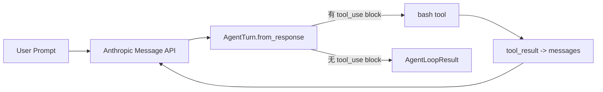

# s01: Agent Loop — 一个循环就够了

> *"一个循环 + 一个工具 = 一个 Agent"* — tool_use 驱动继续，显式结果说明停止。
>
> **Harness 层**: 循环 — 模型与真实世界的第一道连接。

---


## 代码架构图



## 学习前置知识

- LLM 一次响应可能包含普通文本, 也可能包含 tool_use。
- Agent loop 的核心不是“会聊天”, 而是能把模型输出、工具执行、工具结果重新喂回模型。
- ReAct 思路可以理解为 Reasoning + Acting 的循环。

## 本章抓住的 WorkBuddy-style 机制

- 用最小 while 循环模拟 WorkBuddy-style harness 的心跳。
- 用 tool_use/tool_result 形成可观察、可测试的交互边界。
- 用 `AgentLoopResult` 显式区分正常回答、token 截断和轮次预算。
- 先接受单进程简化, 后续章节再把 UI、Sidecar、Session 拆开。

## 常见误区

- 把 agent 写成一次性 prompt 调用, 后面就很难加入工具、记忆和恢复。
- 直接信任 stop_reason 容易漏掉流式响应里的工具调用。
- 使用无界 `while True`, 模型持续调用工具时无法给 harness 一个确定的停止点。
- 一开始就上复杂框架, 会看不清 harness 的真正边界。
## 问题

你提出了一个问题给大模型："帮我读取下我的目录下有哪些文件，并且执行XXX.py"。

模型能输出一条 bash 命令，但输出完了就停了。它不会自己跑，也不会看到结果后继续推理。

你可以手动跑一遍，把输出粘贴回对话框，让它接着干。下一个命令出来，你再跑一遍、再贴回去。每一个来回，你都在做中间层。

把它自动化，就是这一章做的事。WorkBuddy 的 生产级 `agent bridge` 核心，拆到底也是这一个循环。

---

## 解决方案

模型返回工具调用就继续，没有工具调用就停止。内容块决定“是否继续”，provider 的 `stop_reason` 用来解释“为什么停止”；harness 自己还维护最大轮次预算。

| 观察结果 | Harness 解释 | 循环动作 |
|------|------|---------|
| 有 `tool_use` block | 模型请求执行真实 I/O | 执行 → 结果喂回去 → 继续 |
| 无工具块，普通结束 | 模型给出最终回答 | 返回 `final_answer` |
| 无工具块，`max_tokens` | 回答被 provider 截断 | 返回 `max_tokens`，保留部分文本 |
| 达到 `max_turns` | Harness 预算耗尽 | 返回 `max_turns`，不再发起新模型调用 |

---

## 工作原理

**第 1 步**：把用户的问题作为第一条消息。

```python
messages = [{"role": "user", "content": query}]
```

**第 2 步**：将消息和工具定义一起发给 LLM。

```python
response = client.messages.create(
    model=MODEL, system=SYSTEM, messages=messages,
    tools=TOOLS, max_tokens=8000,
)
```

**第 3 步**：把 provider 响应归一成一个 `AgentTurn`。解析只做一次，后续判断和执行共享同一份数据。

```python
turn = AgentTurn.from_response(response)
messages.append({"role": "assistant", "content": turn.content})
```

**第 4 步**：先判断是否停止。工具内容块优先决定循环是否继续，`stop_reason` 负责区分终止类型。

```python
stop_reason = stop_reason_for(turn)
if stop_reason is not None:
    return AgentLoopResult(
        stop_reason=stop_reason,
        turns=turn_number,
        tool_calls=tool_call_count,
        final_text=turn.text,
        provider_stop_reason=turn.provider_stop_reason,
    )
```

**第 5 步**：执行模型要求的工具，收集结果。

```python
results = [execute_bash_call(call) for call in turn.tool_calls]
```

**第 6 步**：把工具结果作为新消息追加，回到第 2 步。

```python
messages.append({"role": "user", "content": results})
```

核心循环因此保持直接，同时返回一个可测试的结果契约：

```python
def agent_loop(messages, max_turns=8):
    tool_call_count = 0
    for turn_number in range(1, max_turns + 1):
        response = client.messages.create(
            model=MODEL, system=SYSTEM, messages=messages,
            tools=TOOLS, max_tokens=8000,
        )
        turn = AgentTurn.from_response(response)
        messages.append({"role": "assistant", "content": turn.content})

        stop_reason = stop_reason_for(turn)
        if stop_reason is not None:
            return AgentLoopResult(
                stop_reason, turn_number, tool_call_count,
                turn.text, turn.provider_stop_reason,
            )

        results = [execute_bash_call(call) for call in turn.tool_calls]
        tool_call_count += len(results)
        messages.append({"role": "user", "content": results})

    return AgentLoopResult(
        LoopStopReason.MAX_TURNS, max_turns, tool_call_count,
        turn.text, turn.provider_stop_reason,
    )
```

循环主体仍然很小；新增类型不是框架层，而是把原来隐藏在松散对象和 `return` 里的 turn、tool call 与停止原因显式化。后面 23 个章节会在这个循环周围叠加机制。

---

## 试一下

> **教学 demo 提示**：代码会执行模型生成的 shell 命令。建议在一个临时测试目录中运行。s04 会讲真正的权限系统。

**准备**（首次运行）：

```sh
pip install -r requirements.txt
cp .env.example .env
# 编辑 .env，填入 ANTHROPIC_API_KEY 和 MODEL_ID
```

**运行**：

```sh
python s01_agent_loop/code.py
```

试试这些 prompt：

1. `Create a file called hello.py that prints "Hello, World!"`
2. `List all Python files in this directory`
3. `What is the current git branch?`

观察重点：模型什么时候调用工具（循环继续），什么时候给出最终文本；如果模型连续调用工具，`max_turns` 如何让 harness 有界停止？

---

## 接下来

现在模型手里只有 bash 一个工具。WorkBuddy-style 桌面 agent 往往有多组 RPC 领域、内置工具池、MCP 连接器工具。怎么管理这么多工具？

s02 Tool Dispatch → 给它多个工具，用一个 dispatch map 统一分发。


<summary>Clean-room 架构对照</summary>

> 以下是教学版对桌面 agent harness 可观察行为的 clean-room 对照。

### Agent loop — harness 的核心

教学版把 agent 核心压缩成一个可读循环。生产级实现通常还会在同一层处理：

- Agent loop 的核心循环
- ACP (Agent Communication Protocol) HTTP 端点定义
- 工具注册和分发逻辑
- 流式响应处理
- 错误恢复策略

### 多进程中的循环位置

WorkBuddy 的 agent loop 不在 Electron 主进程里跑，而在 CLI 会话子进程中运行：

```
Electron Main Process
  └─ SidecarServer
       └─ JSON-RPC over Unix Socket
            └─ CLI Session Process (cli/)
                 └─ ACP HTTP Server
                      └─ Agent Loop
```

主进程通过 Sidecar 管理会话的创建、销毁、状态查询，但不直接运行 agent loop。这种分离让 UI 不被 agent 的长时间运行阻塞。

### stop_reason 的处理

流式 provider 往往会让内容块和最终停止元数据在不同事件中到达。因此 harness 不应只用 `stop_reason` 决定是否执行工具；先检查归一化后的 `tool_use` 内容块，再用停止元数据解释最终状态，更容易兼容同步与流式实现。

### RingBuffer — 有界输出缓冲

Sidecar 进程使用 固定大小的 RingBuffer 来缓冲 agent 的流式输出。当 agent 产生大量输出（比如读取一个大文件），RingBuffer 确保不会丢失数据，同时避免无限内存增长。超出缓冲的内容会被丢弃，但 agent 仍然能继续工作。

### 教学版的简化

- 生产级 agent bridge → 一个小型有界循环 + 显式结果契约
- 多进程 Sidecar → 单进程直接调用
- 流式响应 → 同步响应
- RingBuffer → 列表
- ACP HTTP → 函数调用

**一句话**：生产级 agent bridge 的核心仍是有界 turn loop；显式字段和退出路径让它可以被测试、观测和安全停止。


---

## 下一课

有界循环搭好了 agent 的骨架。但循环里只有一个显式的 bash 分支——agent 怎么知道有哪些工具可用？怎么从模型输出的函数调用路由到正确的工具？s02 讲工具分发——dispatch map、并发执行、流式工具调用。

s02 Tool Dispatch → 多个工具, 一个 dispatch map。
