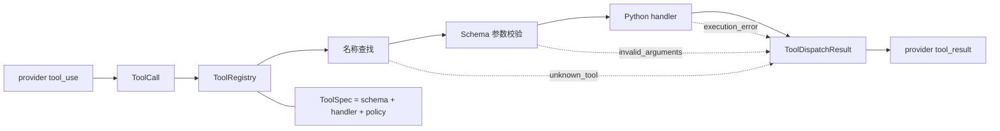

# s02: Tool Dispatch — 一个注册表就是工具边界

> *“模型只提出调用意图，Harness 决定它能否以及如何成为一次本地执行。”*
>
> **Harness 层**：工具分发 — 从模型协议跨入真实 Python 代码的边界。

---


## 代码架构图



## 学习前置知识

- s01 已经把一轮模型响应归一成 `AgentTurn`，并用工具内容块决定循环是否继续。
- 工具定义存在两个方向：向模型描述可用能力，以及在本地执行 Python callable。
- 模型产生的是不可信协议输入；即使 schema 已发给模型，Harness 仍要在执行前验证。
- 并发是执行策略，不是所有工具调用的默认属性。

## 本章抓住的 WorkBuddy-style 机制

- 用一个 `ToolRegistry` 管理注册、模型 schema、名称查找、参数校验和执行。
- 用 `ToolCall` 隔离 provider block，用 `ToolDispatchResult` 隔离本地执行结果。
- 未知工具、错误参数和 handler 异常都转换成显式错误结果，不让 Agent Loop 崩溃。
- 只有标记为 `concurrent_safe` 的只读工具批次才能并发；写入和未知调用保守串行。
- 文件工具继续使用 `safe_path()` 限制工作区边界。
- bash handler 为子进程重新构造最小环境，避免把 provider 凭据随工具调用直接传出 Harness。

## 常见误区

- 分别维护 `TOOLS` 和 `TOOL_HANDLERS`：改了 schema 忘记改 handler，或者反过来。
- 认为模型“看过 schema”就不会传错参数：模型输出仍然可能缺字段、类型错误或包含多余字段。
- 直接执行 `handler(**block.input)`：协议错误和 Python 异常会穿透到循环层。
- 把所有同轮工具都并发：`write_file` 后紧跟 `read_file` 时会产生竞态。
- 把安全策略塞进 Agent Loop：循环会逐渐知道每种工具的细节，新增工具就必须改循环。
- 认为设置 `cwd` 就完成了隔离：工作目录不会自动移除父进程的 API key、SSH agent socket 或其他环境变量。

## 问题

s01 只有一个 bash 工具，所以循环可以直接写：

```python
output = run_bash(call.arguments["command"])
```

当工具扩展到 read、write、edit 和 glob 后，硬编码分支会同时承担七件事：

1. 告诉模型有哪些工具；
2. 根据名字找到 Python 函数；
3. 判断参数是否完整；
4. 把参数传给 handler；
5. 决定能否并发；
6. 把成功或失败编码回 provider 协议。
7. 决定工具子进程可以继承哪些宿主环境变量。

如果这些信息散落在 schema 列表、dispatch 字典和循环分支中，它们迟早会不一致。真正需要新增的不是更多 `if/elif`，而是一条明确的 **dispatch boundary**。

---

## 解决方案

每个工具只注册一次：

```python
ToolSpec(
    name="read_file",
    description="Read UTF-8 file contents from the workspace.",
    input_schema=object_schema(
        {
            "path": {"type": "string"},
            "limit": {"type": "integer", "minimum": 1},
        },
        ["path"],
    ),
    handler=run_read,
    concurrent_safe=True,
)
```

这一个对象同时回答四个问题：

| 字段 | 面向谁 | 作用 |
|------|--------|------|
| `name` | 模型协议和 Harness | 稳定查找键 |
| `description + input_schema` | 模型 | 描述调用方式 |
| `handler` | 本地执行器 | 实际 Python 实现 |
| `concurrent_safe` | Harness | 批量执行策略 |

`ToolRegistry` 再从这些 `ToolSpec` 派生模型工具目录，并使用同一批对象完成运行时查找。项目中不再存在一份独立的 `TOOLS` 列表和另一份 `TOOL_HANDLERS` 字典。

---

## 工作原理

### 1. 归一化 provider 输入

模型 SDK 的 block 是供应商对象。dispatch 层先只提取需要的字段：

```python
@dataclass(frozen=True)
class ToolCall:
    tool_use_id: str
    name: str
    arguments: object
```

`arguments` 故意只声明为不可信 `object`，因为“它是不是可用的参数映射”本身就是 Harness 要验证的协议条件。校验通过后，dispatch 才把它收窄为 `Mapping` 并展开给 handler；这里不提前假装输入可信。

### 2. 从注册表生成模型 schema

```python
def model_schemas(self):
    return [spec.model_schema() for spec in self._specs.values()]
```

`model_schema()` 返回深拷贝。调用方即使修改发送给 SDK 的字典，也不会污染注册表中的执行契约。

### 3. 先查找，再校验，最后执行

```python
def dispatch(self, call):
    spec = self.get(call.name)
    if spec is None:
        return unknown_tool_result(call)

    error = validate(spec.input_schema, call.arguments)
    if error:
        return invalid_arguments_result(call, error)

    try:
        return success_result(call, spec.handler(**dict(call.arguments)))
    except Exception as exc:
        return execution_error_result(call, exc)
```

顺序很重要：

- **查找失败**说明模型调用了未注册能力；
- **校验失败**说明协议参数无法安全绑定；
- **执行失败**说明已经进入 handler，但本地 I/O 或实现报错。

三者对排查问题的意义不同，所以使用稳定的 `ToolErrorCode` 区分，而不是全部返回模糊的 `Error: ...`。

### 4. 参数校验属于 Harness

本章实现教学所需的 JSON Schema 子集：

- 输入必须是 object；
- required 字段必须存在；
- `additionalProperties: false` 拒绝拼错或多余参数；
- 检查 string、integer、number、boolean、object、array；
- 支持本章 `limit` 使用的 `minimum`。

这不是要重写完整 JSON Schema 标准，而是展示关键职责：**schema 不只用于提示模型，也用于执行前验证**。生产实现可以在相同边界替换成成熟 validator，而 Agent Loop 无需改变。

### 5. 错误也是正常协议结果

```python
@dataclass(frozen=True)
class ToolDispatchResult:
    call: ToolCall
    content: str
    error_code: ToolErrorCode | None = None
```

失败时编码为：

```python
{
    "type": "tool_result",
    "tool_use_id": "call_123",
    "content": "Error [invalid_arguments]: ...",
    "is_error": True,
}
```

Agent Loop 因此可以把失败反馈给模型，让模型修正参数或选择其他工具，而不是因为一个 `KeyError` 或 `TypeError` 整体退出。

### 6. 并发由工具元数据决定

当前五个工具的策略是：

| 工具 | `concurrent_safe` | 原因 |
|------|-------------------|------|
| `read_file` | 是 | 只读文件 |
| `glob` | 是 | 只读目录匹配 |
| `bash` | 否 | 命令语义未知 |
| `write_file` | 否 | 修改文件 |
| `edit_file` | 否 | 读取后再写入 |

只有整个批次都明确安全时才进入线程池；只要包含一个未知、bash 或写工具，就按模型给出的顺序串行执行。并发结果仍按原调用顺序返回，保证 `tool_use_id` 对齐。

### 7. 文件边界仍由 handler 保证

```python
def safe_path(path_text: str) -> Path:
    path = (WORKDIR / path_text).resolve()
    if not path.is_relative_to(WORKDIR):
        raise ValueError(f"path escapes workspace: {path_text}")
    return path
```

注册表负责通用协议边界，handler 仍负责自己的领域约束。路径越界异常会被 dispatch 捕获并转换成 `execution_error`。s04 会把更完整的 allow / ask / deny 决策提升到权限层；s23 再讲系统沙盒。

### 8. bash 子进程不继承 provider 凭据

真实模型客户端通常需要从宿主环境读取 API key，但执行工具的 shell 不应自动得到同一批凭据。`run_bash()` 因此显式传入重新构造的环境：

```python
completed = subprocess.run(
    command,
    cwd=WORKDIR,
    env=build_subprocess_env(WORKDIR),
    shell=True,
    # ...
)
```

`build_subprocess_env()` 只保留命令查找、语言区域和临时文件所需的变量；`HOME` 与 `PWD` 都指向 `WORKDIR`。未列入允许列表的 `OPENAI_API_KEY`、`ANTHROPIC_API_KEY`、`SSH_AUTH_SOCK` 和任意宿主变量不会进入子进程。

这是对子进程直接继承环境的默认拒绝，不是完整沙盒。bash 仍可能读取工作区中的 `.env`、访问当前系统用户有权读取的其他文件或连接网络；这些能力需要 s04 的权限判断、s23 讨论的系统隔离和生产环境的网络策略共同限制。

---

## Agent Loop 为什么几乎不变

s02 继承 s01 的 `AgentTurn`、停止原因和最大轮次，只把硬编码执行替换成两句：

```python
tools = registry.model_schemas()
dispatch_results = registry.dispatch_many(list(turn.tool_calls))
```

随后统一编码：

```python
messages.append({
    "role": "user",
    "content": [result.to_protocol_block() for result in dispatch_results],
})
```

这正是边界设计的价值：新增一个工具时，循环不需要知道它的 schema、函数签名、错误类型或并发策略。

---

## 相对 s01 的变化

| 组件 | s01 | s02 |
|------|-----|-----|
| 工具数量 | 1 个 bash | 5 个注册工具 |
| 元数据来源 | 单工具常量和硬编码执行 | `ToolSpec` 单一真源 |
| 名称查找 | 无 | `ToolRegistry.get()` |
| 参数处理 | 直接取 `command` | schema 执行前校验 |
| 错误处理 | bash 文本错误 | 稳定错误码 + `is_error` |
| 并发 | 串行 | 仅全只读安全批次并发 |
| 路径安全 | bash 自身语义 | 文件 handler 使用 `safe_path()` |
| 子进程环境 | 继承 provider 进程环境 | 允许列表 + 工作区 `HOME` / `PWD` |
| 循环契约 | 显式 turn 与 stop reason | 保持不变，只委托 dispatch |

---

## 试一下

无需 API key 的章节演示：

```sh
python3 s02_tool_dispatch/code.py --demo
```

连接真实 provider：

```sh
python3 s02_tool_dispatch/code.py
```

可以尝试：

1. `Read README.md and s01_agent_loop/README.md, then compare them` 观察两个只读调用能否并发。
2. `Create notes/demo.txt, then read it back` 观察写后读为何保守串行。
3. `Find all Python files under s02_tool_dispatch` 观察 glob 工具。
4. 在测试中构造缺少参数或未知工具，观察 `is_error` 结果如何回到模型。

观察重点不是工具函数各自做什么，而是每次调用如何穿过同一条注册、校验、执行和返回路径。

---


<summary>Clean-room 生产设计对照</summary>

### 动态工具池仍需要统一注册边界

生产 Harness 的工具可能来自内置工具、MCP 连接器或按需加载的技能：

```text
assemble_tool_pool() = BUILTIN_TOOLS + MCP_TOOLS + SKILL_TOOLS
```

来源可以动态变化，但进入 Agent Loop 前仍应归一成统一的工具描述：稳定名称、模型 schema、执行入口和策略元数据。S02 使用静态注册表，是为了把这条不随来源变化的边界讲清楚；S03 才讨论“先发现、再加载”。

### 完整生产实现会继续增加什么

- 使用成熟 JSON Schema validator，并输出可定位到字段路径的错误；
- 为工具名称加入命名空间，例如 `mcp__server__tool`；
- 增加权限等级、超时、取消、输出上限和审计标签；
- 根据资源锁或读写集合判断能否并发，而不只使用布尔值；
- 对流式工具参数先组装完整 JSON，再进入同一个 dispatch boundary；
- 记录调用耗时、错误码和重试次数，供 trace 与 eval 使用。
- 将默认拒绝的环境过滤覆盖到 sidecar、MCP server 和其他外部进程，并与 OS 沙盒及网络出口控制组合使用。

这些机制都可以扩展 `ToolSpec` 或包裹 `dispatch()`，不需要把工具细节重新塞回 Agent Loop。


---

## 下一课

现在所有工具都能通过一个注册表描述和执行，但它们仍在启动时全部可见。工具数量继续增长时，完整 schema 会占用上下文，也会降低模型选对工具的概率。

s03 Deferred Loading → ToolSearch + DeferExecuteTool：先发现，再加载。
