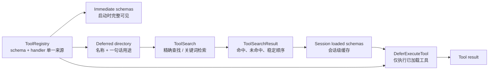

# s03: Deferred Tool Loading — 先发现，再加载，再执行

> “工具先列目录，schema 用到再展开。”
>
> **Harness 层**：控制每一轮向模型暴露哪些工具契约。

---


## 代码架构图



S02 解决的是“工具定义和执行不能分家”：schema、handler 和 dispatch 由同一个注册表管理。S03 没有再造第二套注册表，而是在同一份工具定义之上增加了**可见性策略**：

- 高频、短 schema 工具从第一轮开始完整可见；
- 低频、长 schema 工具启动时只出现在紧凑目录；
- `ToolSearch` 命中后，完整 schema 才进入本次会话；
- `DeferExecuteTool` 只允许执行已经被发现并加载的延迟工具。

这是一种 clean-room 教学实现。它说明 deferred tools 的必要数据流，不依赖某个产品的私有字段、固定工具数量或内部索引实现。

## 为什么模型不是一开始就看到所有 input_schema

标准 tool calling 通常会把每个工具的 `name`、`description`、`input_schema` 一起发给模型。工具少时，这是最简单可靠的方案；工具目录变大后，全量 schema 会持续占用上下文，而且多数工具在当前任务里根本不会被调用。

因此 S03 把“知道有这个能力”和“知道怎么调用这个能力”拆开：

| 阶段 | 模型看到什么 | 能做什么 |
|---|---|---|
| 启动 | 即时工具完整 schema；延迟工具名称与简述 | 判断需要搜索哪类能力 |
| 发现 | `ToolSearch` 返回的少量完整 schema | 理解命中工具的参数契约 |
| 执行 | `DeferExecuteTool` 通用入口 | 按已加载契约提交参数 |

目录不是 schema 的替代品。它只负责召回候选工具；真正执行前，模型仍然必须看到完整 `input_schema`。

## 设计不变量

### 1. 工具定义只有一份

```python
registry.register(
    "image_gen",
    schema=IMAGE_GEN_SCHEMA,
    handler=mock_image_gen,
    defer=True,
)
```

`ToolEntry` 同时持有目录描述、完整 schema、handler 和加载策略。搜索结果与执行入口都从这份定义解析，避免“目录说有工具，但执行映射没有”或“schema 已更新，handler 仍按旧参数运行”。

注册时还会拒绝：

- 空名称；
- 重复名称；
- 注册名称与 schema 名称不一致；
- 非 object 类型的输入 schema。

这些问题在启动阶段暴露，比运行到模型调用时才失败更容易定位。

### 2. 已加载状态属于会话

```python
self._loaded_schemas: dict[str, dict[str, Any]] = {}
```

注册表描述“系统有什么工具”，loaded cache 描述“当前会话已经向模型展示过什么 schema”。二者不能混为一谈。第一次搜索返回 `load_state=loaded`，同一会话再次搜索返回 `load_state=cached`，但不会创建第二份工具定义。

### 3. 搜索结果必须可解释、可复现

`ToolSearchResult` 同时记录：

- `matches`：命中的名称、分数、完整 schema、加载状态；
- `missing`：精确名称未命中或查询无结果；
- 稳定顺序：先按分数降序，再按名称升序打破平分。

显式的次级排序很重要。若平分结果依赖字典或注册顺序，同一个输入可能在不同构建中加载不同工具，回归 trace 也会产生无意义抖动。

本章的关键词评分器故意保持简短、可读：精确名称最高，名称 token 次之，描述 token 再次之。生产系统可以换成 BM25、向量检索或混合召回，但仍应保留相同的结果契约和稳定排序。

### 4. 发现是执行前置条件

```python
output = handle_defer_execute(
    registry,
    toolName="image_gen",
    params={"prompt": "a cat sitting on a desk"},
)
```

如果 `image_gen` 尚未进入 loaded cache，执行器返回可观察错误并提示先调用 `ToolSearch`。它也不会接受即时工具：即时工具应该走 S02 的直接 dispatch，不能借通用延迟入口绕过原有边界。

这里的加载只表示“schema 已进入会话上下文”，并不表示下载代码、安装插件或绕过权限检查。

## 主要代码流程

### 路径 A：按精确名称发现

```text
Model: ToolSearch(tool_names=["image_gen"])
  -> ToolRegistry.load_by_name()
  -> 确认它是 deferred tool
  -> schema 写入 session loaded cache
  -> ToolSearchResult(matches=[...], missing=[])
  -> 完整 input_schema 返回给模型
```

精确列表会保留调用者顺序，同时折叠同一次请求中的重复名称，避免重复 schema 进入同一个 tool result。

### 路径 B：按用途搜索

```text
Model: ToolSearch(queries=["image generation"], top_k=3)
  -> 规范化查询词
  -> 只评分 deferred tools
  -> (-score, name) 稳定排序
  -> 只加载 top_k 命中 schema
  -> 返回可解释的 ToolSearchResult
```

未命中不会抛异常，也不会改变 loaded cache；结果会显式告诉模型哪个名称或查询没有对应延迟工具。

### 路径 C：执行已加载工具

```text
Model: DeferExecuteTool(toolName="image_gen", params={...})
  -> 工具是否存在？
  -> 是否为 deferred tool？
  -> schema 是否已在本会话加载？
  -> 从同一 ToolEntry 取得 handler
  -> 执行并把成功/失败写成 tool result
```

handler 异常会被转换为模型可见的观察结果，避免一个工具失败直接拆掉 agent loop。参数的完整 JSON Schema 校验已经在 S02 讲解，本章聚焦可见性与加载状态，不重复扩大验证器实现。

## 为什么保留 ToolSearch + DeferExecuteTool 两步

生产 harness 常见两种渐进式方案：

1. 搜索后，在下一轮直接把命中工具加入 provider 的 `tools` 列表；
2. 搜索后，通过一个通用执行入口调用命中工具。

本章选择第二种，因为它能在一个离线、单文件 demo 里直接观察完整状态机，同时不依赖特定 provider 是否支持运行中修改工具集合。两种方案共享核心原则：**模型执行前必须获得准确 schema，harness 只暴露当前任务需要的少量 schema。**

## Token 估算的正确读法

`code.py` 用 `len(json) // 4` 做教学估算，运行时会同时输出：

- 全量加载全部 schema 的估算成本；
- 启动时即时 schema + 延迟目录的估算成本；
- 本会话经 `ToolSearch` 实际加载的增量；
- 最终相对全量加载的估算差值。

这些数字只用于比较本 demo 的两种装载策略，不是 tokenizer 实测，也不应外推成任何真实产品的固定节省比例。真实收益取决于 provider 序列化方式、工具数量、schema 长度、缓存策略和单会话实际命中数。

## 失败路径

| 场景 | Harness 行为 | 设计原因 |
|---|---|---|
| 精确名称不存在 | 写入 `missing`，不激活任何工具 | 让模型可以改写查询 |
| 关键词无命中 | 返回明确空结果 | 空结果是数据，不是异常 |
| 重复注册名称 | 启动时抛 `ValueError` | 防止目录和执行歧义 |
| 平分结果 | 按名称稳定排序 | 保持测试与 trace 可复现 |
| 未搜索直接执行 | 拒绝并提示先搜索 | 保证模型先看参数契约 |
| 延迟入口调用即时工具 | 拒绝并提示直接调用 | 保留 S02 dispatch 边界 |
| handler 抛异常 | 转成工具错误文本 | 保住 agent loop |

## 运行

```sh
python3 s03_deferred_loading/code.py
```

不需要 API key。默认 mock 对话会依次执行：

1. `ToolSearch(tool_names=["image_gen"])`；
2. 返回并缓存 `image_gen` 完整 schema；
3. `DeferExecuteTool(toolName="image_gen", params=...)`；
4. mock handler 返回图片路径；
5. 输出本次会话的 schema 成本统计。

也可以进入交互模式：

```sh
python3 s03_deferred_loading/code.py --interactive
```

```text
tools
search image
schema image_gen
run image_gen {"prompt":"a cat at a desk","size":"1024x1024"}
q
```

## 测试覆盖

```sh
python3 -m pytest -q tests/test_s03_deferred_loading.py
```

行为测试固定了本章最重要的五条契约：

1. 重复名称不能注册；
2. 未命中不会污染 loaded cache；
3. 平分搜索结果顺序稳定；
4. 延迟工具必须先发现再执行；
5. 即时工具不能通过延迟执行器绕行。

## 练习

1. 给 scorer 增加同义词映射，但保持相同分数下按名称稳定排序。
2. 给 `ToolSearchResult` 增加 `query_id`，观察多轮 trace 中一次发现如何对应后续执行。
3. 将 session loaded cache 移到独立 `ToolVisibility` 对象，比较“全局注册表 + 多会话状态”的生命周期。
4. 把关键词评分器替换为离线 BM25，同时让现有五个行为测试继续通过。

---

上一课：[s02 Tool Dispatch](/lib/09-harness/learn-workbuddy/s02_tool_dispatch) — 一个注册表统一 schema、验证和执行

下一课：[s04 Permission & Hooks](/lib/09-harness/learn-workbuddy/s04_permission_hooks) — 工具可调用之后，先做权限与生命周期边界
