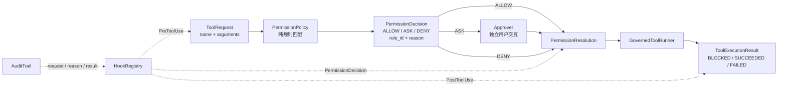

# s04: Permission & Hooks — 先决策，再审批，再执行

> “先划边界，再给自由。”
>
> **Harness 层**：把模型提出的动作变成可解释、可审批、可审计的执行结果。

---


## 代码架构图



S03 解决“哪些工具 schema 对模型可见”，S04 解决“模型选中工具后，Harness 是否允许它跨入本地执行”。核心并不是危险词越列越多，而是把治理过程拆成三个可测试阶段：

1. `PermissionPolicy.decide()` 只做规则匹配，输出 `ALLOW / ASK / DENY`；
2. `resolve_permission()` 只为 `ASK` 请求用户意见，`ALLOW / DENY` 不触发交互；
3. `GovernedToolRunner.run()` 根据解析结果决定是否调用 handler，并统一返回执行结果。

每个权限决定都带稳定的 `rule_id` 和面向人的 `reason`。审计记录因此能回答“哪条规则、为什么、用户是否批准、工具最终怎样结束”，而不是只留下一句模糊的“permission denied”。

## 为什么必须拆开三个阶段

旧式写法常把规则判断、`input()` 和 handler 调用塞进同一个 pre-tool hook。它能运行，却会产生三个问题：

- 单元测试规则时被迫模拟交互；
- `deny`、用户拒绝和 handler 失败都变成相似的字符串；
- 审计只能看到最终结果，无法复原决策依据。

本章把三个问题分别建模：

| 阶段 | 输入 | 输出 | 明确不做 |
|---|---|---|---|
| Policy | `ToolRequest` | `PermissionDecision` | 不询问用户，不执行工具 |
| Approval | `PermissionDecision` | `PermissionResolution` | 不重新匹配规则，不调用 handler |
| Execution | `PermissionResolution` | `ToolExecutionResult` | 不偷偷改变权限决定 |

这使 CLI、桌面弹窗和自动化测试都能复用同一个 policy：它们只需要注入不同 `Approver` 回调。

## 核心数据契约

### ToolRequest

```python
@dataclass(frozen=True)
class ToolRequest:
    tool_use_id: str
    name: str
    arguments: object
```

Provider 的 tool-use block 在进入治理层时先归一化成 `ToolRequest`。`arguments` 暂时保留为 `object`，因为模型输入在校验前不能假设一定是字典。

### PermissionDecision

```python
@dataclass(frozen=True)
class PermissionDecision:
    request: ToolRequest
    action: PermissionAction
    rule_id: str
    reason: str
```

`action` 只有三种：

| Action | 含义 | 下一步 |
|---|---|---|
| `ALLOW` | 已命中显式安全规则 | 不询问，允许执行 |
| `ASK` | 策略无法证明无副作用，或操作本身需要知情同意 | 进入独立审批层 |
| `DENY` | 明确禁止、越界、输入不适合安全判断，或没有任何规则覆盖 | 不可由审批回调覆盖 |

`rule_id` 是稳定机器标识，适合指标聚合与回归断言；`reason` 保存当次请求的具体解释，适合 UI 和审计。两者缺一不可。

### PermissionResolution

`PermissionResolution` 保留原始 decision，并增加：

- `allowed`：最终是否允许进入 handler；
- `approval_status`：`not_required / approved / rejected / cancelled`。

因此“规则直接拒绝”和“规则要求审批但用户拒绝”不会被压成同一个布尔值。

### ToolExecutionResult

执行阶段统一返回：

| Status | 是否调用 handler | 典型原因 |
|---|---:|---|
| `BLOCKED` | 否 | policy deny、用户拒绝或取消 |
| `SUCCEEDED` | 是 | handler 正常返回 |
| `FAILED` | 可能 | handler 缺失或抛出异常 |

`to_protocol_block()` 会把 `BLOCKED / FAILED` 编码成 provider 可识别的 error tool result。权限失败成为 agent loop 的数据，而不是拆掉循环的异常控制流。

## 有序规则与默认拒绝

`PermissionPolicy` 使用 first-match-wins 的有序规则：

```text
1. bash.hard_deny                 → DENY
2. path.outside_workspace        → DENY
3. path.read_allow               → ALLOW
4. path.write_requires_approval  → ASK
5. bash.requires_approval        → ASK
6. default.deny                  → DENY（没有规则命中）
```

顺序本身就是安全语义。硬拒绝必须先于普通 bash 审批，否则 `sudo` 或递归强制删除可能被错误降级成“询问后可执行”。路径越界也必须先于工作区内读写规则。

### 为什么默认拒绝

```python
return PermissionDecision(
    request,
    PermissionAction.DENY,
    "default.deny",
    f"no permission rule matched tool {request.name!r}",
)
```

当新增一个 handler 却忘记补权限规则时，默认放行会悄悄扩大 agent 权限；默认拒绝则会在测试或首次调用中明确暴露缺口。Fail-closed 不是“所有动作都拒绝”，而是“每一种可执行动作都必须有显式治理路径”。

## 工作区路径作用域

文件工具在规则匹配前先经过 `WorkspaceScope`：

```text
用户参数
→ 相对路径拼接 workspace root
→ resolve(strict=False)
→ 是否仍位于 workspace root 下？
→ inside: 继续匹配读/写规则
→ outside / resolution error: DENY
```

它覆盖三类常见越界：

- `../outside/secret.txt` 形式的路径穿越；
- `/etc/hosts` 形式的绝对外部路径；
- `workspace/link/new.txt` 中 `link` 实际指向工作区外的符号链接。

`strict=False` 允许检查尚未创建的目标文件，同时会解析已经存在的父级符号链接。`glob` 则检查第一个 wildcard 之前的静态路径前缀，例如 `../outside/*.txt` 会在真正展开之前被拒绝。

这仍然只是 preflight。检查完成到 handler 使用路径之间可能发生变化；生产环境还需要容器、系统沙盒、受限文件描述符或其他 OS 级隔离关闭 TOCTOU 与间接执行风险。

## Bash 的 allow / ask / deny

命令字符串不是可靠的沙盒语言，因此本章只做克制分类：

- `sudo`、递归强制删除、格式化、关机重启、典型 `dd` 设备写入：`DENY`；
- 其他所有 shell 请求：`ASK`；
- 真正需要自动读取时，使用受 `WorkspaceScope` 保护的 `read_file / glob`：`ALLOW`。

原因是首 token 不能证明路径和副作用：`cat /etc/passwd` 会越过文件工具的 workspace scope，`git diff --no-index` 可以读取任意路径，看似只读的命令还可以通过重定向、管道、别名或脚本产生副作用。与其建立容易被误解的“安全 shell 列表”，本章把自动读取能力放在结构化文件工具中。

> 字符串与正则规则是安全带，不是沙盒。它不能完整理解 shell AST、脚本间接调用、解释器代码、竞态和系统调用。项目的完整边界说明见 [`docs/security-boundaries.md`](https://github.com/adongwanai/learn-workbuddy/blob/d8c2a32614555196e405f20c67e23ed84f2f2239/docs/security-boundaries.md)。

## 用户审批为何不能覆盖 DENY

```python
def resolve_permission(decision, approver):
    if decision.action is ALLOW:
        return allowed_without_prompt
    if decision.action is DENY:
        return blocked_without_prompt
    return approved_or_rejected(approver(decision))
```

`Approver` 只在 `ASK` 分支被调用。硬拒绝、路径越界、非法输入与默认拒绝都不会弹出“是否继续”，因为弹窗本身会暗示用户有权覆盖系统边界。

CLI 使用 `console_approver()`；桌面应用可以替换为模态对话框；测试使用 lambda。Policy 不认识任何一种 UI。

## Hook 生命周期与审计

权限是显式流水线，Hook 是生命周期扩展点：

| Hook | Payload | 用途 |
|---|---|---|
| `PreToolUse` | `ToolRequest` | 记录原始请求、指标 |
| `PermissionDecision` | `PermissionResolution` | 记录规则、理由与审批结果 |
| `PostToolUse` | `ToolExecutionResult` | 记录 blocked/succeeded/failed、输出告警 |
| `UserPromptSubmit` | 用户文本 | 输入侧观测或过滤扩展 |
| `Stop` | 无 | 会话统计与清理 |

本章的 Hook 不负责把拒绝变成允许。授权路径保持显式，扩展 hook 负责观察、审计和后处理，避免第三方扩展成为隐蔽的权限提升入口。

`AuditTrail` 为每次工具调用保留三类记录：

```text
request     tool=write_file
permission tool=write_file rule=path.write_requires_approval
           reason="write_file mutates workspace content..." outcome=approved
result     tool=write_file rule=path.write_requires_approval outcome=succeeded
```

这里使用内存记录方便教学；S23 会进一步讲持久化和防篡改审计链。S04 的重点是先把“为什么做出这个决定”放进稳定契约。

## Agent loop 中的主流程

```python
request = ToolRequest.from_block(block)
result = RUNNER.run(request)
protocol_results.append(result.to_protocol_block())
```

`GovernedToolRunner` 内部顺序固定：

```text
emit PreToolUse
→ policy.decide
→ resolve_permission
→ emit PermissionDecision
→ blocked：不调用 handler
→ allowed：执行 handler，捕获异常
→ emit PostToolUse
→ 返回 ToolExecutionResult
```

Agent loop 本身不再拼接权限字符串，也不直接读取审批输入。它只接收结构化结果并继续 provider 协议。

## 失败路径

| 场景 | Decision / Result | 审计价值 |
|---|---|---|
| 未知工具 | `DENY / BLOCKED`，`default.deny` | 暴露漏配 policy |
| 参数不是 object | `DENY / BLOCKED`，`request.invalid_arguments` | 无法安全判断时 fail closed |
| 路径逃逸 | `DENY / BLOCKED`，`path.outside_workspace` | 记录目标与作用域 |
| 写入工作区且批准 | `ASK → approved → SUCCEEDED` | 区分策略与用户意图 |
| 写入工作区但拒绝 | `ASK → rejected → BLOCKED` | 证明 handler 未执行 |
| handler 抛异常 | `ALLOW/approved → FAILED` | 与权限拒绝分开统计 |
| 审批时 EOF / Ctrl-C | `ASK → cancelled → BLOCKED` | 默认安全退出 |

## 运行

```sh
python3 s04_permission_hooks/code.py
```

需要模型配置；统一的无 API key 教学入口仍可使用：

```sh
python3 s04_permission_hooks/code.py --demo
```

可尝试让模型：

1. 读取工作区文件，观察 `path.read_allow`；
2. 写入工作区文件，观察独立审批；
3. 读取 `../outside.txt`，观察路径作用域拒绝；
4. 执行 `ls` 或 `python3 script.py`，观察 bash 默认进入审批；
5. 执行递归强制删除，观察不可覆盖的 hard deny。

## 测试覆盖

```sh
python3 -m pytest -q tests/test_permission_gates.py
```

专项测试固定以下治理契约：

- hard deny 始终是带理由的结构化决定；
- 未匹配工具默认拒绝；
- 相对穿越、绝对外部路径和符号链接逃逸被拒绝；
- policy 是纯决策，不会偷偷提示用户；
- shell 不凭首 token 获得自动权限，自动读取走受作用域保护的文件工具；
- deny 不可被 approval callback 覆盖；
- 审计同时保存 rule、reason、审批 outcome 和执行 status；
- blocked 与 handler failed 都被编码成 tool result；
- 操作系统异常不会拆掉教学脚本。

## 面试时应能回答

**为什么不是一个 `is_allowed: bool`？** 因为“不需要审批地允许”“需要用户同意”“系统不可覆盖地拒绝”是三种不同治理语义；布尔值无法表达用户拒绝与系统拒绝的差别。

**为什么 rule_id 和 reason 都要保存？** rule_id 稳定，便于统计和测试；reason 带本次请求上下文，便于 UI 解释和事故复盘。

**为什么写工作区也要 ASK？** 路径在允许范围内只说明没有越界，不说明用户同意内容被修改。Scope 与 consent 是两个维度。

**为什么 Hook 不直接控制权限？** Hook 适合观测和扩展生命周期；若任意扩展能把 deny 改成 allow，授权事实源会变得不可追踪。显式 policy pipeline 更容易审计。

**这套实现还不是生产沙盒的原因？** 它没有 shell AST、进程/网络/系统调用隔离、完整参数 schema 验证、持久审批授权、TOCTOU 防护和防篡改审计。它提供的是 Harness 治理契约，不宣称替代 OS 安全边界。

---

上一课：[s03 Deferred Tool Loading](/lib/09-harness/learn-workbuddy/s03_deferred_loading) — 控制哪些工具 schema 进入会话

下一课：[s05 Electron Shell](/lib/09-harness/learn-workbuddy/s05_electron_shell) — 把 agent 能力放入明确的桌面进程边界
