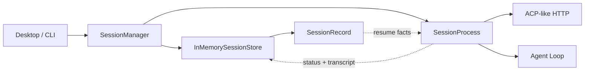

# s07: Session Management — 逻辑会话可恢复，运行时必须重建

> `session_id` 标识一段可继续的工作历史；进程、线程、端口和 provider client 只是这一时刻的运行时资源。
>
> **Harness 层**：会话生命周期、运行时隔离与恢复边界。

---


## 代码架构图



## 相对 s06 新增了什么

s06 把桌面主进程与 Sidecar 分开，解决“谁来托管 Agent”的问题；本章继续向下拆分，解决“Sidecar 如何管理多个独立工作会话”的问题。

s07 不再把一个 session 简化成进程表中的一行，而是明确区分两类对象：

| 对象 | 生命周期 | 包含内容 | 不应包含 |
|---|---|---|---|
| `SessionRecord` | 可以跨 runtime 存活 | session id、cwd、mode、backend、transcript、generation | 线程、端口、HTTP server、锁、provider client |
| `SessionProcess` | 只属于一次 runtime generation | HTTP listener、线程、abort signal、turn lock、执行入口 | 跨会话 memory、永久身份 |

这个拆分决定了恢复语义：**resume 不是复活旧进程，而是使用旧记录创建一个新的运行时。**

## 学习目标

完成本章后，应能解释下面五个问题：

1. 为什么“会话仍存在”和“会话进程仍活着”是两回事？
2. `create`、`resume`、`close`、`forget` 分别改变什么？
3. 为什么端口、线程、锁和 provider client 不能被持久化后直接恢复？
4. session transcript 与长期 memory 有什么区别？
5. 为什么 UI 上显示的 `running` 不能单独作为进程存活证明？

## 四个生命周期操作

### Create：同时创建身份和第一代运行时

`create_session()` 先验证 cwd、mode 和 backend，然后创建新的 `SessionRecord`。记录写入 store 后，Manager 才启动第一代 `SessionProcess`。

```text
validate request
      ↓
allocate session_id
      ↓
store SessionRecord(status=creating, generation=1)
      ↓
start SessionProcess
      ↓
publish idle
```

如果运行时启动失败，逻辑记录不会静默消失，而是保留 `error` 和 `last_error`。这样 UI 能解释失败，用户也可以在修复环境后关闭并恢复。

### Close：释放运行时，不删除会话历史

`close_session()` 的职责是回收当前 runtime generation：

1. 将状态切换为 `closing`；
2. 请求正在运行的 turn 协作式中断；
3. 停止 HTTP server 并关闭 listener；
4. 清理线程和端口引用；
5. 发布 `closed`，保留 record 与 transcript。

Close 是幂等操作。重复关闭已经关闭的逻辑会话不会删除历史，也不会生成第二个错误。

### Resume：使用旧身份创建新运行时

`resume_session()` 加载已有 `SessionRecord`，递增 `runtime_generation`，重新进入 `creating`，再分配新的 HTTP server、线程、端口和 provider client。

```text
SessionRecord(session_id=sess_0001, generation=1, closed)
                           │
                           │ resume
                           ▼
SessionProcess(session_id=sess_0001, generation=2, new runtime)
```

恢复后保持不变的是逻辑身份、cwd、mode、backend 与 transcript；必须重建的是进程级资源。若同一个 session id 已经有 live runtime，resume 会拒绝创建第二个，避免两个执行器同时改写同一段会话历史。

### Forget：显式删除逻辑会话

`forget_session()` 才是真正删除记录的操作，而且要求先关闭 runtime。将 close 与 forget 分开，能避免用户只是关掉窗口或重启应用时意外丢失历史。

| 操作 | 保留 session id | 保留 transcript | 保留 runtime | 可继续 resume |
|---|---:|---:|---:|---:|
| create | 是 | 新建空记录 | 是 | 不适用 |
| close | 是 | 是 | 否 | 是 |
| resume | 是 | 是 | 新建 | 已恢复 |
| forget | 否 | 否 | 否 | 否 |

## 状态机

本章使用下面六个状态：

| 状态 | 含义 | 允许的主要后继状态 |
|---|---|---|
| `creating` | 正在分配 runtime 资源 | `idle`、`error`、`closing` |
| `idle` | runtime 就绪，等待输入 | `running`、`closing`、`error` |
| `running` | 正在执行一个 turn | `idle`、`closing`、`error` |
| `closing` | 正在中断并释放资源 | `closed`、`error` |
| `closed` | 没有 live runtime，记录仍存在 | 由 Manager resume 为新一代 `creating` |
| `error` | 当前 generation 失败并记录原因 | `closing`，随后可 resume |

`SessionProcess._transition()` 集中检查合法迁移，避免 HTTP handler、CLI 和 Manager 分别随意改字符串。一个 turn 只能从 `idle` 进入 `running`；turn lock 会拒绝同一 session 的并发输入。

需要特别注意：持久化记录中的 `idle` 或 `running` 是最后一次观测，不是操作系统层面的 liveness proof。应用崩溃后，旧记录可能仍显示 `running`，但旧进程已经不存在。恢复时必须以 Manager 当前是否拥有 live runtime 为准，并创建新的 generation。

## Transcript 不是长期 Memory

这两个概念经常因为都“保存了过去内容”而被混在一起，但它们解决的问题完全不同：

| 维度 | Session transcript | Long-term memory |
|---|---|---|
| 作用域 | 一个 session id | 用户、项目或组织等跨会话作用域 |
| 主要用途 | 继续当前对话的协议上下文 | 在新任务中召回过去仍有价值的信息 |
| 写入方式 | 按 turn 顺序追加消息与工具结果 | 经过提取、筛选、去重、合并或遗忘策略 |
| 读取方式 | 顺序读取或截取最近窗口 | query、过滤、排序、RAG 或策略选择 |
| 生命周期 | close 后可保留，forget 时删除 | 不应随任一 session close 自动删除 |
| 质量问题 | 上下文膨胀、协议完整性 | 相关性、陈旧性、污染、作用域泄漏 |

因此，本章恢复的是**会话连续性**，不是跨会话的“记住用户”。后续 Memory 章节负责提取和召回；RAG 章节负责从外部知识源检索证据。即使三者最终进入同一个 Agent prompt，它们仍应保留不同的数据来源、作用域和生命周期。

## 为什么只提供 InMemorySessionStore

本章没有新增 SQLite 或 JSONL 后端。`InMemorySessionStore` 的作用是固定接口边界，并允许测试把同一个 store 注入两个不同的 `SessionManager`：第一个 Manager 关闭后，第二个 Manager 可以加载记录并 resume。

```python
store = InMemorySessionStore()

manager_v1 = SessionManager(store)
sid = manager_v1.create_session("/workspace")
manager_v1.shutdown_all()       # 只关闭 runtime

manager_v2 = SessionManager(store)
manager_v2.resume_session(sid)  # 同一 id，新的 generation
```

这证明了恢复协议，但不冒充磁盘持久化。生产适配器通常还需要处理事务、schema migration、并发写入、崩溃恢复和 transcript 容量控制；这些机制不应塞进一次轻量的 session 生命周期教学里。

## ACP-like HTTP 边界

每个 live `SessionProcess` 尝试监听由操作系统原子分配的本机端口。使用端口 `0` 直接 bind，避免“先找空闲端口、稍后再 bind”产生 check-then-bind 竞争。

```text
POST /agent/send      发送一个非空用户消息
GET  /agent/status    查询当前 generation 状态与摘要
POST /agent/abort     请求协作式中断
GET  /agent/messages  读取 JSON-safe transcript 视图
```

HTTP handler 只做传输解析和错误映射，不直接写状态。所有入口都委托给 `SessionProcess`，因此 CLI、HTTP 与测试共享同一套状态机。

在禁止 socket bind 的教学沙箱里，runtime 会明确打印 `socket binding unavailable`，但仍可演示 create/resume/close。这个降级是安全的，因为端口只是可选运行时能力，不是 session 身份。它不会伪造一个实际不存在的 endpoint。

## PTY 与 Pipe 属于运行时配置

| 特性 | PTY | Pipe |
|---|---|---|
| 终端语义 | 有 TTY，可支持颜色、光标、窗口大小 | 普通 stdin/stdout/stderr |
| 信号体验 | 更接近交互式终端 | 需要显式进程信号与协议控制 |
| 适合场景 | REPL、交互式 CLI、终端 UI | 非交互式工具与结构化输出 |
| 恢复方式 | 新建 PTY 和 worker | 新建 pipes 和 worker |

本章把 `backend` 保存在记录中，是为了在 resume 时重新选择相同的运行方式，并不意味着 PTY file descriptor 或 pipe handle 可以被持久化。

当前 Python demo 为了保持跨平台，只用 `subprocess.run(..., capture_output=True)` 演示命令执行，`pty` 值用于讲解运行时选择，不声称实现了完整 PTY。真正的 PTY 适配器还要处理 resize、ANSI、foreground process group 和 signal forwarding。

## Close 与 Abort 不一样

`abort()` 只设置当前 runtime 的协作式中断信号，目标是停止一个 turn；它不删除 record，也不自动关闭 listener。`close()` 则结束整个 runtime generation，并在必要时先请求 abort。

本章的 provider 调用是同步调用，因此 abort 无法强制打断正在阻塞的 SDK 请求，只能在循环边界生效。生产 Harness 通常还需要 provider cancellation、进程信号、超时与最终强制回收。README 明确保留这个边界，避免把一个 `threading.Event` 描述成完整进程中断机制。

## 代码 walkthrough

### `SessionRecord`

保存可恢复事实，并通过 `summary()` 输出 UI 安全的元数据。记录里没有 `port`、server、thread、lock 或 provider client。

### `InMemorySessionStore`

用锁保护 create/save/load/list/delete，并在边界处 deep copy，避免调用者绕过 save 悄悄修改共享记录。它是存储端口，不是长期记忆库。

### `SessionProcess`

拥有一次 runtime generation 的所有临时资源；集中执行状态迁移、turn 互斥、provider loop、abort 与 close。每次状态或 transcript 变化都通过 `record_sink` 回写 store。

### `SessionManager`

是 Sidecar 控制面：

- `create_session()`：新 id + generation 1；
- `resume_session()`：旧 id + generation 加一；
- `close_session()`：释放 runtime，保留 record；
- `forget_session()`：删除已关闭的 record；
- `shutdown_all()`：关闭全部 live runtime，但不清空 store。

## 测试覆盖

`tests/test_session_lifecycle.py` 使用假的 HTTP listener，不依赖网络权限，覆盖：

- logical record 不持有端口和 server；
- create 后进入 idle；
- turn 执行期间进入 running，结束后回到 idle；
- close 保留 transcript；
- resume 保持 session id、创建新 runtime、递增 generation；
- 替换 Manager 后仍能从共享 store resume；
- live session 不允许重复 resume；
- close 幂等，forget 必须显式执行；
- close 完成后才返回的 provider 结果不能覆盖 `closed` 记录；
- provider 失败记录为 error，关闭后可以恢复。

## 运行

离线结构演示：

```bash
python3 s07_session_management/code.py --demo
```

交互式生命周期演示：

```bash
python3 s07_session_management/code.py
```

建议按顺序尝试：

```text
/sessions
/close sess_0001
/sessions
/resume sess_0001
/sessions
/forget sess_0001   # live 状态会拒绝，必须先 close
```

## 常见误区

- **把窗口或 tab 当 session。** UI 可以重建，session identity 不应依赖窗口对象。
- **把端口当 session identity。** resume 后端口可以变化，session id 才是逻辑身份。
- **close 等于 delete。** 这会让正常退出或应用重启意外丢失历史。
- **从数据库状态推断进程活着。** `running` 只是记录，必须结合当前 runtime registry 或进程探测。
- **把 transcript 当 memory。** transcript 只能继续本会话，不提供跨会话筛选、作用域和遗忘策略。
- **序列化整个 runtime。** thread、lock、socket 与 client 应重建，不能反序列化复活。
- **两个 runtime 共用同一 session id。** 会导致 transcript 写入竞争与工具副作用失序。

## 练习

1. 为 `InMemorySessionStore` 实现 SQLite adapter，但保持 `SessionManager` 无需修改。
2. 增加 startup reconciliation：将上次崩溃遗留的 `running` 记录标记为可恢复状态。
3. 为 transcript 增加容量上限与 compaction 入口，并说明它为什么仍不等于 long-term memory。
4. 为 close 实现“协作式 abort → 超时 → 强制终止”的分阶段回收策略。

## 下一课

s07 固定了会话身份、runtime generation 与恢复边界。s08 在这个 session runtime context 上加入模型路由：不同任务可以选择不同成本与能力层级，但路由结果仍属于当前 runtime 的执行配置。
