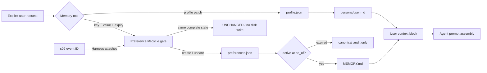

# s11: User Memory — Profile 与 Preference 的用户级边界

> 工作区记忆回答“这个项目长期有效的事实是什么”；用户记忆回答“这个人跨项目仍然有效的稳定信息与明确偏好是什么”。
>
> **Harness 层**：Memory ownership、显式状态变更、有效期、证据来源与 Prompt context。

---


## 本章解决什么问题

s10 已经能把项目决策、约定和踩坑经验蒸馏成工作区记忆，但以下信息不属于任何项目：

- 用户希望被如何称呼；
- 用户所在时区；
- 所有项目都使用中文回复；
- 默认采用简洁说明；
- 编辑器统一使用 tabs。

如果把这些内容写进每个项目，会产生复制、漂移和跨用户污染。如果把对话中出现过的所有描述直接追加到一个 `MEMORY.md`，同一个偏好更新后又会同时存在新旧版本。

本章把用户记忆设计成两个不同的契约：

| 类型 | 回答的问题 | 更新方式 | 例子 |
|---|---|---|---|
| Profile | “这个用户是谁？” | 显式字段 patch | `name`、`call_them`、`timezone` |
| Preference | “跨项目默认怎样做？” | 按稳定 key 创建、替换或删除 | `response.language=Chinese` |

两者都属于用户作用域，但不能混成任意 Markdown：Profile 需要字段级更新，Preference 需要冲突替换和幂等重试。

## 设计目标

本章的核心不是“多存一个文件”，而是让 Harness 能回答五个问题：

1. **Owner 是谁？** 每份状态都带稳定 `user_scope`，同一根目录可安全承载多个用户。
2. **写入是否明确？** 只有 `update_user_profile` 和 `save_user_preference` 等显式工具能改变状态。
3. **重复调用会怎样？** value、source、expiry 和 source event 全部相同才是 no-op，不增长文件、不增加 revision。
4. **偏好变化会怎样？** 相同 key 的新状态替换旧状态，旧时间戳不能回滚较新的 canonical evidence。
5. **临时偏好何时失效？** `expires_at` 到达后记录仍可审计，但不再进入 `MEMORY.md` 或 Prompt。
6. **偏好从哪里来？** Harness 可保存 s09 transcript event ID；该字段不开放给模型自行编造。
7. **进程重启后信谁？** JSON 是 canonical state，Markdown 只是 active、Prompt-facing projection，可从 JSON 修复。

## 代码架构图



这里有一条重要边界：`UserMemory` 不接收 workspace path，也不读取 s10 的日志。用户上下文和工作区上下文可以在 s15 组装 Prompt 时合并，但存储、更新策略和所有权仍然分开。

## 存储结构

教学实现默认写入 `~/.learn_workbuddy/user-memory/`，不会碰真实产品目录：

```text
~/.learn_workbuddy/user-memory/
└── users/
