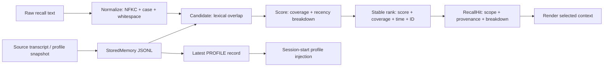

# s12: Remote Memory — Stored Record 与 Recalled Context

> Memory 是带 owner 和 source 的持久记录；Recall 是针对当前 query 生成的候选视图。两者生命周期、可信度和使用方式不同。
>
> **Harness 层**：Remote memory boundary、retrieval contract 与 context provenance。

---


## 本章解决什么问题

s10 和 s11 已经分别定义了 Workspace Memory 与 User Memory。它们解决“把什么状态持久化到哪里”，但还没有回答长时间跨度下的另一个问题：

> 当前任务需要过去哪一段信息？

一个常见错误是把“数据库里存过的所有记忆”和“本轮应该进入 Prompt 的上下文”都叫 memory。这样会掩盖关键边界：

- 存储记录必须长期存在，并能说明属于谁、来自哪里；
- 召回结果只对某个 query 有意义，换一个 query，排名和结果都可能变化；
- 检索命中不等于事实正确，也不等于必须进入 Prompt；
- 召回不应因为读到了某条记录，就把它重新写成一条新记忆。

本章把召回主路径拆成五个可独立验证的阶段：

```text
normalize -> candidate -> score -> stable rank -> render
```

这些阶段围绕 `RecallQuery`、`RecallCandidate`、`RecallScoreBreakdown`、
`RecallHit` 和 `RecallResult` 传递结构化数据。任何阶段失败都能定位到
输入、候选、评分、排序或上下文渲染，而不是只看到一个无法解释的最终分数。

## 代码架构图



图中有两条不同路径：

- 最新 Profile snapshot 在会话启动时加载，并保留 `memory_id`、`source_id`、`captured_at`；
- Conversation records 只在模型明确调用 `recall_history` 时参与召回，形成当前 query 的 hits。

Profile 不是 history hit，history hit 也不会被自动保存成 Profile。

## 核心数据契约

### StoredMemory：持久记录

```python
@dataclass(frozen=True)
class StoredMemory:
    memory_id: str
    user_scope: str
    kind: MemoryKind
    content: str
    summary: str
    source: MemorySource
    stored_at: str
```

`StoredMemory` 是远端服务中的 durable evidence。它必须有稳定 ID、用户作用域和来源。教学实现使用追加式 JSONL 模拟远端服务，进程重启后可重新读取。

### MemorySource：来源

```python
@dataclass(frozen=True)
class MemorySource:
    source_id: str
    source_type: str
    title: str
    captured_at: str
```

`source_id` 指向产生记录的原始对象，例如 transcript 或 profile snapshot。`stored_at` 表示记录何时进入存储，`captured_at` 表示来源事件发生的时间，两者不能混为一个字段。

### RecallQuery：本轮检索请求

```python
@dataclass(frozen=True)
class RecallQuery:
    query_id: str
    text: str
    normalized_text: str
    terms: tuple[str, ...]
    user_scope: str
    limit: int
    issued_at: str
```

召回服务看不到当前聊天，因此 `text` 必须自包含：说明要找什么历史信息，
而不是只写“继续上次”。原始输入先折叠空白，`normalized_text` 再执行
NFKC、casefold 和空白归一化；后续所有阶段只使用稳定排序的 `terms`。
`query_id` 把 candidates、scores 和 hits 绑定到同一次检索，便于工具结果、
审计和 Prompt context 对齐。

### RecallCandidate：未评分候选

```python
@dataclass(frozen=True)
class RecallCandidate:
    query_id: str
    record: StoredMemory
    searchable_terms: tuple[str, ...]
    matched_terms: tuple[str, ...]
    captured_at: datetime
```

Candidate 只表示某条 conversation record 与 query 存在 lexical overlap。
它还没有 score 和 rank，也不会复制或改写 `StoredMemory`。把候选构造单独
建模后，可以替换成倒排索引、向量召回或 hybrid retrieval，而不用改排序契约。

### RecallScoreBreakdown：可解释评分

```python
@dataclass(frozen=True)
class RecallScoreBreakdown:
    matched_terms: tuple[str, ...]
    query_term_count: int
    lexical_coverage: float
    recency: float
    lexical_contribution: float
    recency_contribution: float
    total: float
```

`total` 不是孤立数字。每条候选都携带 matched terms、query term 数量、
coverage、recency、权重和两项 contribution，因此调用方能解释“为什么命中”
以及“每部分为最终分数贡献了多少”。

### RecallHit：候选视图

```python
@dataclass(frozen=True)
class RecallHit:
    query_id: str
    memory_id: str
    rank: int
    snippet: str
    scope: RecallScope
    provenance: MemorySource
    score_breakdown: RecallScoreBreakdown
```

`RecallHit` 不是复制出来的新记忆。它只是某条 `StoredMemory` 针对当前 query
的检索投影。`scope` 明确用户边界与 memory kind，`provenance` 指回原始来源，
`score_breakdown` 解释本次排序。再次查询时，这些字段可以完全不同。

为避免破坏已有 Layered Memory walkthrough，Python 对象仍提供 `hit.source`
和标量 `hit.score` 兼容视图；新代码应读取 `provenance` 与
`score_breakdown`。JSON 工具结果也暂时保留 `source` 兼容别名。

## 主要代码流程

### 1. Store：写入带来源的远端记录

```python
store.append(
    kind=MemoryKind.CONVERSATION,
    memory_id="memory-42",
    content="Selected SQLite WAL for local persistence.",
    summary="Selected SQLite WAL.",
    source=MemorySource(
        source_id="transcript-42",
        source_type="conversation_transcript",
        title="Persistence decision",
        captured_at="2026-08-01T12:00:00Z",
    ),
)
```

写入前会验证内容，并把 `user_scope` 写进每条 JSONL 记录。`RemoteMemoryStore.append()` 使用与 JSONL 同目录的 advisory lock，把“读取现有 ID、拒绝重复 ID、一次 `O_APPEND` 写入、`fsync`”放进同一个独占临界区。两个协作进程即使同时提交相同 `memory_id`，也只能有一个成功，另一个得到明确的 `RemoteMemoryDuplicateError`；读取时 scope 不一致仍会失败，避免远端历史跨用户泄漏。

这里的文件锁是本地教学实现对服务端原子 compare-and-insert 的模拟。它解决同一存储路径上协作 writer 的 check-then-act 竞态；真实远端 Memory 服务应使用数据库唯一索引、条件写或事务，而不是依赖客户端文件锁。

### 2. Normalize：构造唯一的规范化 Query

```python
result = RecallEngine(store).recall(
    "  LAYERED   Memory  ",
    limit=5,
)
```

RecallEngine 不会访问 Agent 当前 messages，因此工具描述明确要求模型重述历史
主题。`normalize_recall_query()` 保留可读文本 `"LAYERED Memory"`，同时生成
`normalized_text="layered memory"` 和稳定 terms。英文按单词切分；连续中文
补充二元字符特征，例如“分层记忆”得到“分层 / 层记 / 记忆”。空白 query
直接拒绝，只有标点且没有 searchable term 的 query 也明确失败。

### 3. Candidate：只构造存在 lexical overlap 的候选

`build_recall_candidates()` 只读取 `CONVERSATION` records，并再次校验每条
record 的 `user_scope` 与 query 一致。候选保存 searchable terms、matched
terms 和来源时间，但此时没有 score、rank，也没有写回 durable store。

`searched_records` 表示检查了多少条 conversation records；
`candidate_records` 表示其中多少条进入评分。两者分开后，无结果时可以判断
问题发生在语料为空、没有词项重合，还是后续 top-k 选择。

### 4. Score 与 Stable Rank：解释分数，固定并列顺序

教学 ranker 使用一个透明的离线基线：

```text
lexical_contribution = 0.85 * query-term coverage
recency_contribution = 0.15 * recency
total = lexical_contribution + recency_contribution
```

`score_recall_candidate()` 返回完整 breakdown，而不是只返回 total。
`stable_rank_recall_candidates()` 使用以下显式排序键：

```text
total DESC
-> lexical_coverage DESC
-> source.captured_at DESC
-> memory_id ASC
```

最后一个稳定 ID 消除了 JSONL 插入顺序对并列结果的影响。相同输入、相同
`as_of` 和相同 records 会得到相同排名。

这个公式不是对生产检索实现的描述，而是为了让课程可以离线测试：读者能直接解释一条记录为什么命中、为什么排在另一条之前。

### 5. Result：返回结构化工具结果

`recall_history` 返回 JSON，而不是预先排版的 Markdown：

```json
{
  "query": {
    "query_id": "...",
    "text": "LAYERED Memory",
    "normalized_text": "layered memory",
    "terms": ["layered", "memory"],
    "user_scope": "...",
    "limit": 5
  },
  "hits": [
    {
      "memory_id": "conversation-003",
      "rank": 1,
      "scope": {
        "user_scope": "...",
        "memory_kind": "conversation"
      },
      "provenance": {
        "source_id": "transcript-conversation-003",
        "source_type": "conversation_transcript",
        "title": "layered memory design",
        "captured_at": "..."
      },
      "source": {
        "source_id": "transcript-conversation-003",
        "source_type": "conversation_transcript",
        "title": "layered memory design",
        "captured_at": "..."
      },
      "score": 0.995161,
      "score_breakdown": {
        "matched_terms": ["layered", "memory"],
        "query_term_count": 2,
        "lexical_coverage": 1.0,
        "recency": 0.967742,
        "weights": {
          "lexical": 0.85,
          "recency": 0.15
        },
        "contributions": {
          "lexical": 0.85,
          "recency": 0.145161
        },
        "total": 0.995161
      }
    }
  ],
  "searched_records": 6,
  "candidate_records": 1,
  "empty_reason": null
}
```

结构化结果让 Harness 可以记录审计、显示来源、根据 Context budget 截断，或在后续版本中插入 reranker，而不必再解析人类文本。

### 6. Render：只渲染选中的候选

```xml
<recalled_context query_id="query-1"
                   normalized_query="layered memory"
                   user_scope="...">
  <hit rank="1" memory_id="conversation-003"
       user_scope="..." memory_kind="conversation">
    <score total="0.995161"
           lexical_coverage="1.000000"
           recency="0.967742"
           lexical_contribution="0.850000"
           recency_contribution="0.145161"/>
    <provenance source_id="transcript-conversation-003"
                source_type="conversation_transcript"
                captured_at="..."/>
    <snippet>Separated workspace, user and remote memory boundaries.</snippet>
  </hit>
</recalled_context>
```

即使进入 Prompt，hit 仍保留 query、scope、provenance 和 score breakdown。
模型看到的是“本轮召回候选”，而不是没有来源的事实段落。无匹配时
`RecallResult` 返回 `empty_reason="no_matching_terms"`，renderer 返回空字符串，
避免为一个空 wrapper 消耗 Prompt budget。

## Profile 为什么单独加载

Remote Profile 也是一种 stored record，但选择策略不同：

- Profile 是某个时间点的服务端快照；
- 会话启动时只选最新 snapshot；
- Profile 保留来源元数据，不伪装成 s11 用户显式偏好；
- Profile records 不参加 conversation recall；
- 历史 conversation hits 也不会自动覆盖 Profile。

系统提示中的 Profile block 因此包含 provenance：

```xml
<remote_profile memory_id="profile-001"
                source_id="profile-snapshot-001"
                captured_at="...">
  ...profile content...
</remote_profile>
```

这比匿名 `<memory>` 文本更容易解释：调用方能知道注入了哪一个 snapshot，以及它何时产生。

## 为什么今天不加复杂 reranker

当前章节要先稳定的是接口，而不是追求更花哨的召回分数：

```text
normalized query
-> source-bearing candidates
-> score breakdown
-> stable rank
-> scoped/provenanced hits
-> rendered context
```

如果现在同时加入 embedding、hybrid search、LLM reranker、时间过滤和反馈学习，读者很难判断问题发生在召回、排序还是 Prompt 注入。保持 ranker 简单，可以先验证：

- query 是否自包含；
- normalize 是否让中英文输入稳定；
- candidate 数量是否能和 searched records 区分；
- hit 是否绑定正确 query；
- scope 与 provenance 是否完整；
- score 的每项 contribution 是否可解释；
- 并列分数是否不依赖存储迭代顺序；
- limit 和 scope 是否生效；
- recall 是否保持只读。

以后替换 ranker 时，只要仍返回同一个 `RecallResult` 契约，上层 Agent tool 和 Prompt assembly 不需要重写。

## 与 s09、s10、s11 的边界

| 模块 | Owner | 核心对象 | 回答的问题 |
|---|---|---|---|
| s09 Transcript | session | event evidence | 这一轮真实发生了什么？ |
| s10 Workspace Memory | workspace | durable project facts | 这个项目长期有效什么？ |
| s11 User Memory | user | profile + explicit preferences | 这个用户跨项目默认怎样？ |
| s12 Remote Memory | remote user/service | stored records + recall hits | 当前问题需要哪段长期历史？ |

s09 transcript 可以成为 s12 StoredMemory 的 source，但“有 transcript”不等于“必须召回”。s12 负责把大量长期记录变成本轮少量候选。

## 失败与边界行为

- 空 query：在 normalize 阶段拒绝调用；
- 只有标点、没有 searchable term：明确拒绝，而不是退化成全量召回；
- `limit` 不在 1 到 10：拒绝调用；
- 重复 `memory_id`：拒绝写入；
- 并发提交相同 `memory_id`：查重与追加在同一临界区内完成，只保留一条可重启读取的记录；
- JSONL 中的 `user_scope` 不匹配：拒绝读取；
- 没有匹配：返回带 query、searched/candidate count 和
  `empty_reason="no_matching_terms"` 的空 `hits`，renderer 不注入空上下文；
- Recall 多次执行：不会改变 durable store；
- Profile snapshot：只用于 profile selection，不混入 conversation hits。

## 无 key 组合边界

`RemoteMemoryStore`、`RecallEngine` 和 context renderer 都是纯本地机制。导入这些类型时不应要求模型配置，也不应因为 import 就向默认目录写 seed records。因此在线副作用分成两个延迟入口：

```text
default_runtime()  -> 首次运行交互 CLI 或 recall_history 时创建教学 store
runtime_client()   -> online agent_loop 真正请求模型时才校验 MODEL_ID
```

这让其他章节和 [Layered Memory Walkthrough](/lib/09-harness/learn-workbuddy/examples-layered_memory_walkthrough) 可以直接复用 S12 的存储与召回契约，而不需要伪造 API key。章节 CLI 的行为不变：真正进入 online loop 时，缺少模型配置仍会明确失败。

## 离线验证

新增测试覆盖：

- StoredMemory 的 source provenance 和跨重启读取；
- Query normalization、Candidate、Score breakdown、Scope、Provenance 与 Rank 契约；
- 英文大小写/空白归一化与中文二元字符召回；
- 空白、纯标点 query 的失败边界；
- 分数并列时按显式 tie-breakers 稳定排序；
- 无结果时的 candidate count、empty reason 和空 renderer；
- Recall 是只读派生视图，不会追加存储；
- 最新 Profile 注入与 conversation recall 隔离；
- 跨用户 scope 文件拒绝；
- Prompt context 保留 query/source/score；
- 工具输出是结构化 JSON，而非预格式化历史文本。
- 导入 S12 时不构造 provider client，也不创建默认 store。

运行：

```bash
python3 -m pytest -q tests/test_remote_memory.py
python3 scripts/verify.py
```

离线查看章节能力增量：

```bash
python s12_cloud_memory/code.py --demo
```

模型交互示例：

```bash
MODEL_ID=<model> ANTHROPIC_API_KEY=<key> python s12_cloud_memory/code.py
```

教学状态默认写入 `~/.learn_workbuddy/remote-memory/`。可以设置 `WORKBUDDY_HOME` 和 `WORKBUDDY_USER_ID` 隔离运行目录与用户作用域。

## 面试表达

我把远端记忆的召回主路径设计成
`normalize -> candidate -> score -> stable rank -> render`：Query 同时保留可读文本
与稳定 terms；Candidate 和 Scoring 分离；每个 hit 都携带 scope、provenance 与
score breakdown；并列分数使用确定性的时间和 ID 键排序。召回是只读派生视图，
无匹配也以显式数据返回。这样后续替换成 embedding、hybrid retrieval 或
reranker 时，所有权、来源、排序证据和 Prompt renderer 的 Harness 契约仍稳定。

## 下一课

s12 已经把大量远端记录压缩成少量、带来源的 recall hits。工具本身仍可能返回很大的内容；s13 将处理大输出外部化，让 Prompt 中保留指针而不是完整结果。
