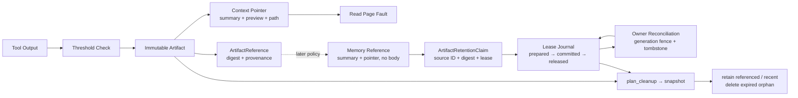

# s13: Tool Output Externalization — 内存不够, 换到磁盘

> *"内存不够, 换到磁盘 — 上下文是内存, 磁盘是外存"* — 工具输出外部化。
>
> **Harness 层**: 上下文管理 — 虚拟内存换页机制。

---


## 代码架构图



## 学习前置知识

- 工具输出可能比模型上下文还大。
- 上下文里应保存摘要和指针, 原文放磁盘或对象存储。
- 外部化需要可追溯, 否则模型找不回细节。

## 本章抓住的 WorkBuddy-style 机制

- 把大输出 swap 到 artifact 文件, prompt 里只留摘要和路径。
- 为 artifact 生成稳定 source ID、摘要、来源工具、时间与 SHA-256，避免它变成不可审计的匿名文件。
- Memory 只能接收 `ArtifactMemoryReference`，保留必要摘要与可检索指针，不复制大结果正文。
- 用无路径 `ArtifactRetentionClaim` 把 Memory 引用投影为清理租约；物理路径始终由 S13 的可信 session root 决定。
- 在 Memory 发布引用前先把 lease intent 追加并 fsync 到 journal；重启后从 journal 恢复当前 claim view。
- 用稳定 transaction ID 和 generation-fenced owner observation 对账 pending lease；不确定结果继续保护 Artifact。
- 清理分成 plan/apply 两阶段，执行前重新核验文件 identity、mtime、大小与 SHA-256；变化时 fail-closed。
- 模拟按需读取片段, 类似缺页中断。
- 为 s14 的压缩减轻压力。

## 常见误区

- 把全部工具输出塞回 messages, 很快耗尽窗口。
- 只保留文件路径不保留摘要, 模型不知道何时读取。
- 外部化文件不纳入审计, 会影响复盘。
- 用进程内计数器重新从 `001` 写起，会覆盖旧 artifact，让已经保存的 pointer 指向错误证据。
- 把 pointer 中的 head/tail 预览原样写进 Memory，本质上仍在复制可能巨大或敏感的工具正文。
- 会话结束就删除整个 `tool-results/`，会让仍被 Workspace/User Memory 引用的证据立即悬空。
- 直接相信 Memory 中的 `artifact_path` 做删除，会把不可信持久化数据变成任意文件删除入口。
- 先发布 Memory 引用、后记录进程内 claim，会在崩溃窗口里产生无法证明归属的 Artifact。
- 删除 Memory 引用前先释放 lease，会在相反的崩溃窗口里留下仍可访问但已失去保护的指针。
- 把一次“未找到”查询直接当成 `ABSENT`，会漏掉读取滞后、并发更新或迟到写入；缺失必须先在 owner 侧封存。
- 扫描到未知文件、符号链接、digest 冲突或竞态仍继续删除，违背证据清理的 fail-closed 边界。

## 问题

一条 `grep -r "TODO" .` 命令能产生多少输出？

在一个中等规模的项目里，可能是几百 KB。在一个大型 monorepo 里，可能是几 MB。如果 agent 在 `/` 根目录下搜——50 MB 不夸张。

模型的上下文窗口是 128K token，大约 500 KB 文本。**一条命令的输出就能把上下文撑爆十倍。**

这不是边缘情况。一个真正干活的 agent——读文件、跑测试、搜索代码——每一步工具调用都在往上下文里灌数据。`grep` 返回 50 MB、`pytest -v` 返回 20 MB、`cat large_file.json` 返回 100 MB——任何一个都能让后续对话直接崩溃。

你不能不让 agent 用这些工具——它需要搜索、需要读文件、需要跑命令。你也不能简单截断输出——agent 可能正好需要第 40000 行的那个错误信息。你需要的是：**完整输出不丢，但上下文不被撑爆。**

---

## 解决方案

```
工具执行
    │
    ▼
┌──────────────────────┐
│ 输出 > 阈值?          │
└──────────┬───────────┘
      No   │   Yes
      │    │    │
      ▼    │    ▼
  直接放    │  ┌─────────────────────────┐
  进上下文  │  │ 写入磁盘:                │
            │  │   tool-results/         │
            │  │     tool_result_001.txt │
            │  │     (完整输出)           │
            │  └──────────┬──────────────┘
            │             │
            │             ▼
            │  ┌─────────────────────────┐
            │  │ 上下文中放指针:          │
            │  │   head 6KB              │
            │  │   ... (省略) ...         │
            │  │   tail 24KB             │
            │  │   [full output at: path]│
            │  └──────────┬──────────────┘
            │             │
            ▼             ▼
       上下文只增长 ~原始大小    上下文只增长 ~30KB
```

把工具的完整输出写到磁盘文件，上下文里只保留一个**指针 + 预览**。这和操作系统的虚拟内存换页是同一个思想——物理内存（上下文窗口）不够时，把数据换到磁盘（`tool-results/*.txt`），内存里只留一个页表条目（指针）。

本章进一步把一份大结果拆成三种生命周期不同的表示：

| 表示 | 包含什么 | 服务对象 | 是否拥有完整正文 |
|------|----------|----------|------------------|
| Artifact 文件 | 完整工具输出 | 审计、按需读取、完整恢复 | 是，唯一正文所有者 |
| Context pointer | source ID、摘要、SHA-256、路径、head/tail 预览 | 当前 Agent turn | 否，只是有界表示 |
| Memory reference | 必要摘要、路径、digest、来源字段 | 后续 Memory policy | 否，刻意没有 `content` 字段 |

这三个对象不能合并成一个字符串：Prompt 需要短期预览，Memory 需要跨会话检索信息，而 artifact 才负责保存不可丢失的原始证据。Memory reference 也只是候选输入，最终是否长期保留仍由 s10–s12 的作用域与保留策略决定。

| 概念 | 操作系统 | WorkBuddy |
|------|---------|-----------|
| 内存 | RAM | 上下文窗口 |
| 外存 | 磁盘 swap | `tool-results/*.txt` |
| 内存条目 | 页表条目 | 指针 + 预览 |
| 读回数据 | 缺页中断 | Read 工具 |

---

## 工作原理

### 阈值检测

不同工具有不同的阈值——Bash 输出波动大（可能几字节，可能几 MB），阈值高一些；其他工具输出相对可控，阈值低一些：

```python
BASH_MAX_OUTPUT_LENGTH = 30000        # chars — Bash 输出超过此值 → 外部化
CODEBUDDY_TOOL_RESULT_THRESHOLD_KB = 50  # KB — 非 Bash 工具超过此值 → 外部化
```

Bash 外部化后，上下文中保留 **head 6KB + tail 24KB ≈ 30KB** 的截断版本。为什么 head + tail 而不是只留 head？因为很多命令的关键信息在末尾——编译错误的最后几行、测试结果的 summary、命令的退出状态。

```python
def should_externalize(self, output: str, tool_name: str) -> bool:
    if tool_name == "bash":
        return len(output) > BASH_MAX_OUTPUT_LENGTH
    else:
        return len(output.encode("utf-8")) > CODEBUDDY_TOOL_RESULT_THRESHOLD_KB * 1024
```

### 磁盘写入

超过阈值的输出写入会话目录下的 `tool-results/` 文件夹，按序编号。文件名通过独占创建保留；即使进程重启后计数器回到 0，也会跳过已有文件，绝不覆盖旧证据：

```
~/.workbuddy/projects/<workspace>/<session>/
└── tool-results/
    ├── tool_result_001.txt    # 第 1 次外部化的完整输出
    ├── tool_result_002.txt    # 第 2 次外部化的完整输出
    ├── tool_result_003.txt
    └── ...
```

```python
def _next_artifact_path(self) -> Path:
    while True:
        self._counter += 1
        path = self.tool_results_dir / f"tool_result_{self._counter:03d}.txt"
        try:
            path.touch(mode=0o600, exist_ok=False)  # 旧证据不能被覆盖
        except FileExistsError:
            continue
        return path
```

### 上下文替换 (pointer + preview)

外部化后，上下文中的 `tool_result` 内容被替换为来源头 + 截断预览。来源头让 Agent 和审计逻辑知道“这是谁产生的、正文在哪里、内容是否仍一致”：

```python
def make_pointer(self, output: str, artifact: ArtifactReference) -> str:
    head = output[:6 * 1024]       # First 6KB
    tail = output[-24 * 1024:]     # Last 24KB

    return (
        f"[Artifact: {artifact.source.source_id}]\n"
        f"Summary: {artifact.summary}\n"
        f"Source: {artifact.source_tool}; SHA-256: {artifact.content_sha256}\n"
        f"Full output: {artifact.path}\n\n"
        f"{head}\n"
        f"\n... [full output at: {artifact.path}] ...\n"
        f"\n{tail}"
    )
```

Agent 看到的是：来源字段 + 有界摘要 + 开头 6KB 预览 + 省略提示 + 末尾 24KB 预览 + 磁盘路径。它知道完整输出在哪，需要时可以用 Read 工具取回。摘要默认由首个非空行和输出规模确定性生成，因此离线 demo 不依赖 API key；生产实现可以替换成任务感知摘要，但仍必须限制长度。

### Artifact → Memory 只传瘦引用

`ArtifactReference.for_memory()` 明确切断正文复制路径：

```python
memory_reference = result.artifact.for_memory()

# 只有 summary、artifact_path、content_sha256、source_tool 和 source。
# 没有 content，也没有 context pointer 中的 head/tail 预览。
payload = memory_reference.to_dict()
```

`source` 与 s09、s12 使用同一组核心字段：`source_id`、`source_type`、`title`、`captured_at`。其中 `source_id` 组合 session、artifact 文件名和内容摘要前缀；`content_sha256` 用于发现文件被替换或损坏。这里没有直接写入 Memory，因为 artifact 是否值得跨会话保留，仍需后续 policy 判断。

### 引用感知的生命周期与 GC

Artifact 不能永久累积，也不能跟随 session 一刀切删除。S13 把“是否还需要这份证据”建模成有界租约：

```text
ArtifactMemoryReference
    └─ ArtifactRetentionClaim
         ├─ source_id              # path-free owner identity
         ├─ content_sha256         # full digest
         ├─ reference_count        # Memory adapter 聚合的活跃引用数
         └─ retain_until?          # 可选租约截止时间
```

`ArtifactRetentionClaim` 刻意没有路径。清理器只解析 `artifact:<session>:<filename>:<digest>`，并要求 session 与当前 `ToolResultExternalizer` 一致；文件最终位置只能从可信 `session_dir/tool-results` 推导。跨 session claim、路径分量和不匹配 digest 在删除前就会被拒绝。

#### Crash-recoverable lease journal

进程内 claim 无法独自跨过崩溃边界。`ArtifactRetentionJournal` 在 session 根写入 append-only `retention-leases.jsonl`，每条记录包含递增 sequence、前一条记录 hash 和自身 SHA-256。读取器只忽略没有换行的最后一条残缺记录；完整坏行、sequence 断裂、跨 session 记录、intent 改写或 hash-chain 断裂都会让恢复失败，GC 不会把损坏日志当成“没有引用”。

引用发布协议按以下顺序执行：

```text
1. PREPARED  ── append + fsync ──▶ lease intent 已持久化
2. Memory adapter 发布引用
3. COMMITTED ── append + fsync ──▶ 引用确认可见
```

步骤 2 的异常不等于“引用未写入”：Memory 可能已持久化引用，只是成功回执因超时或连接中断没有到达 Harness。`publish_reference()` 只在可信 adapter 抛出 `ArtifactPublicationRejected` 时追加 `ABORTED`；该类型必须保证**引用没有写入，且没有仍可能提交的在途写入**。不能依据异常消息、HTTP 状态码或模型输出直接推断这个保证。

其他异常（包括 `TimeoutError`、`ConnectionError`、`OSError` 和普通 `RuntimeError`）原样传播，租约保持 `PREPARED`。进程在步骤 1 后退出也采用同样的恢复方式：无论 Memory 写入尚未发生、正在发生，还是已经成功但步骤 3 尚未执行，fresh journal 都把 `PREPARED` 恢复为无过期时间的保护性 claim，并把 transaction ID 放入 `pending_transaction_ids` 等待可信 adapter 对账。即使原 `retain_until` 和 orphan TTL 已过期，GC 仍会保留证据；这是待对账状态，不是永久完成状态。

删除方向采用相反的安全顺序：先由 Memory adapter 删除引用，成功后才追加 `RELEASED`。`remove_reference()` 封装了这个顺序；若删除失败或进程先退出，committed lease 继续保护 Artifact。

```python
journal = ArtifactRetentionJournal(session_dir)
claim = ArtifactRetentionClaim.from_memory_reference(memory_reference)

transaction, stored_record = journal.publish_reference(
    claim,
    lambda: memory_adapter.append(memory_reference),
    transaction_id="workspace-artifact-reference-1",
)

# Memory 删除成功后才释放；异常时 lease 保持 committed。
journal.remove_reference(
    transaction.transaction_id,
    lambda: memory_adapter.remove(memory_reference.source.source_id),
)
```

publisher 成功返回必须表示引用已持久化。明确拒绝可以来自完全未发起写入的 adapter 校验，例如：

```python
def publish_validated_reference():
    if not memory_adapter.accepts(memory_reference):
        # 仅本地校验，尚未发起任何写入。
        raise ArtifactPublicationRejected("reference rejected before write")
    # 不把这里的普通异常转换成明确拒绝：写入结果可能已经不确定。
    return memory_adapter.append(memory_reference)
```

`publish_reference()` 不会自动重放已有 transaction ID。看到已有 `PREPARED` 时，Harness 必须先向 Memory owner 对账：确认引用已持久化才 `commit()`；确认引用未发布、并排除在途写入后才 `abort()`。一次查询“未找到”本身不足以排除延迟提交或读视图滞后。看到已有 `COMMITTED` 时也不能再次调用 publisher。这样重试不会把“不确定是否已经成功”变成重复 Memory 写入。

#### Generation-fenced owner reconciliation

`ArtifactReferenceOwner` 是 Memory adapter 必须实现的可信边界。`inspect_fenced(transaction)` 返回的 context manager 在整个裁决期间排除同一 transaction ID 的发布变化，并提供 `ArtifactReferenceObservation`：

| owner observation | Harness 行为 | lease 结果 |
|---|---|---|
| `PUBLISHED`，source ID 与完整 digest 都匹配 | fence 内追加 `COMMITTED` | 引用按原租约保护 |
| `PUBLISHED`，identity 不匹配 | 记录 `pending_conflict` | 保持 `PREPARED`，无限期保护 |
| `UNKNOWN` | 记录 `pending_unknown` | 保持 `PREPARED`，等待重试 |
| 未封存的 `ABSENT` | owner 先用 CAS 写 tombstone 并推进 generation | seal 成功后追加 `ABORTED` |
| seal 前 generation 变化 | 记录 `pending_stale` | 保持 `PREPARED`，重新观察 |
| 已封存的 `ABSENT` | 不重复 seal，直接完成 journal transition | 追加 `ABORTED` |

缺失路径刻意采用 `owner tombstone → journal ABORTED` 的顺序。tombstone 必须永久拒绝这个稳定 transaction ID 的迟到写入和未来重放。如果进程在 tombstone fsync 后、journal append 前退出，Artifact 仍受 `PREPARED` 保护；重启后 owner 返回已封存的 absence，再安全完成 `ABORTED`。反过来先 abort 再封存，会重新打开“GC 已删除证据、迟到 Memory 引用随后可见”的窗口。

```python
# adapter 自己负责把数据库行版本、ETag 或对象 generation 映射为 fence。
reports = journal.reconcile_pending(memory_owner_adapter)
for report in reports:
    audit_sink.append(report.to_dict())
```

`reconcile_pending()` 只处理调用开始时看到的 pending snapshot；并发新增的 prepare 留给下一轮。单条 `reconcile_reference()` 和 terminal report 都是幂等的：并发 reconciler 最多追加一个终态事件，后来者得到 `already_committed`、`already_aborted` 或 `already_released`。报告只包含 transaction ID、状态、原因和 generation，不携带物理路径、Memory 正文或凭证。

这里不能由 S13 提供一个“适配所有 Memory”的默认实现：本地 JSONL、SQLite、远端数据库和对象存储的线性化点不同。具体 adapter 必须在真正的 Memory owner 内实现排他 fence、条件 tombstone 和稳定 publication ID；仅在客户端查询两次 generation 不能替代服务端 CAS 或事务。

清理分成两个阶段：

1. `plan_cleanup()` 只读扫描，流式计算 SHA-256，并冻结 size、mtime、device 与 inode 快照；默认 policy 为 dry-run。
2. `apply_cleanup()` 只处理计划中的 `planned_delete`，并强制接收执行时的当前 claim 视图；新增 active claim 会保留文件。删除前还会重新检查 ownership、文件类型、快照和 digest，任何变化都 fail-closed。

| 状态 | 含义 | 是否删除 |
|---|---|---|
| `retained_referenced` | active claim 与完整 digest 都匹配 | 否 |
| `retained_recent` | 尚未达到 orphan TTL | 否 |
| `retained_limit` | 本轮达到最大删除数量 | 否 |
| `retained_unknown` / `denied` | 非 S13 文件、目录或符号链接边界 | 否 |
| `retained_corrupt` | claim 与文件 digest/快照矛盾 | 否 |
| `missing_referenced` | active claim 指向的 artifact 已不存在 | 无文件可删，显式报告悬空引用 |
| `planned_delete` | 已过 TTL 且没有 active claim | dry-run 仅报告 |
| `deleted` | apply 阶段重验成功 | 是 |
| `already_missing` / `race_detected` | 重复执行或 plan 后文件发生变化 | 否 |

```python
claim = ArtifactRetentionClaim.from_memory_reference(
    memory_reference,
    reference_count=2,
    retain_until="2026-09-01T00:00:00+00:00",
)
policy = ArtifactCleanupPolicy(
    orphan_ttl_seconds=24 * 60 * 60,
    max_deletions=100,
    dry_run=False,
)
journal = ArtifactRetentionJournal(session_dir)
plan = externalizer.plan_cleanup_from_journal(journal, policy=policy)
report = externalizer.apply_cleanup_from_journal(plan, journal)
```

`reference_count` 由可信 Memory adapter 聚合，不让模型直接声明；同一 Artifact 的多个 committed/pending lease 会按完整 digest 聚合。claim 缺席或租约过期后，文件仍必须超过 orphan TTL 才有资格删除。`prepare()` 与 journal-aware cleanup 使用同一排他锁：prepare 在锁内重新核验 typed source、普通文件边界与完整 digest；apply 在锁内重新 fold claims，并把锁保持到文件重验和删除完成。lease 先拿锁则 GC 保留，GC 先删除则 prepare 拒绝发布悬空引用。session 一旦存在 durable journal，旧的 raw-claims cleanup 入口会拒绝执行，避免调用方意外绕过真实 owner。cleanup plan/report 和 recovery report 都不接受物理路径。生产对象存储应把相同契约映射为 generation fence、条件删除或事务，而不是假设本地 advisory lock 能跨主机生效。

### 按需读取 (Read = 缺页中断)

当 agent 发现预览里有关键信息被省略了，它调用 Read 工具读取磁盘上的完整文件——这就是**缺页中断**：

```
Agent 上下文                           磁盘
┌─────────────────────┐               ┌──────────────────────┐
│ tool_result:         │               │ tool_result_001.txt  │
│   head 6KB ...       │               │ (50MB 完整输出)       │
│   [full at: path]    │── Read ──▶    │                      │
│   ... tail 24KB      │               │                      │
│                      │◀──content──   │                      │
│ Read result:         │               │                      │
│   line 40000: ERROR  │               │                      │
└─────────────────────┘               └──────────────────────┘
       ~30KB                              不进上下文
```

```python
def read_artifact(self, artifact: ArtifactReference, offset: int = 0, limit: int = 2000) -> str:
    """Read owned evidence on demand and verify its digest first."""
    owned_path = self._owned_path(artifact.path)
    encoded = owned_path.read_bytes()
    if hashlib.sha256(encoded).hexdigest() != artifact.content_sha256:
        raise ArtifactIntegrityError("artifact digest mismatch")
    content = encoded.decode("utf-8")
    lines = content.split("\n")
    selected = lines[offset:offset + limit]
    return "\n".join(selected)
```

---

## OS 类比: 虚拟内存换页

这不是比喻——这就是虚拟内存换页，只是应用到了 LLM 上下文管理上。

| OS 概念 | WorkBuddy 对应 | 说明 |
|---------|---------------|------|
| 物理内存 (RAM) | 上下文窗口 | 有限、快、贵——128K token |
| 磁盘 swap 区 | `tool-results/*.txt` | 无限、慢、便宜 |
| 页表条目 | 指针 + 预览 | 小巧，指向实际数据位置 |
| 缺页中断 (page fault) | Read 工具读磁盘文件 | 按需把数据从磁盘取回上下文 |
| 按需分页 (demand paging) | 工具输出外部化 + 按需 Read | 数据不主动加载，用到时才读 |
| 进程隔离 | SubAgent 独立上下文 | 子 Agent 的上下文不污染主 Agent |
| 异步 I/O | 后台任务机制 | 长任务转后台，不阻塞上下文 |
| 内存回收 / GC | compact + auto compact | 上下文满了做压缩（s18） |
| 文件系统 | 三层记忆系统 | 云端 → 用户级 → 工作区 |
| 进程回放上限 | 会话回放 ≤ 1000 条 | 防止历史回放耗尽内存 |

**一句话**：上下文是 RAM，磁盘是 swap，Read 是 page fault handler。

---

## 三层防线框架

上下文管理是一个三层防线体系——本章节是**第一层（入口控制）**：

```
┌─────────────────────────────────────────────────────────┐
│ Layer 1: 入口控制 (本章 s17)                              │
│   ├─ 工具输出外部化 (大输出 → 磁盘, 上下文只留指针)        │
│   ├─ 延迟工具加载 (schema 按需加载, s04)                  │
│   ├─ 后台任务隔离 (长任务转后台, 不占上下文)              │
│   └─ SubAgent 上下文隔离 (子 Agent 独立上下文)            │
│                                                         │
│   策略: 从一开始就不让大东西进入上下文 (预防式)            │
├─────────────────────────────────────────────────────────┤
│ Layer 2: 主动压缩 (s18)                                   │
│   ├─ pre-message compact (10% 阈值, 消息前压缩)          │
│   └─ auto compact (70-92% 阈值, 自动压缩)                │
│                                                         │
│   策略: 上下文太大了就压缩 (治疗式)                        │
├─────────────────────────────────────────────────────────┤
│ Layer 3: 持久化扩展 (s14-s16)                             │
│   ├─ 云端记忆 (用户画像, 服务端检索)                      │
│   ├─ 用户级记忆 (MEMORY.md, 手动偏好)                     │
│   └─ 工作区记忆 (每日日志, 只追加)                        │
│                                                         │
│   策略: 不需要的上下文放到外部存储, 按需取回               │
└─────────────────────────────────────────────────────────┘
```

**第一层是最高优先级**——因为它在数据进入上下文之前就拦截，ROI 最高。一条 grep 命令省下的 50MB，比压缩 50MB 已有上下文容易得多。

---

## 为什么比智能记忆更优先

> *"复刻时这层比'智能记忆'更优先，因为它直接决定长任务能不能跑下去"*

四个原因：

**1. 直接决定长任务能不能跑下去**

智能记忆（s14-s16）解决的是"记住什么"的问题。输出外部化解决的是"能不能继续跑"的问题。一个 agent 如果连第二回合都撑不过去（因为第一条 grep 命令把上下文撑爆了），再聪明的记忆系统也没用。

```
没有输出外部化:
  Turn 1: grep → 50MB → 上下文爆 → 💥 API 报错 → 任务终止

有输出外部化:
  Turn 1: grep → 50MB → 外部化 → 上下文 +30KB → 继续跑
  Turn 2: pytest → 20MB → 外部化 → 上下文 +30KB → 继续跑
  Turn 3: cat → 100MB → 外部化 → 上下文 +30KB → 继续跑
  ...
  Turn 50: 上下文还没满 → 任务完成 ✅
```

**2. 是第一道防线——防止上下文被填满**

压缩（s18）是治疗——上下文已经满了才触发。外部化是预防——大输出从一开始就不进上下文。预防永远比治疗便宜。

**3. 实现比 AI 驱动的记忆选择简单得多**

memorySelector（s16）需要调一个 lite 模型做相关性判断——涉及模型调用、prompt 工程、JSON 解析。输出外部化只需要一个长度判断 + 文件写入——纯逻辑，零模型调用。

**4. ROI 立竿见影**

一条 grep 命令就能省 50MB 上下文。实现只需要几十行代码。没有比这更高 ROI 的上下文管理策略了。

---

## WorkBuddy 架构对照

### 环境变量与阈值

生产级桌面 agent 的输出外部化由两个环境变量控制：

```bash
# Bash 输出超过此长度 → 写磁盘, 上下文留 head+tail
BASH_MAX_OUTPUT_LENGTH=30000

# 非 Bash 工具结果超过此大小 → 写磁盘, 上下文留占位符
CODEBUDDY_TOOL_RESULT_THRESHOLD_KB=50
```

### 磁盘文件结构

```
