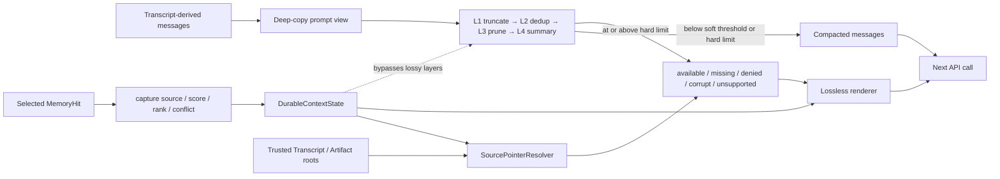

# s14: Context Compact — 上下文总会满, 要有办法腾地方

> *"上下文总会满, 要有办法腾地方"* — 四层压缩管线，保最新、弃最旧、留摘要。
>
> **Harness 层**: 上下文管理 — agent 的记忆预算。

---


## 代码架构图



## 学习前置知识

- 压缩不是截断, 而是结构化重建上下文。
- 不同角色需要不同压缩策略: 主会话、子任务、摘要恢复。
- 触发阈值应该在溢出前, 不是报错后。
- Transcript、Memory 和当前 Prompt 是生命周期不同的视图；压缩只允许改变最后一个。

## 本章抓住的 WorkBuddy-style 机制

- 吸收公开 Agent 架构中的分层压缩与结构化摘要思路。
- 四层策略只处理可丢弃、可重建的 messages 副本，不修改 Transcript 派生输入。
- 用不可变 `DurableContextState` 单独携带已确认事实、未决事项和已选检索证据。
- 每条 durable item 强制保留 source pointer 与 `last_confirmed_at`，并在下一轮 system context 中结构化渲染。
- 用 `SourcePointerResolver` 在可信根目录和授权策略内重新核验 Transcript / Artifact，而不是把 pointer 字符串当成证据。
- 来源核验明确区分 `available`、`missing`、`denied`、`corrupt` 与 `unsupported`；只有 `available` 才能携带证据哈希。
- `capture_retrieval_evidence()` 只冻结上游已经选中的 hit，不在压缩阶段重做 scope、score、冲突或预算裁决。
- 用 `tool_use.id` / `tool_result.tool_use_id` 校验并原子裁剪工具交互，兼容同一消息中的并行调用。

## 常见误区

- 简单删除早期消息, 会丢掉用户原始意图。
- 让生成式摘要负责保存 durable fact，模型可能改写事实或遗漏 pending task。
- 压缩后不标注来源, 后续很难验证。
- 直接把 pointer 拼成文件路径，会把不可信标识符变成路径遍历或跨 session 读取入口。
- 来源已清理、无权限或校验失败时仍渲染成“已验证”，会伪造证据可用性。
- 把核验时读取的 excerpt 自动注入 Prompt，会让外部证据正文绕过既有预算与选择边界。
- 原地修改 messages 会连带污染 Transcript 回放或调用方保存的证据视图。
- 摘要生成失败后仍用错误字符串替换旧历史，会静默丢失最后一份可用上下文。
- 把压缩当成一定成功的操作，会让不可压缩的超长消息继续进入 provider 请求。
- 只删重复的 `tool_result` 或只检查最近消息的第一个 block，会留下孤立调用并让 provider 拒绝整个请求。

## 问题

agent 跑得越久，消息历史越长。一次对话可能产生几十条消息——每次工具调用的输入输出都堆在 `messages` 列表里。模型的上下文窗口是有限的（128K、200K，无论多大终归有限），一旦超限，API 直接报错。

这不是边缘情况。一个真正干活的 agent——读文件、跑命令、改代码——几轮工具调用就能吃掉几万 token。长对话必须有一种机制：**在不丢失关键信息的前提下，压缩上下文。**

你不能简单地删掉旧消息——那会让 agent 失忆，重复之前做过的事。也不能不删——那会让 API 调用失败。你需要一个**分层压缩策略**：先做最廉价的压缩，不够再做更激进的，层层递进。

---

## 解决方案

四层压缩管线，从轻到重依次触发：

| 层级 | 策略 | 做什么 | 代价 |
|------|------|-------|------|
| Layer 1 | 工具结果截断 | 大输出截断为摘要 | 低（不丢消息） |
| Layer 2 | 文件内容去重 | 同一文件多次读取 → 只留最新 | 低（仅删除冗余交互） |
| Layer 3 | 消息历史修剪 | 删除旧的非关键消息 | 中（可能丢细节） |
| Layer 4 | 全对话摘要 | 用模型生成摘要替换历史 | 高（一次 API 调用） |

```
每次 API 调用前检查上下文大小:

  messages token count
        │
        ▼
  ┌─────────────┐
  │ < 阈值?     │── Yes ──▶ 正常调用 API
  └─────────────┘
        │ No
        ▼
  ┌─────────────────────────────────────┐
  │ Layer 1: 截断超大工具结果             │
  │ (单条 tool_result > 5000 tokens?)    │
  └─────────────────────────────────────┘
        │ 还超?
        ▼
  ┌─────────────────────────────────────┐
  │ Layer 2: 文件内容去重                 │
  │ (同一文件被读多次? 只留最新一次)       │
  └─────────────────────────────────────┘
        │ 还超?
        ▼
  ┌─────────────────────────────────────┐
  │ Layer 3: 修剪旧消息                   │
  │ (保留最近 N 轮, 旧的删除)             │
  └─────────────────────────────────────┘
        │ 还超?
        ▼
  ┌─────────────────────────────────────┐
  │ Layer 4: 生成摘要替换历史              │
  │ (调用模型总结, 替换全部旧消息)          │
  └─────────────────────────────────────┘
```

**关键原则**：系统提示、工具定义与 `DurableContextState` **永远不进入有损压缩层**。压缩器先深拷贝 messages，四层只操作这份可丢弃 Prompt 视图；已确认事实、未决事项，以及已选 MemoryHit 的来源、分数、排名和冲突标记沿旁路进入下一次 API 调用。

工具调用还有一条独立的不变量：每个非空 `tool_use.id` 必须唯一对应一个稍后出现的 `tool_result.tool_use_id`。压缩入口先用 `validate_tool_protocol()` 检查整张关联图；缺失、未知、重复或倒序 ID 都抛出 `ToolProtocolError`，即使消息尚未达到软阈值也不会把无效历史交给 provider。L2/L3/L4 删除内容时，把这对 block 当成一个原子 interaction group；并行工具调用仍可按各自 ID 独立保留。

### 压缩对象边界：Messages 可以有损，Durable state 必须无损

```python
@dataclass(frozen=True)
class DurableFact:
    fact_id: str
    content: str
    source_pointer: str
    last_confirmed_at: str

@dataclass(frozen=True)
class PendingItem:
    item_id: str
    description: str
    source_pointer: str
    last_confirmed_at: str

@dataclass(frozen=True)
class RetrievalEvidence:
    memory_id: str
    source_id: str
    source_type: str
    source_title: str
    captured_at: str
    score: float
    source_rank: int
    conflict_key: str | None = None

@dataclass(frozen=True)
class DurableContextState:
    facts: tuple[DurableFact, ...] = ()
    pending_items: tuple[PendingItem, ...] = ()
    retrieval_evidence: tuple[RetrievalEvidence, ...] = ()
```

`frozen=True` 防止压缩流程就地改写字段，tuple 防止在 state 内追加或删除条目。构造时还会拒绝空 ID、空 source、重复 ID、越界 score、非正 rank 和没有时区的时间。这里的 `source_pointer` 可以指向 s09 Transcript event，也可以指向 s13 Artifact；`RetrievalEvidence` 则保存一次已选检索结果的来源与裁决元数据。两者都让压缩后的上下文仍能回到原始证据。

```text
可压缩 messages                     不可有损 durable state
----------------                    -----------------------
旧对话细节                          已确认事实
重复文件读取                        未决事项
大工具结果的上下文副本              source pointer
探索过程                            last_confirmed_at
已召回正文的重复表述                retrieval source / score / rank / conflict
```

生成式摘要即使遗漏任务，甚至错误地把“SQLite WAL”写成“JSON 文件”，也只能污染一次 conversation summary，不能修改 `DurableContextState`。下一轮 Prompt 由 `render_durable_context()` 重新注入原始结构化事实。

### Source pointer 不是证据本身

本章支持两类无路径标识符：

```text
transcript:<session_id>:<positive_sequence>
artifact:<session_id>:<filename>:<12-or-64-char-sha256>
```

pointer 只携带经过严格校验的 session、sequence、filename 和 digest；Transcript / Artifact 的物理根目录由 harness 可信配置提供。授权回调在任何文件查找之前执行，解析器还会拒绝 `.`、`..`、斜杠、反斜杠、冒号和符号链接逃逸。

| 状态 | 含义 | Prompt 中的呈现 |
|---|---|---|
| `available` | owner 文件存在且结构、归属、摘要均通过核验 | `source_status=available` + 完整 evidence SHA-256 |
| `missing` | 文件或指定 Transcript event 不存在，也包括读取竞态中被清理 | `evidence_unavailable=true` |
| `denied` | 授权策略、文件权限或 owner 边界拒绝访问 | `evidence_unavailable=true` |
| `corrupt` | pointer 格式、Transcript envelope、UTF-8 或 Artifact digest 无效 | `evidence_unavailable=true` |
| `unsupported` | scheme 不属于本章支持的 owner | `evidence_unavailable=true` |

Transcript 核验会检查 session、连续 sequence 与 event ID；Artifact 核验以流式读取计算 SHA-256，不会为了验签把整个大文件载入内存。解析结果可以返回有界 excerpt 给审计 UI，但 `render_durable_context()` **绝不注入 excerpt 或来源正文**：pointer 可用时只注入状态和哈希，不可用时显式降级，绝不根据 durable fact 的文本反推或伪造证据。

```python
resolver = SourcePointerResolver(
    transcript_root=state_home / "transcripts",
    artifact_root=state_home,
    authorize=source_policy,
)
resolutions = resolve_durable_sources(result.durable_state, resolver)
durable_context = render_durable_context(
    result.durable_state,
    source_resolutions=resolutions,
)
```

`source_resolutions` 必须与 durable state 中去重后的 pointer 精确一一绑定；缺项、多项或拿另一轮的结果替换都会被拒绝。这样清理、权限变化与 Artifact 损坏只能改变下一轮的核验状态，不能被旧摘要掩盖。

---

## 工作原理

### Token 计数与阈值检查

每次 API 调用前，先估算当前 `messages` 的 token 数量。超过阈值就触发压缩：

```python
TOKEN_THRESHOLD = 100_000  # 触发压缩的阈值

def estimate_tokens(messages: list) -> int:
    """粗略估算 messages 的 token 数。

    生产级 harness 常用 tiktoken 精确计数。
    教学版用 4 字符 ≈ 1 token 的粗略估算。
    """
    total = 0
    for msg in messages:
        content = msg.get("content", "")
        if isinstance(content, str):
            total += len(content) // 4
        elif isinstance(content, list):
            for block in content:
                if isinstance(block, dict):
                    total += len(json.dumps(block)) // 4
                else:
                    total += len(str(block)) // 4
    return total
```

### Layer 1: 工具结果截断

工具返回大块输出（比如读了一个 5000 行的文件）是上下文膨胀的主要原因。第一层策略：截断超大工具结果。

```python
MAX_TOOL_RESULT_TOKENS = 5000

def truncate_tool_results(messages: list) -> list:
    """Layer 1: 截断超过 5000 token 的工具结果。"""
    for msg in messages:
        if msg["role"] != "user":
            continue
        content = msg.get("content")
        if not isinstance(content, list):
            continue
        for block in content:
            if isinstance(block, dict) and block.get("type") == "tool_result":
                result = block.get("content", "")
                tokens = len(str(result)) // 4
                if tokens > MAX_TOOL_RESULT_TOKENS:
                    # 这里只做有界截断；真正摘要属于 Layer 4
                    truncated = str(result)[:MAX_TOOL_RESULT_TOKENS * 4]
                    block["content"] = (
                        truncated +
                        f"\n\n[... 已截断, 原始长度 {len(str(result))} 字符 ...]"
                    )
    return messages
```

### Layer 2: 文件内容去重

同一个文件被读多次（agent 先读了全文，改了几行后又读了一次确认）——旧的读取结果是冗余的，只留最新的。

```python
def dedup_file_reads(messages: list) -> tuple[list, int]:
    validate_tool_protocol(messages)
    tool_results = [
        block
        for message in messages
        if isinstance(message.get("content"), list)
        for block in message["content"]
        if isinstance(block, dict) and block.get("type") == "tool_result"
    ]
    latest_reads = {}  # path -> tool_use_id
    for block in tool_results:
        if block.get("_read_path"):
            latest_reads[block["_read_path"]] = block["tool_use_id"]

    obsolete_ids = {
        block["tool_use_id"]
        for block in tool_results
        if block.get("_read_path")
        and latest_reads[block["_read_path"]] != block["tool_use_id"]
    }
    # 按 ID 同时删除旧 tool_use 与旧 tool_result；同一消息中的
    # 其他并行调用、结果和文本 block 不受影响。
    old_count = estimate_tokens(messages)
    deduplicated = _without_tool_interactions(messages, obsolete_ids)
    return deduplicated, old_count - estimate_tokens(deduplicated)
```

完整实现还会在删除后再次校验，并返回精确的 token 节省量；上面的片段突出所有权关系：`_read_path` 只判断“哪个文件读重复了”，`tool_use_id` 才决定“必须成对删除哪些协议 block”。

### Layer 3: 消息历史修剪

前两层不够时，开始删除旧消息。保留最近 N 轮对话，旧消息直接删除：

```python
KEEP_RECENT_TURNS = 6  # 保留最近 6 轮

def prune_old_messages(messages: list) -> tuple[list, int]:
    interactions = validate_tool_protocol(messages)
    selected = {0, *range(len(messages) - KEEP_RECENT_TURNS, len(messages))}
    crossing_ids = {
        tool_id
        for tool_id, pair in interactions.items()
        if ((pair.tool_use_message in selected)
            != (pair.tool_result_message in selected))
    }
    kept = [msg for index, msg in enumerate(messages) if index in selected]
    # 跨越裁剪边界的一侧也被移除；混合消息中的普通文本仍保留。
    old_count = estimate_tokens(messages)
    pruned = _without_tool_interactions(kept, crossing_ids)
    return pruned, old_count - estimate_tokens(pruned)
```

只检查最近第一条消息的第一个 block 不够：一条消息可能先有文本、后有多个工具结果。这里检查的是所有 interaction 的两个消息索引，因此无论 block 顺序或并行数量如何，都不会留下半条调用链。

### Layer 4: 全对话摘要

最激进的策略——用模型生成旧对话摘要，同时保留最近消息。它只总结 conversation messages，不接收 `DurableContextState`。如果模型调用失败或返回空摘要，函数保留原消息并报告节省 0 token，不能用“摘要失败”字符串覆盖历史：

```python
def generate_summary(messages: list, summarizer) -> tuple[list, int]:
    interactions = validate_tool_protocol(messages)
    recent_start = len(messages) - 4
    # 若固定边界切在 tool_use 与 result 之间，向前扩展到 tool_use。
    while any(
        pair.tool_use_message < recent_start <= pair.tool_result_message
        for pair in interactions.values()
    ):
        recent_start = min(
            pair.tool_use_message
            for pair in interactions.values()
            if pair.tool_use_message < recent_start <= pair.tool_result_message
        )

    old_messages = messages[:recent_start]
    recent = messages[recent_start:]

    try:
        summary = summarizer(json.dumps(old_messages)).strip()
    except Exception:
        return messages, 0
    if not summary:
        return messages, 0

    summarized = [
        {"role": "user", "content": f"[对话摘要]\n{summary}"},
        {"role": "assistant", "content": "好的, 我已了解之前的对话内容。"},
    ] + recent
    return summarized, estimate_tokens(messages) - estimate_tokens(summarized)
```

向前扩展可能让“最近窗口”超过四条消息，这是有意的：保留一条完整交互比机械满足消息条数更重要。如果扩展到索引 0、已经没有可总结的旧消息，或新视图并未真正变小，函数直接保留原视图。

### 在循环中的位置

```python
def agent_loop(messages: list, durable_state: DurableContextState, resolver):
    while True:
        result = compact_context(messages, durable_state)
        messages = result.messages
        source_resolutions = resolve_durable_sources(result.durable_state, resolver)
        durable_context = render_durable_context(
            result.durable_state,
            source_resolutions=source_resolutions,
        )

        response = client.messages.create(
            system=SYSTEM + "\n\n" + durable_context,
            messages=messages,
            ...,
        )
        # ... 正常循环 ...
```

`compact_context()` 成功时返回 `CompactionResult`，同时记录压缩前后 token 和实际触发的层。它会深拷贝输入 messages，因此原始 Transcript 回放视图不随 L1/L2 的就地整理发生变化。兼容入口 `compact_if_needed()` 仍只返回 messages，方便前面章节的调用方式保持简单。

四层执行后，如果消息视图仍达到 `HARD_LIMIT`，函数抛出 `MessageViewLimitExceeded`。异常携带压缩前后 token、硬上限和已执行层，不携带消息正文；调用方可以审计阻断原因，同时避免把超长内容复制到日志。

---

## 教学版的触发与停止条件

本章用两个条件承担不同职责：`estimate_tokens(messages) >= TOKEN_THRESHOLD` 是启动压缩的软阈值；`tokens_after >= HARD_LIMIT` 是四层都执行后阻止 provider 请求的硬上限。每层结束都重新估算，低于软阈值就立即停止。本章没有声称某个外部产品采用特定百分比、内部 Agent 名称或环境变量。

```text
低于 80,000 tokens ──> 不压缩，返回深拷贝
达到 80,000 tokens ──> L1 → 检查 → L2 → 检查 → L3 → 检查 → L4
                         └──────── 任一层达标即停止 ────────┘
L4 后仍达到 120,000 ──> 抛出类型化错误，不请求 provider
```

这里的 token 估算只覆盖 `messages`。system prompt、工具定义和 provider 自己的精确计数不在本章输入里，因此 `HARD_LIMIT` 是消息视图准入边界，不等同于完整模型上下文上限。

---

## 压缩不是 Memory 写入

结构化摘要可以尽量保留意图、关键操作和当前进度，但它仍是模型生成的、有损的 Prompt 视图，不能作为长期事实的唯一副本：

```text
Transcript events ──派生──> messages ──有损压缩──> compacted messages
Memory records ───────────> DurableContextState ──无损渲染──> system context
```

两条路径只在下一次模型请求时汇合。摘要说“任务已完成”不会自动关闭 pending item；只有经过 Memory 自己的确认与写入流程，durable state 才能改变。这也是为什么本章保留 source pointer：压缩后仍能回到 Transcript 或 Artifact 核验证据。

### 已选 MemoryHit：压缩正文，不压缩选择依据

检索结果的正文可能已经出现在旧消息里，L3/L4 可以删除或摘要这段正文；但如果来源、分数和冲突裁决也只存在于旧消息中，压缩后就无法回答“这条记忆为什么进入上下文”。本章把两部分拆开：

```text
Recall candidates
      │  scope → confidence → dedupe → conflict → top-k / budget
      ▼
selected hits ──capture_retrieval_evidence()──> immutable RetrievalEvidence
      │                                              │
      └── recalled text 进入 Prompt                  └── 绕过 L1–L4
```

`capture_retrieval_evidence()` 接收的是**已经选中的** hit，而不是全部候选。它用结构属性同时适配 S12 的 `RecallHit.rank` 和 S15 的 `MemoryContextCandidate.source_rank`，复制 `memory_id`、完整 provenance、原 score、rank 与可选 `conflict_key`。压缩层不重新排序，也不允许冲突败者因为窗口变化而回填；否则同一次检索会在压缩前后产生两套决策。

`conflict_key` 存在时，渲染结果明确标成 `conflict_winner=<key>`；不存在则标成 `conflict=none`。它不是让摘要模型再次判断冲突，而是保存上游裁决的可审计标记。正文可以变短，选择依据必须保持原值。

---

## 生产化时还要补什么

本章刻意保持 clean-room 教学实现。生产 harness 通常还要根据自己的模型与协议补齐：

| 关注点 | 本章做法 | 生产化方向 |
|--------|----------|------------|
| token 计数 | 4 字符约 1 token | 使用目标模型 tokenizer，并计入 system 与 tools |
| 工具结果 | 保留有界前缀 | 按内容类型保留头尾，或外置为 Artifact |
| 协议完整性 | 全量校验 ID，并按 ID 原子裁剪调用组 | 补充 provider 专属的相邻角色、批量结果等语法约束 |
| 摘要失败 | 原消息原样保留 | 加超时、重试预算和可观测失败原因 |
| 长期事实 | durable state 旁路 | 接入带版本、冲突处理和来源校验的 Memory store |
| source 核验 | 本地可信根、前置授权、结构与 digest 校验 | 对象存储 adapter、签名 manifest、细粒度租户策略与审计 trace |
| 检索证据 | 已选 hit 的不可变元数据 | 持久化 query/decision trace，并把来源核验结果关联到选择记录 |

这些是可验证的设计方向，不代表任何特定闭源产品的内部实现。

### 作为 Harness 公共边界

S24 综合章直接复用本章的 `capture_retrieval_evidence()`、`DurableContextState`、`SourcePointerResolver`、`compact_context()` 和 `render_durable_context()`。因此导入 S14 时不会解析调用方的 CLI provider 参数；只有直接执行 `s14_context_compact/code.py` 才拥有这段命令行配置。综合 Harness 可以离线加载压缩与来源核验契约，同时继续把真正的 provider client 延迟到生成式摘要路径。

跨章节集成仍遵守所有权边界：S12 负责 recall，S15 负责 winner/loser，S14 只冻结已选证据并携带它穿过有损压缩。S14 不会因为窗口变化重新召回、重新排序或让 conflict loser 回填。

---

## 代码 walkthrough

`code.py` 实现了完整的四层压缩管线：

1. **`DurableFact` / `PendingItem`** — 不可变的事实与未决事项，强制携带 source pointer 和带时区的最近确认时间
2. **`RetrievalEvidence` / `capture_retrieval_evidence()`** — 从已选 hit 冻结来源、分数、排名与冲突标记，不复制召回正文
3. **`DurableContextState`** — 在有损管线旁路传递的 Memory 输入，并按各自 ID 域拒绝重复条目
4. **`parse_source_pointer()` / `SourcePointerResolver`** — 解析无路径来源 ID，在可信 owner 根目录内授权、定位并核验证据
5. **`SourceResolution` / `resolve_durable_sources()`** — 用不可变五态结果冻结本轮观察，并按首次出现顺序去重
6. **`render_durable_context()`** — 把 durable state 与核验状态独立渲染进 system context，不混入摘要或 excerpt
7. **`estimate_tokens()`** — 粗略估算 messages 的 token 数（4 字符 ≈ 1 token）
8. **`validate_tool_protocol()`** — 用唯一 ID 校验完整、正序的 tool-use/result 关联图
9. **`truncate_tool_results()`** — Layer 1: 截断超过 5000 token 的工具结果
10. **`dedup_file_reads()`** — Layer 2: 同一文件多次读取，只留最新的完整 interaction group
11. **`prune_old_messages()`** — Layer 3: 保留最近 N 轮，原子移除跨边界工具交互
12. **`generate_summary()`** — Layer 4: 在完整交互边界生成摘要；失败或空摘要时保留原历史
13. **`compact_context()`** — 深拷贝 messages，先校验协议，再依次尝试四层并返回 `CompactionResult`
14. **Agent 循环** — 每次 API 调用前压缩 disposable messages、重新核验来源，再独立注入 durable state

运行后会看到压缩日志——每层触发时打印 `[compact]` 消息，可以看到哪些层在什么时候被触发。

---

## 运行

```bash
python s14_context_compact/code.py
```

试试持续对话，观察 token 计数增长和压缩触发。可以输入 `stats` 查看当前上下文使用情况。

---

## 练习

1. 给 pending item 增加状态机（open / blocked / done）。思考：完成状态由谁确认，如何避免摘要中的一句“已完成”越权修改 durable state？
2. 当前 Layer 4 的摘要是一次性生成。实现增量摘要：每次只摘要新增的 messages，与之前的摘要合并；然后设计测试证明 durable state 不参与摘要合并。
3. 为远端 object store 实现 resolver adapter，保持同一五态输出和前置授权契约。设计测试证明重定向、过期签名与跨租户 key 不能越过 owner 边界。
4. `estimate_tokens` 用 4 字符 ≈ 1 token 估算。安装 tokenizer 做精确计数，对比中英文和结构化 tool result 的偏差。

---

## 下一课

上下文满了能压缩。但系统提示本身也可能很大——WorkBuddy 的系统提示是运行时从十几个片段组装出来的。怎么组装？什么时候重新组装？

s15 Prompt Assembly → 运行时分段拼接 + 身份注入。
