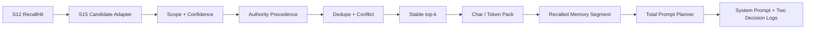

# s15: Prompt Assembly — 从召回候选到预算内上下文

> Prompt 不是写死的字符串，也不是把所有召回结果直接拼进去。Harness 必须先选择，再装箱，最后才组装。
>
> **Harness 层**：RAG / Context 的 selection → pack 边界。

---


## 本章解决什么问题

S12 已经把远端记录重写为一条可解释召回链：

```text
query → candidate → score → stable rank → RecallResult
```

但“召回到”不等于“应该进入 Prompt”。召回结果还可能包含：

- 其他用户作用域的数据；
- 只有弱词法重合的低置信度记录；
- 内容重复、来源不同的记录；
- 同一个事实槽位中的新旧冲突；
- 排名靠后、超过 top-k 的记录；
- 单条很长、会挤掉其他上下文的记录。

因此 S15 负责后半条链：

```text
RecallResult
  → scope gate
  → confidence gate
  → authority precedence
  → exact dedupe
  → explicit conflict resolution
  → stable top-k / budget packing
  → <recalled_memory>
  → total prompt segment planner
```

这条路径中的每个候选最终都有一个 `selected` 或 `rejected` 决策，以及机器可读的原因码。

## 代码架构图



## S12 与 S15 的职责边界

| 章节 | 负责 | 不负责 |
|---|---|---|
| S12 Remote Memory | query 规范化、候选生成、score breakdown、稳定排名、scope 与 provenance | 不决定最终 Prompt 使用哪些 hit |
| S15 Prompt Assembly | scope/置信度门禁、权限层级、去重、冲突、top-k、字符/token 预算、Prompt 片段组装 | 不重算检索分数，不写回长期记忆 |

`memory_candidates_from_recall()` 只做结构适配：复制 S12 的 `scope`、`score`、`rank` 和 `provenance`，不偷偷重算。S12 记录默认标为 `user_default`；只有可信 Harness 调用方可以通过 `authority_by_memory_id` 显式标记 workspace override 或本轮指令。这样 retrieval 与 selection 可以独立测试和演进。

## Memory Selection 的核心契约

### `MemoryContextCandidate`

一条候选包含：

- `memory_id`：稳定身份；
- `text`：准备进入上下文的紧凑文本；
- `user_scope`：所有权边界；
- `score`：S12 产生的召回分数；
- `source_rank`：S12 的稳定排名；
- `provenance`：来源 ID、类型、标题与采集时间；
- `conflict_key`：可选的显式事实槽位；
- `authority`：`current_turn`、`workspace_override` 或 `user_default`。

`conflict_key` 不由 S15 从自然语言里猜。例如“自动化语言偏好”可以由结构化记忆生产者标成 `preference:automation-language`。让 Prompt Assembly 再调用一个模型判断矛盾，会把不可观察的第二次推理藏进关键路径。

### `MemorySelectionPolicy`

```python
policy = MemorySelectionPolicy(
    min_score=0.35,
    top_k=5,
    max_chars=3_000,
    max_tokens=800,
)
```

字符和 token 是两条独立约束。字符预算适合完全离线、确定性的教学回归；token 预算可以注入目标模型 tokenizer：

```python
plan = select_memory_context(
    candidates,
    user_scope=current_scope,
    policy=policy,
    token_counter=target_model_tokenizer,
)
```

默认 `estimate_context_tokens()` 只是透明的离线估算：拉丁词组、单个 CJK 字符和标点分别计一个教学单位。它不会冒充任何供应商 tokenizer。

### `MemoryContextPlan`

Plan 同时返回：

- `context`：预算内的 `<recalled_memory>`；
- `used_chars` / `used_tokens`：包括 XML wrapper 与 provenance 属性的真实装箱成本；
- `selected_memory_ids` / `rejected_memory_ids`；
- `decisions`：每条候选的权限层级、状态、原因、关联 winner 和解释文本。

## 三层偏好权限，而不是三个分数权重

同一个事实槽位可能同时有三种有效输入：

| Authority | 含义 | 示例 |
|---|---|---|
| `current_turn` | 用户只对当前任务给出的明确要求 | “这次请用 Go 实现” |
| `workspace_override` | 当前项目的局部约定 | “本仓库自动化统一使用 TypeScript” |
| `user_default` | 跨项目复用的个人默认偏好 | “我通常偏好 Python” |

仲裁规则固定为：

```text
current_turn > workspace_override > user_default
```

这不是给 score 再乘一个权重。低层候选即使 score 更高、rank 更靠前、来源更新，也不能覆盖高层候选；只有处在同一 authority 时才比较检索证据：

```text
authority desc → score desc → source_rank asc → captured_at desc → memory_id asc
```

权限字段由 Harness 边界提供，模型不能发明 `system_override` 一类更高等级。未知值会 fail-closed。默认值是 `user_default`，因此原有 S12 adapter 与手写候选保持兼容。

### Authority 不等于 Harness required

`current_turn` 是偏好候选中的最高层，但仍不是系统安全规则。Base instructions、工具边界和 Working mode 继续由 required `PromptSegment` 承载：

- authority 只在候选之间决定谁赢、谁先使用 Memory 预算；
- required 片段先预留总 Prompt 预算，任何 preference 都不能覆盖或挤掉它；
- required 本身装不下时抛出 `PromptBudgetError`，不会把安全规则降级成可选偏好。

本轮用户消息仍由 conversation messages 传给模型；`current_turn` 候选是它的结构化仲裁投影和审计证据，不应取代原始用户消息。

## 选择顺序为什么不能交换

### 1. Scope gate

候选的 `user_scope` 必须与当前查询作用域一致。即使跨用户候选分数最高，也先以 `scope_mismatch` 拒绝，不能让排序覆盖安全边界。

### 2. Confidence gate

低于 `min_score` 的记录以 `low_confidence` 拒绝。低置信度不是“排在最后也许能用”，而是默认 abstain，避免预算宽松时把噪声重新放回 Prompt。

### 3. Authority precedence

通过门禁的候选先按三层 authority 排序。这个顺序同时控制去重 winner、冲突 winner 和后续 top-k/预算装箱，避免低层高分候选抢占空间后让本轮要求消失。

Authority 不能绕过前两道门：跨 scope 或低于 `min_score` 的 `current_turn` 投影仍然会被拒绝。

### 4. Exact dedupe

正文与显式 `conflict_key` 都经过 NFKC、大小写折叠和空白归一化；只有事实槽位和正文都相同才做确定性精确去重。排序更强的候选保留，其他候选记录 `duplicate_content`、winner ID 以及归一化槽位。没有 `conflict_key` 的候选只与同样没有槽位的候选去重，不会替代带槽位的记录。

例如，本轮指令 A 是分析语言槽位的 `Use Python`，工作区偏好 B 是自动化语言槽位的 `Use Python`，用户默认 C 是自动化语言槽位的 `Use Bash`。A、B 正文相同，但描述不同槽位，必须都进入冲突阶段；B 随后按 authority 击败 C。如果仅按正文删除 B，C 就会错误入选。正文相同不等于可丢弃事实槽位信息。

不同槽位的相同正文可能各占一份上下文预算，因为它们携带不同的事实约束与来源。若 B 最终因预算不足未入选，已经被 B 击败的 C 也不会回填；去重、冲突裁决和预算装箱仍按原有顺序执行。

这里刻意不声称完成了语义去重。生产环境可以在上游增加 embedding cluster，但必须继续输出可追踪的 winner/loser 关系。

### 5. Explicit conflict resolution

相同 `conflict_key` 的不同内容竞争同一事实槽位。跨 authority 时，低层候选以 `authority_loser` 拒绝，并记录 winner ID 与双方层级；同层冲突则继续使用 `conflict_loser`。

同层候选按以下键稳定排序：

```text
score desc → source_rank asc → captured_at desc → memory_id asc
```

第一条成为 winner。冲突败者不会因为 winner 太长或当前预算变化而回填，因为它表达的是已被裁决掉的事实，不只是昂贵上下文。

### 6. Top-k 与预算装箱

存活候选按 authority 优先的稳定顺序逐条尝试：

- 已经选满时：`top_k_reached`；
- 加入后字符超限：`char_budget_exceeded`；
- 加入后 token 超限：`token_budget_exceeded`；
- 两条预算都满足：`selected`。

每个 `<memory_hit>` 是原子块，不做中间截断。某条高分记录过长时会被拒绝，但不会停止装箱；较小的后续候选仍可填入剩余预算，直到选满 top-k。

## 两层预算，而不是一个模糊的长度限制

S15 有两次不同的决策：

```text
Memory candidates
  └─ MemorySelectionPolicy
       └─ <recalled_memory> segment
            └─ plan_prompt(total prompt budget)
                 └─ final system prompt
```

第一层在 memory 内部选择事实，能解释每条 hit 为什么被拒绝；第二层在系统提示全局比较 persona、memory、project、skills 等片段的价值。如果总 Prompt 预算更紧，整个 memory 片段仍可能被原子舍弃，并由 `SegmentDecision` 记录原因。即使 memory 中存在 `current_turn` 投影，它也不能把可选 Memory 片段升级成 required 系统规则。

这两个决策日志不能合并：一个回答“为什么没选这条记忆”，另一个回答“为什么最终没放这个 Prompt 片段”。

## 系统提示的十类片段

| # | 片段 | 来源 | 条件 | 总预算策略 |
|---|---|---|---|---|
| 1 | Base instructions | Harness 基础规则 | 始终 | required |
| 2 | Identity | SOUL / IDENTITY / USER | 文件存在或教学默认值 | 可选，高价值 |
| 3 | Recalled memory | S12 → S15 selection plan | 当前查询有选中 hit | 可选，中等价值 |
| 4 | Project context | 工作区结构 | 始终构建 | 可选，高价值 |
| 5 | Tool descriptions | 工具注册表 | 有工具 | required |
| 6 | Expert instructions | 当前专家 | 激活时 | 可选，高价值 |
| 7 | Skill instructions | 已加载 SKILL.md | 加载时 | 可选，高价值 |
| 8 | Connector status | MCP connectors | 有连接器时 | 可选，较低价值 |
| 9 | Regional conventions | 当前区域 | 按区域 | 可选，低价值 |
| 10 | Working mode | craft / plan / ask | 始终 | required |

### 展示顺序和预算价值是两件事

`priority` 决定片段最后出现在 Prompt 的位置，`budget_priority` 决定预算紧张时谁先获得空间。工作模式可以放在 Prompt 最后，却仍然是不可删除的 required 片段。

总 Prompt 规划流程为：

```text
构建片段并记录 provenance
  → 先预留 required
  → required 超预算时 fail-closed
  → optional 按 budget_priority 尝试加入
  → 已选片段按 priority 渲染
  → PromptPlan + SegmentDecision
```

如果 required 本身超过预算，`PromptBudgetError` 会阻止 provider 调用，而不是静默删除安全规则。

## 运行时重新组装

系统提示会缓存，但下列状态变化会触发重新组装：

| 事件 | 影响的片段 |
|---|---|
| 新查询安装 S12 recall candidates | Memory selection 与 memory segment |
| 查询结束或切换用户 scope | 清除 memory segment，防止跨查询泄漏 |
| 加载技能 | Skill instructions |
| 切换专家 | Expert instructions |
| 切换工作模式 | Working mode |
| 连接器上线/下线 | Connector status |
| 身份文件修改 | Identity |

`set_recalled_memory()` 保存的是候选，不是上一次渲染好的字符串。每次重组装都会在当前 scope、policy 和 tokenizer 下重新规划。`clear_recalled_memory()` 则显式结束查询期状态。

## 无 API key 的演示

```bash
python s15_prompt_assembly/code.py
```

进入交互后输入：

```text
memory
```

教学 fixture 会同时产生：User Default、Workspace Override、本轮指令、同槽跨层冲突、低置信度候选和跨用户候选。终端会展示每条记录的 authority、rank、score、selected/rejected、原因码和解释，并展示 memory 与总 Prompt 两层预算。

继续输入：

```text
memory clear
```

即可观察查询结束后 Memory 片段变为 inactive。

也可以收紧总 Prompt 字符预算：

```bash
PROMPT_BUDGET_CHARS=2000 python s15_prompt_assembly/code.py
```

`PromptSegment`、`MemoryContextCandidate`、`select_memory_context()` 和 `plan_prompt()` 都是纯标准库离线契约。只有真正进入 `agent_loop()` 时，`runtime_client()` 才检查 `MODEL_ID`、provider SDK 和 API 配置。

## 常见误区

- **把 RecallHit 直接拼进 Prompt**：跳过 scope、冲突和预算决策。
- **只保留 total score**：无法解释低置信度或冲突 winner。
- **用输入顺序决定冲突**：JSONL 顺序变化会让事实翻转。
- **让高 score 覆盖高 authority**：检索相关性不能改变用户指令的权限边界。
- **让模型自行声明 authority**：模型可以提议内容，不能为自己授予更高权限。
- **把 `current_turn` 当成 required**：用户偏好层级不能覆盖 Harness 安全规则。
- **对长记忆直接切字符串**：可能切断 provenance、XML 和事实语义。
- **把未命中写成空 `<memory>`**：浪费 token，且让模型误以为存在记忆证据。
- **把字符估算叫真实 token**：不同模型 tokenizer 不同，应显式注入。
- **总预算不足就删除安全规则**：required 必须 fail-closed。
- **查询结束后不清 memory state**：可能把上一轮候选泄漏到下一用户或下一问题。

## 面试时应能讲清楚

1. Retrieval、selection、packing、prompt assembly 分别解决什么问题？
2. 为什么 scope 和 confidence 必须在去重、冲突、预算之前？
3. 为什么 conflict 需要显式 slot，而不能靠字符串去重代替？
4. 高分长候选超预算后，为什么允许小候选 backfill，而 conflict loser 不允许？
5. 为什么需要 memory decision log 和 segment decision log 两套审计？
6. 如何接入真实 tokenizer，而不破坏离线回归和上层 API？
7. 如何把精确去重升级为语义去重，同时保持 deterministic replay？
8. 为什么 authority 必须先于 score？它为什么又必须晚于 scope 和 confidence gate？
9. `current_turn` 与 required PromptSegment 的权限边界分别是什么？

## 练习

1. 注入目标模型 tokenizer，对比默认 estimator 的选择差异，并验证每次运行的 decision log 可复现。
2. 在上游增加结构化 `fact_type + subject`，生成更可靠的 conflict key。
3. 增加“必须保留”的 Memory 类型，思考它与 Harness required 安全规则有何不同，以及预算不足时是否应该 fail-closed。
4. 把 decision reason 汇总为 offline eval 指标，例如 scope rejection rate、low-confidence abstention rate 和 budget utilization。
5. 为 authority 来源增加签名或事件绑定，证明层级由可信 Harness 产生而不是模型伪造。

## 下一课

S15 已经能把检索结果选择并装进 Prompt。下一步 S16 处理按需加载的 Skills，让扩展知识不必从会话开始就常驻上下文。
