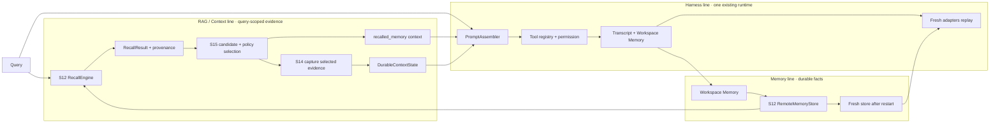

# s24: Comprehensive — 机制很多, 循环一个

> *"机制很多，契约只有一份"* — 综合章消费前面章节的稳定边界，不另造一套简化语义。
>
> **Harness 层**: 综合 — 循环属于 agent, 机制属于 harness。

---


## 代码架构图



这不是第二个 Agent：S24 只负责把已有运行时接到 S12、S14、S15 的公开契约上。召回算法仍归 S12，候选准入与预算仍归 S15，S14 只冻结已选证据并压缩 disposable messages；工具权限、transcript 和工作区作用域仍由 S24 原有 harness 管理。

## 学习前置知识

- 完整 harness 是多个小机制组合, 不是一个大框架魔法。
- `RecallResult` 是带分数、作用域和 provenance 的检索证据，不应未经选择直接塞入 prompt。
- recalled text 可以被压缩或摘要，但 S15 的 winner、来源、分数、排名和 conflict key 必须沿 S14 durable bypass 保留。
- 重启回归必须用新建的 store、memory 和 transcript adapter 读取磁盘，不能拿旧对象冒充恢复成功。
- Python 教学实现复刻的是架构机制, 不是 Electron/Node 源码。
- 最终 demo 应该能展示端到端数据流、安全边界，以及各章契约没有在集成时退化。

## 本章抓住的 WorkBuddy-style 机制

- 串起 block-driven loop、单一工具注册表、显式权限、作用域记忆、JSONL transcript、SQLite 和审计。
- 复用 S12 `RecallEngine` 与 S15 `select_memory_context`，把 `query → recall → select → context → tool → transcript/memory → restart` 变成一个可回归契约。
- 复用 S14 `capture_retrieval_evidence()` 与 `compact_context()`，不在综合章维护第二套压缩语义。
- S14 四层压缩后仍达到消息视图硬上限时，记录阻断审计并在 provider 请求前失败关闭。
- 用 clean-room Python 证明 WorkBuddy-style harness 的核心可以从零搭建。
- 把前 23 章收束成一个可运行 mini WorkBuddy。

## 常见误区

- 只做聊天界面没有 sidecar/session/memory/audit, 不算 harness。
- 单章里是 `ASK`，综合章却自动批准，属于集成语义漂移。
- 把“写入过记忆”当成“重启后可恢复”，却没有通过新对象回读 transcript、workspace memory 与 remote memory。
- 只把 recalled text 交给摘要模型：摘要可以改写 winner，且压缩后无法解释来源和排名。
- 在 S24 复制一套简化压缩器：阈值、裁剪层级和 durable bypass 会与 S14 漂移。
- 公开表达混淆源码提取和教学实现, 会带来信任和合规风险。
## 问题

24 课, 24 个机制。看起来很多, 但如果回头看, 每一课都在做同一件事：给 agent loop 加一层能力。

```
s01  agent loop              → 循环本身
s02  tool dispatch           → 循环里的工具分发
s03  deferred loading        → 循环里的工具按需展开
s04  permission hooks        → 循环里的安全门
s05  electron shell          → 循环的进程外壳
s06  sidecar server          → 循环的通信管道
s07  session management      → 循环的生命周期
s08  model routing           → 循环的模型选择
s09  jsonl transcript        → 循环的事件记录
s10  workspace memory        → 循环的工作区记忆
s11  user memory             → 循环的用户级记忆
s12  cloud memory            → 循环的远端召回抽象
s13  output externalization  → 循环的大输出换出
s14  context compact         → 循环的上下文压缩
s15  prompt assembly         → 循环的 prompt 组装
s16  skills system           → 循环的技能加载
s17  mcp connectors          → 循环的外部工具协议
s18  experts system          → 循环的领域专家
s19  visualizer              → 循环的输出可视化
s20  result presentation     → 循环的结果交付
s21  sqlite database         → 循环的持久化层
s22  automation scheduler    → 循环的定时触发
s23  audit sandbox           → 循环的安全审计
s24  comprehensive           → 所有机制回到一个循环
```

没有一个机制替代了循环。每一个机制都是在循环的某个环节插入能力——工具调用前加权限检查, API 调用后加用量记录, 会话结束时加记忆蒸馏, 上下文满时加压缩, 执行命令时加沙盒和审计。

这就是本教程的核心洞察：**循环属于 agent。机制属于 harness。** 模型负责推理和决策, harness 负责提供安全、高效、可追溯的执行环境。24 个机制组合在一起, 把一个 30 行的 `while True` 变成了桌面 AI 助手。

---

## 解决方案

```
                    ┌─────────────────────────────────┐
                    │         System Prompt            │
                    │  ┌─────┐ ┌─────┐ ┌───────────┐  │
                    │  │SOUL │ │USER │ │SKILLS list │  │
                    │  │     │ │MEM  │ │EXPERTS    │  │
                    │  └─────┘ └─────┘ └───────────┘  │
                    └──────────────┬──────────────────┘
                                   │
                    ┌──────────────▼──────────────────┐
                    │       ┌─────────────┐           │
                    │       │  Agent Loop │           │
                    │       │  while True │           │
                    │       └──────┬──────┘           │
     ┌──────────────┼──────────────│──────────────────┼──────────────┐
     │              │              │                  │              │
     │   ┌──────────▼─────────┐   │   ┌──────────────▼───────────┐  │
     │   │  Tool Dispatch     │   │   │  Context Management       │  │
     │   │  ┌──────────────┐  │   │   │  ┌──────────────────────┐ │  │
     │   │  │ Permission   │  │   │   │  │ Compaction (s14)     │ │  │
     │   │  │ Check (s04)  │  │   │   │  │ Prompt Assembly (s15)│ │  │
     │   │  ├──────────────┤  │   │   │  └──────────────────────┘ │  │
     │   │  │ Sandbox      │  │   │   └──────────────────────────┘  │
     │   │  │ Check (s23)  │  │   │              │                  │
     │   │  ├──────────────┤  │   │   ┌──────────▼───────────┐     │
     │   │  │ Execute      │  │   │   │  Memory (s10-s12)     │     │
     │   │  ├──────────────┤  │   │   │  workspace / user /   │     │
     │   │  │ Audit Log    │  │   │   │  cloud                 │     │
     │   │  │ (s23)        │  │   │   └───────────────────────┘     │
     │   │  ├──────────────┤  │   │              │                  │
     │   │  │ Usage Track  │  │   │   ┌──────────▼───────────┐     │
     │   │  │ (s21)        │  │   │   │  SQLite DB (s21)      │     │
     │   │  └──────────────┘  │   │   │  sessions / usage /   │     │
     │   └────────────────────┘   │   │  automations           │     │
     │              │              │   └───────────────────────┘     │
     │   ┌──────────▼─────────┐   │              │                  │
     │   │  Visualizer (s19)  │   │   ┌──────────▼───────────┐     │
     │   │  present_files     │   │   │  Automation (s22)     │     │
     │   │  (s20)             │   │   │  Scheduler            │     │
     │   └────────────────────┘   │   └───────────────────────┘     │
     │              │              │              │                  │
     └──────────────┼──────────────│──────────────│──────────────────┘
                    │              │              │
                    └──────────────▼──────────────┘
                    ┌─────────────────────────────┐
                    │    Electron Shell (s05-s07) │
                    │    main + renderer + sidecar│
                    │    + CLI session            │
                    └─────────────────────────────┘
```

### 24 课全景表

| 课 | 机制 | 格言 | 在循环中的位置 |
|---|---|---|---|
| s01 | Agent Loop | 一个循环就够了 | 循环本身 |
| s02 | Tool Dispatch | 加工具不改循环 | 循环内, 工具分发 |
| s03 | Deferred Loading | 工具不全部加载 | 工具分发后, 按需发现 |
| s04 | Permission Hooks | 先划边界再给自由 | 工具执行前 |
| s05 | Electron Shell | 一个进程不够要三个 | 循环的外壳 |
| s06 | Sidecar Server | 主进程不跑 agent | 进程间通信 |
| s07 | Session Mgmt | 每个会话一个子进程 | 循环的生命周期 |
| s08 | Model Routing | 用 AI 管理 AI | API 调用前, 模型选择 |
| s09 | JSONL Transcript | 对话写盘追加不覆盖 | 每轮循环后, 持久化 |
| s10 | Workspace Memory | 项目事实按 scope 隔离 | 实质工作完成后 |
| s11 | User Memory | 跨项目偏好放用户级 | Prompt 组装时 |
| s12 | Cloud Memory | 有些记忆在云端 | Prompt 组装时 |
| s13 | Output Externalization | 大输出写磁盘留指针 | 工具执行后, 入上下文前 |
| s14 | Context Compact | 上下文总会满 | 循环内, API 调用前 |
| s15 | Prompt Assembly | prompt 是组装出来的 | 每次 API 调用 |
| s16 | Skills System | 技能先列目录 | Prompt 组装 + 工具池 |
| s17 | MCP Connectors | 外接工具标准协议 | 工具池扩展 |
| s18 | Experts System | 领域专家整包加载 | Prompt + 工具 + 记忆 |
| s19 | Visualizer | 不只是文字 | 输出处理 |
| s20 | Result Presentation | 做完要交付 | 输出处理 |
| s21 | SQLite Database | 会话要持久 | 每次操作后 |
| s22 | Automation Scheduler | 到点自动跑 | 循环外触发 |
| s23 | Audit & Sandbox | 每步留痕 | 工具执行前后 |
| **s24** | **Comprehensive** | **机制很多循环一个** | **全部集成** |

---

## 工作原理

### 1. 完整的 Agent Pipeline

一个集成了全部机制的 agent 循环, 每一轮做这些事：

```python
def comprehensive_agent_loop(messages, session):
    while True:
        # ── 1. Prompt Assembly (s15) ──
        system = assemble_prompt(
            soul=get_soul(),           # s11: 身份
            user_mem=get_user_memory(), # s11: 用户偏好
            workspace_mem=get_workspace_log(),  # s10: 工作区日志
            cloud_profile=get_cloud_profile(),  # s12: 云端记忆
            skills=list_skills(),       # s16: 技能目录
            expert=get_expert(),        # s18: 领域专家
            tools_context=get_tools_info()  # s17: MCP 连接器
        )

        # ── 2. Context Compaction (s14) ──
        if token_count(messages) > THRESHOLD:
            messages = compact_context(messages)

        # ── 3. Model Routing (s08) ──
        model = route_model(session.agent_type)  # lite/default/craft

        # ── 4. API Call ──
        response = client.messages.create(
            model=model, system=system,
            messages=messages, tools=session.tools,
        )

        # ── 5. JSONL Transcript (s09) ──
        transcript.append({
            "type": "message",
            "role": "assistant",
            "content": response.content
        })

        # ── 6. Usage Tracking (s21) ──
        db.track_usage(session.id, model, response.usage)

        # ── 7. Inspect normalized content blocks (s01) ──
        messages.append({"role": "assistant", "content": response.content})
        tool_blocks = [b for b in response.content if b.type == "tool_use"]
        if not tool_blocks:
            # ── 8. Result Presentation (s19, s20) ──
            present_result(response.content)
            # ── 9. Memory Update (s10) ──
            update_workspace_memory(session, messages)
            return

        # ── 10. Tool Dispatch (s02) + Deferred Loading (s03) ──
        results = []
        for block in tool_blocks:
                # ── 10a. Deferred Tool? (s03) ──
                if block.name in DEFERRED_TOOLS:
                    tool_schema = tool_search(block.name)  # ToolSearch
                    result = defer_execute(tool_schema, block.input)  # DeferExecuteTool
                    results.append({"type": "tool_result",
                                    "tool_use_id": block.id, "content": result})
                    continue

                # ── 10b. Permission Check (s04) ──
                decision = check_permission(block.name)
                if decision is DENY:
                    results.append(denied_result(block.id))
                    continue

                # ── 10c. Sandbox Check (s23) ──
                if not check_sandbox(block.input):
                    results.append(blocked_result(block.id))
                    continue

                # ── 10d. Execute + Audit (s23) ──
                audit_entry("tool_execute", block.name, block.input)
                output = TOOL_HANDLERS[block.name](**block.input)
                audit_entry("tool_result", block.name, output)

                # ── 10e. Output Externalization (s13) ──
                if should_externalize(output):
                    pointer = write_to_disk(output)
                    output = make_pointer(pointer)  # 上下文只留指针

                # ── 10f. Tool Usage (s21) + JSONL (s09) ──
                db.record_tool_call(session.id, block.name)
                transcript.append({
                    "type": "function_call_result",
                    "tool": block.name, "result": output
                })

                results.append({
                    "type": "tool_result",
                    "tool_use_id": block.id,
                    "content": output,
                })

        messages.append({"role": "user", "content": results})
```

### 2. 机制分组

24 个机制可以分为 7 组, 每组服务于循环的一个维度：

```
┌──────────────────────────────────────────────────────────────────┐
│                       Agent Loop (s01)                            │
│                                                                  │
│  ┌──────────┐  ┌──────────┐  ┌──────────┐  ┌────────────────┐  │
│  │ 工具层    │  │ 进程层    │  │ 持久层    │  │  记忆层         │  │
│  │ s02 s03  │  │ s05 s06  │  │ s09 s21  │  │  s10 s11 s12  │  │
│  │ s16 s17  │  │ s07 s08  │  │ s22      │  │  s15          │  │
│  │ s18      │  │          │  │          │  │                │  │
│  └──────────┘  └──────────┘  └──────────┘  └────────────────┘  │
│                                                                  │
│  ┌──────────────┐  ┌──────────┐  ┌──────────┐                  │
│  │ 上下文管理层  │  │ 安全层    │  │ 交互层    │                  │
│  │ s13 s14      │  │ s04 s23  │  │ s19 s20  │                  │
│  └──────────────┘  └──────────┘  └──────────┘                  │
└──────────────────────────────────────────────────────────────────┘
```

| 层 | 课 | 职责 |
|---|---|---|
| 工具层 | s02, s03, s16, s17, s18 | 工具分发、延迟加载、技能、连接器、专家 |
| 进程层 | s05, s06, s07, s08 | Electron、Sidecar、会话管理、模型路由 |
| 持久层 | s09, s21, s22 | JSONL 对话日志、SQLite、自动化调度 |
| 记忆层 | s10, s11, s12, s15 | 三层记忆、prompt 组装 |
| 上下文管理层 | s13, s14 | 输出外部化、上下文压缩 |
| 安全层 | s04, s23 | 权限检查、沙盒、审计日志 |
| 交互层 | s19, s20 | 可视化、结果交付 |

### 3. 核心洞察

```
Agency 来自模型。
Harness 让 agency 落地。

模型 = Claude / GPT / GLM (推理 + 决策)
Harness = 24 个机制 (执行环境 + 安全 + 记忆 + 持久化)

Agent = 模型 × Harness
```

同样的模型, 放在 30 行的 CLI harness 里, 就是一个终端工具。放在 24 个机制的 Desktop harness 里, 就是一个桌面 AI 助手。模型没变, 变的是 harness。

---

## WorkBuddy 架构对照

> 基于桌面 agent harness 可观察行为抽象出的 clean-room 对照。

### Agent loop — harness 的核心

生产级桌面 agent bridge 通常会把协议、工具循环和安全治理收束到同一个运行时模块。教学版把它拆成：

- Agent loop 的核心循环（s01）
- 工具注册和分发（s02）
- 延迟加载 ToolSearch（s03）
- 权限检查逻辑（s04）
- 流式响应处理
- 模型路由 lite/default/craft（s08）
- JSONL 对话持久化（s09）
- 输出外部化（s13）
- 上下文压缩管线（s14）
- Prompt 分段组装（s15）
- 技能和专家加载（s16, s18）
- 可视化输出注入（s19）
- 用量追踪（s21）

### 多进程架构

```
Electron Main Process
  ├── SidecarServer
  │     ├── JSON-RPC over Unix Socket (s06)
  │     ├── Model Router lite/default/craft (s08)
  │     ├── SQLite Database (s21)
  │     ├── Automation Scheduler (s22)
  │     └── Audit Log Writer (s23)
  ├── Renderer Process (renderer/)
  │     └── React UI (s05)
  ├── Preload Script (preload/)
  │     └── IPC Bridge (s05)
  └── CLI Session Process (cli/)
        └── Agent Loop (agent bridge module)
              ├── Prompt Assembly (s15)
              ├── Tool Dispatch (s02)
              ├── Deferred Loading (s03)
              ├── JSONL Transcript (s09)
              ├── Output Externalization (s13)
              ├── Context Compaction (s14)
              └── Memory Management (s10-s12)
```

### 一句话总结

```
WorkBuddy-style harness = 一个 agent loop (s01)
                        + 22 个累加机制 (s02-s23)
                        + 一个综合收束 (s24)
```

**循环不变, 机制叠加。** 这就是 harness 工程的本质。

---

## 代码 walkthrough

`code.py` 是终点章的集成示例, 在一个文件中展示了全部 24 个机制的核心模式：

1. **Agent Loop**（s01）— `while True` 核心循环
2. **Tool Dispatch**（s02）— `TOOL_HANDLERS` dispatch map
3. **Deferred Loading**（s03）— ToolSearch + DeferExecuteTool 两步调用
4. **Permission Hooks**（s04）— 工具执行前的权限检查
5. **Electron Shell**（s05）— 三进程架构模拟
6. **Sidecar Server**（s06）— JSON-RPC 路由
7. **Session Management**（s07）— 会话状态机
8. **Model Routing**（s08）— lite/default/craft 三级路由
9. **JSONL Transcript**（s09）— 对话追加持久化
10. **Workspace Memory**（s10）— 项目级工作日志
11. **User Memory**（s11）— 跨项目偏好和长期约束
12. **Cloud Memory**（s12）— 远端 profile / recall 抽象
13. **Output Externalization**（s13）— 大输出写磁盘留指针
14. **Context Compaction**（s14）— 复用四层压缩与 durable retrieval bypass
15. **Prompt Assembly**（s15）— 运行时分段组装 system prompt
16. **Skills**（s16）— 技能目录列表
17. **MCP Connectors**（s17）— 外部工具协议
18. **Experts**（s18）— 领域专家包
19. **Visualizer**（s19）— SVG/HTML 注入
20. **Result Presentation**（s20）— present_files 交付
21. **Database**（s21）— SQLite 会话持久化 + 用量追踪
22. **Automation**（s22）— RRULE 定时调度
23. **Audit & Sandbox**（s23）— 命令安全分级 + 哈希链审计
24. **Comprehensive**（s24）— 全部机制集成到一个循环，并以离线 RAG-memory 重启契约证明没有语义漂移

这不是生产代码, 而是教学集成——每个机制用最简形式展示其在循环中的位置。

### RAG-memory 集成主流程

`run_rag_memory_harness()` 不重新实现 retrieval、compaction 或 prompt policy，而是编排四章已经定义好的边界：

1. 工作区事实同时写入 S24 作用域日志和 S12 append-only store，并保留 `source_id`、来源类型和采集时间。
2. 查询交给 S12 `RecallEngine`，得到带 rank、score、scope、provenance 的 `RecallResult`。
3. S15 把 hit 投影成 candidate，再按 scope、最低分、authority、top-k 和字符/token 预算选择。
4. S14 只接收 S15 已选 candidate，冻结 source、score、rank 与 conflict winner；rejected candidate 永远不进入 durable state。
5. S24 调用 S14 公共 `compact_context()`。recalled text 属于可压缩消息，`DurableContextState` 绕过 L1–L4；若四层结束后消息视图仍达到硬上限，类型化错误会在 provider 请求前终止本轮。
6. recalled text 与 durable proof 分成两个 Prompt 片段：前者提供回答内容，后者只证明选择依据，二者都不能充当指令。
7. 原有 `ToolRegistry → permission → execute_tool` 执行只读 `list_files`，结果与选择证据按顺序追加到 transcript。
8. 新建 `Memory`、`Transcript`、`RemoteMemoryStore` 重新读盘；从选择事件重建 evidence，并与同 query 的 `recall_result` 交叉校验。context、durable proof 及其 SHA-256 一并写入 manifest。
9. 同一工作区重试时，workspace winner 与 user-default conflict loser 都由 scope + fact SHA-256 导出稳定 ID；已有不可变记录通过校验后复用，每次尝试仍保留独立 session、transcript 与 manifest。

### 压缩与重启不变量

`memory_context_selected` 事件保存 `evidence_schema_version`、`query_id`、selected/rejected IDs，以及 selected candidate 的结构化 retrieval evidence。恢复函数不会重新运行召回或选择，也不会信任一段自然语言摘要：

- evidence IDs 必须与 selected IDs 顺序完全一致；
- rejected ID 不能出现在 durable evidence；
- source、captured time、score 和 rank 必须与同一 `query_id` 的 `recall_result` 相符；
- 未包含 evidence schema 的旧事件按“没有持久化 proof”恢复为空状态，不伪造来源；
- adversarial summary 即使声称应采用 conflict loser，也只能污染 disposable summary，不能改写 `DurableContextState`。

S24 的 `compact_context()` 现在是 S14 的薄 adapter，成功时返回 `CompactionResult`。在线循环和 `/compact` 命令都显式接回 `messages` 与 `durable_state`，并将 applied layers 展示给用户；因此综合章不会再和 S14 各自维护阈值或裁剪策略。若 S14 抛出 `MessageViewLimitExceeded`，在线循环把压缩前后 token、硬上限和 applied layers 写入审计链后继续抛出，既不记录消息正文，也不调用 provider。

### 为什么重试不应该再写一份记忆

append-only 约束意味着历史记录不能被覆盖，但不意味着同一个逻辑事实可以无限重复追加。S24 把两种语义拆开：

- **语义状态幂等**：workspace winner 与 user-default conflict loser 分别按自身 scope 和精确内容得到稳定 `memory_id`。首次运行追加两条记录，后续运行校验 kind、content、summary 与 provenance 后复用。
- **并发重试收敛**：S12 在 advisory lock 内原子执行查重与追加。两个 Harness 同时越过乐观读取时，胜方写入，败方收到明确的 duplicate 异常；S24 重新读取并严格校验胜方的不可变字段，一致才按复用成功处理。
- **尝试证据追加**：每次运行仍创建新的 session，并写入独立的五事件 transcript 和 manifest，保留“这次重试确实发生过”的审计证据。
- **冲突失败关闭**：如果稳定 ID 已存在但不可变内容不同，harness 报出 idempotency-key collision，而不是静默接受错误记录或执行 upsert。

因此，idempotency 保护的是业务副作用，append-only 保护的是历史证据；两者并不冲突。

这个锁只模拟单机 JSONL 服务边界，不把本地文件锁包装成分布式一致性方案。生产远端存储需要由服务端唯一约束或事务提供相同的线性化点。

---

## 运行

### 三分钟离线 demo

不需要 API key。第一段仍保留两轮 tool-loop walkthrough：第一轮故意让 provider stop reason 与 content block 矛盾，用来证明循环由规范化 block 驱动；随后同一命令完成 RAG-memory 端到端与重启回放。

```bash
python3 s24_comprehensive/code.py --walkthrough
```

讲解时沿输出依次指出：

1. `tool_use → tool_result → final text`：content block 才是循环控制事实。
2. `query → recall → select → context`：检索与 prompt 准入是两个不同的策略边界。
3. `select → S14 durable proof → compact`：只有 winner 的来源、分数、排名和 conflict key 绕过有损层。
4. `tool → transcript/memory → restart`：工具仍走原注册表，重启通过 fresh adapter 回读 5 个事件、两类记忆与 retrieval proof。
5. `retry: OK, memory_records=reused, remote_records=2`：重复执行复用 winner 与 loser，不制造第三条语义记录，但会留下新的尝试证据。
6. `rag memory harness: OK` 与 manifest 路径：成功不是一句打印，而是多项离线检查与可校验 artifact。

写工具仍然是 `ASK`，walkthrough 不会自动批准写入。相关契约测试可单独运行：

```bash
python3 -m pytest -q tests/test_comprehensive_contracts.py
```

契约测试会强制触发 S14 L3/L4，并注入一段要求恢复 conflict loser 的对抗摘要；断言 recalled text 可以消失，但 winner proof 原样保留。测试还会篡改 transcript 中的 selected ID 与 source ID，验证重启恢复失败关闭。

提交前仍需运行仓库统一校验：

```bash
python3 -m pytest -q
python3 scripts/verify.py
```

在线交互需要 provider 配置：

```bash
python s24_comprehensive/code.py
```

运行后, 你会看到一个集成了全部机制的 agent。试试：

1. 和它聊天, 观察每一轮中各个机制的运作
2. 输入 `/status` 查看 agent 的完整状态（会话、用量、工具、记忆）
3. 输入 `/audit` 查看审计链
4. 输入 `/memory` 查看工作区记忆
5. 输入 `/compact` 手动触发上下文压缩

---

## 练习

1. 给集成 agent 添加 MCP 连接器模拟（s17）：定义一个外部工具, 通过 `tools/list` 发现、`tools/call` 执行
2. 添加 Visualizer 模拟（s19）：当 agent 输出包含 `<svg>` 标签时, 保存为文件并"注入"到 UI
3. 添加 Automation 触发（s22）：实现一个 `/schedule` 命令, 把当前 prompt 注册为定时任务

---

## 24 课完结

```
s01  Agent Loop            ──▶  起点: 一个循环 + 一个工具
s02  Tool Dispatch         ──▶  多个工具, 一个 dispatch map
s03  Deferred Loading      ──▶  ToolSearch + DeferExecuteTool 两步调用
s04  Permission Hooks      ──▶  先划边界, 再给自由
s05  Electron Shell        ──▶  三个进程, 一个应用
s06  Sidecar Server        ──▶  JSON-RPC, RingBuffer
s07  Session Management    ──▶  每个会话一个子进程
s08  Model Routing         ──▶  lite/default/craft 三级路由
s09  JSONL Transcript      ──▶  对话持久化, 追加写入, 崩溃恢复
s10  Workspace Memory      ──▶  每天的工作记下来
s11  User Memory           ──▶  跨项目的偏好
s12  Cloud Memory          ──▶  服务端检索
s13  Output Externalization──▶  大输出写磁盘, 上下文留指针
s14  Context Compact       ──▶  四层压缩管线
s15  Prompt Assembly       ──▶  运行时分段拼接
s16  Skills System         ──▶  按需加载技能
s17  MCP Connectors        ──▶  连接器生态
s18  Experts System        ──▶  领域专家包
s19  Visualizer            ──▶  SVG/HTML 可视化
s20  Result Presentation   ──▶  文件交付
s21  SQLite Database       ──▶  WAL 模式, 7 张表
s22  Automation Scheduler  ──▶  到点自动跑
s23  Audit & Sandbox       ──▶  每步留痕, 不可篡改
s24  Comprehensive         ──▶  终点: 全部归到一个循环
```

从 s01 的 30 行 `while True`, 到 s24 的 500 行集成 agent, 循环本身没有变。变的是围绕循环的 harness 机制——权限、记忆、压缩、审计、持久化、调度、可视化。

**Agency 来自模型。Harness 让 agency 落地。造好 Desktop Harness, 模型会完成剩下的。**
