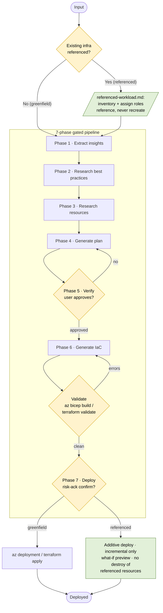

# Azure Enterprise Infra Planner

## When to Use This Skill

Activate this skill when user wants to:
- Plan enterprise Azure infrastructure from a workload or architecture description
- Architect a landing zone, hub-spoke network, or multi-region topology
- Design networking infrastructure: VNets, subnets, firewalls, private endpoints, VPN gateways
- Plan identity, RBAC, and compliance-driven infrastructure
- Generate Bicep or Terraform for subscription-scope or multi-resource-group deployments
- Plan disaster recovery, failover, or cross-region high-availability topologies

## Quick Reference

| Property | Details |
|---|---|
| MCP tools | `insights_get`, `get_azure_bestpractices_get`, `wellarchitectedframework_serviceguide_get`, `microsoft_docs_fetch`, `microsoft_docs_search`, `bicepschema_get` |
| CLI commands | `az deployment group create`, `az bicep build`, `az resource list`, `terraform init`, `terraform plan`, `terraform validate`, `terraform apply`, `checkov` |
| Output schema | [schema.md](/lib/10-context-memory/microsoft-skills/_github-plugins-azure-skills-skills-azure-enterprise-infra-planner-references-schema) |
| Key references | [workflow.md](/lib/10-context-memory/microsoft-skills/_github-plugins-azure-skills-skills-azure-enterprise-infra-planner-references-workflow), [waf-checklist.md](/lib/10-context-memory/microsoft-skills/_github-plugins-azure-skills-skills-azure-enterprise-infra-planner-references-waf-checklist), [resources/](/lib/10-context-memory/microsoft-skills/_github-plugins-azure-skills-skills-azure-enterprise-infra-planner-references-resources), [constraints/](/lib/10-context-memory/microsoft-skills/_github-plugins-azure-skills-skills-azure-enterprise-infra-planner-references-constraints) |

## Workflow (Start Here)

Follow the step-by-step instructions in [workflow.md](/lib/10-context-memory/microsoft-skills/_github-plugins-azure-skills-skills-azure-enterprise-infra-planner-references-workflow) to execute the 7 phases of infrastructure planning and provisioning.

## Architecture

The skill runs a **7-phase, gated pipeline**. Input is triaged into one of two flows:

- **Greenfield** — only new requirements; run the phases straight through.
- **Referenced (brownfield)** — the user supplies something that already exists (a live resource /
  resource group / subscription, IaC or an infra plan, or a requirements doc). The same phases run, plus
  [referenced-workload.md](/lib/10-context-memory/microsoft-skills/_github-plugins-azure-skills-skills-azure-enterprise-infra-planner-references-referenced-workload): existing resources are inventoried and
  referenced (never recreated), the new workload is wired into them, and **Phase 7 deploys additively**
  (incremental only — never modifying or destroying the referenced resources).

Every phase advances only after its gate passes. Phase 5 requires explicit user approval; **Phase 6 is a
hardened, self-verifying gate** — the generated IaC must be secure-by-default, pass local validation
(`az bicep build` / `terraform validate`) with zero errors, pass a `checkov` security scan with no
unresolved high/critical findings, and the skill must **show the command output** and emit a completion
self-check before advancing; Phase 7 requires an explicit, risk-acknowledged deploy confirmation.

