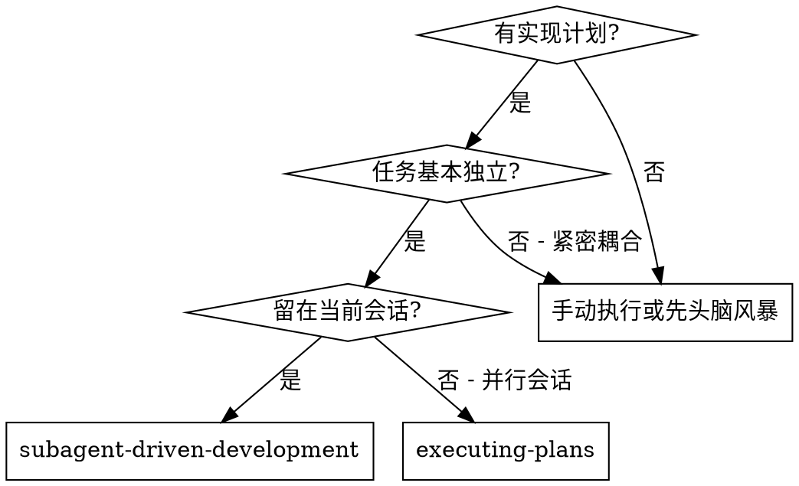
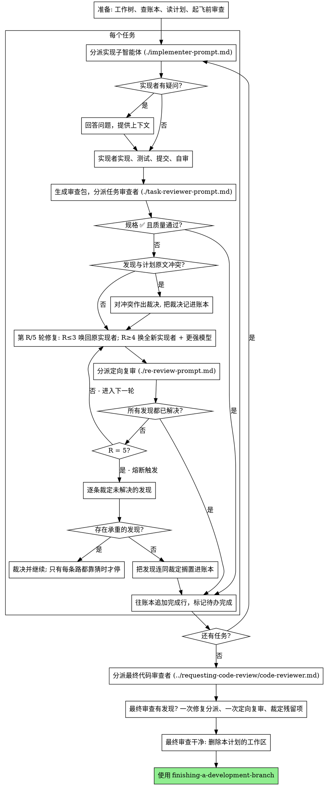

# 子智能体驱动开发

通过为每个任务分派一个全新的实现子智能体来执行计划：每个任务完成后做一次任务审查（规格合规性 + 代码质量），全部任务结束后再做一次覆盖整个分支的宽范围审查。

**为什么用子智能体：** 你把任务委派给具有隔离上下文的专用智能体。通过精心设计它们的指令和上下文，确保它们专注并成功完成任务。它们绝不应继承你会话的上下文或历史记录——你要精确构造它们所需的一切。这样也能为你自己保留用于协调工作的上下文。

**核心原则：** 每个任务一个全新子智能体 + 任务审查（规格 + 质量）+ 结尾宽范围审查 = 高质量、快速迭代

**旁白：** 工具调用之间最多说一句简短的旁白——进度账本和工具结果本身就是记录。

**持续执行：** 不要在任务之间停下来向你的人类伙伴确认。不间断地执行计划里的所有任务。唯一该停下的理由是：你无法解决的 BLOCKED 状态、确实妨碍推进的歧义，或所有任务已完成。"我该继续吗？"之类的询问和进度小结都在浪费他们的时间——他们让你执行计划，那就执行。

**做裁决，不要停摆。** 一个正在跑的计划不等人。冲突、歧义、计划缺陷、你本来想申请突破的上限——你自己定。规格是有约束力的权威，计划是它的论证，两者都答不上来的部分由你的判断来定。每个决定都以 `Ruling: <你决定了什么> — <为什么> — <如果错了代价是什么>` 记进账本，然后继续。一个错误的裁决，代价是你人类伙伴看得见、也撤得掉的返工；一个停在问题上的会话，代价是他们的一整天，而且什么也换不来。

只有四件事会让你停下，也只有这四件：不可逆或破坏性的操作；涉及安全的动作；这个工作树之外、按惯例应当先问一声的副作用（合并、推送到共享分支、发布）；以及一个坏到每条前进路径都只能靠猜的计划。遇到这四类，停下来问。

## 何时使用

**与 Executing Plans（并行会话）的对比：**
- 同一会话（无上下文切换）
- 每个任务全新子智能体（无上下文污染）
- 每个任务后做审查（规格合规性 + 代码质量），结尾做宽范围审查
- 更快的迭代（任务间无需人工介入）

## 流程

## 准备

确保工作发生在一个隔离的工作区里：用 using-git-worktrees 创建一个，或者核实已有的那个。没有你人类伙伴的明确同意，绝不在 main/master 分支上开始实现。

会话记忆无法在上下文压缩（compaction）中存活。在真实会话里，丢失了位置的控制者曾重新分派整段已经完成的任务序列——这是观察到的最昂贵的失败。把进度记在一个账本文件里，而不只是记在待办里。
